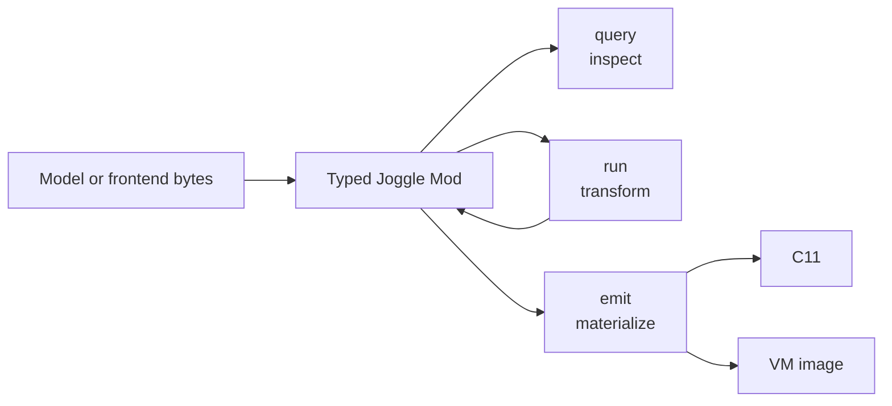

<p align="center">
  <picture>
    <source media="(prefers-color-scheme: dark)" srcset="docs/assets/logo/joggle-dark.svg">
    
  </picture>
</p>

<h1 align="center">Joggle</h1>

<p align="center">
  A typed compiler infrastructure for model semantics, IR transformation,
  representation conversion, and inspectable artifact generation.
</p>

<p align="center">
  
  <a href="https://lancerstadium.github.io/joggle/"></a>
  <a href="https://github.com/lancerstadium/joggle/actions/workflows/ci.yml"></a>
  
  
</p>

Joggle uses the same `.jog` language for readable model IR and compiler
functions. Queries inspect a program, transformations edit it transactionally,
frontends convert external formats explicitly, and emitters produce C or VM
artifacts without hiding intermediate stages.

> [!IMPORTANT]
> Joggle is pre-1.0 research software. The documented API describes implemented
> and tested project behavior; compatibility may change before 1.0.

## At a glance

| Area | Implemented surface |
| --- | --- |
| Language | structural types, generics, overloads, loops, branches, metadata |
| Program model | `Mod / Fn / Blk / Op / Val / Ty / Attr` |
| Compiler functions | typed query, transformation, conversion, and emission functions |
| Packages | graph-scoped `mod` packages with explicit `use` dependencies and `-M` roots |
| Updates | verified transactions, observed dependencies, revision-indexed reuse |
| Frontends | selected ONNX and TFLite import and semantic conversion paths |
| Artifacts | inspectable C11 and deterministic VM images |

## Architecture



Import, inference, conversion, optimization, storage planning, and emission are
explicit functions. Users can inspect or persist the graph between any two
steps. See the [compiler model](docs/compiler/index.md) for the object model and
component boundaries.

## Quick start

The default build needs CMake 3.20 or newer and a C++20 compiler. It downloads
no dependencies.

```sh
cmake -S . -B build -DCMAKE_BUILD_TYPE=Release
cmake --build build
ctest --test-dir build --output-on-failure
```

Check a fixture, run a transformation, and query the result:

```sh
./build/joggle check test/data/matmul.jog -M build/modules

./build/joggle run opt.fold_add_zero test/data/matmul.jog \
  -M build/modules > transformed.jog

./build/joggle query opt.untyped transformed.jog -M build/modules
```

Expected query result:

```text
[]
```

> [!NOTE]
> Every file command accepts `-` as input, so commands can form a shell
> pipeline. Named intermediate files are preferable when a stage must remain
> inspectable or reproducible.

Continue with [Start here](docs/start/index.md) and the ordered
[guides](docs/guides/index.md).

## From ONNX to C

Enable the optional ONNX frontend, then keep every stage visible:

```sh
cmake -S . -B build -DCMAKE_BUILD_TYPE=Release -DJOGGLE_BUILD_ONNX=ON
cmake --build build

./build/joggle read onnx.read model.onnx \
  -M build/modules > source.jog

./build/joggle run onnx.nn.infer onnx.nn.convert opt.basic source.jog \
  -M build/modules > semantic.jog

./build/joggle run c.prepare bounds.fold opt.fold opt.basic \
  tile.canon mem.plan semantic.jog \
  -M build/modules > prepared.jog

./build/joggle query c.frontier prepared.jog -M build/modules
./build/joggle emit c.source prepared.jog -M build/modules > model.c
```

An empty `c.frontier` means the remaining operations are representable by the
C emitter. Numerical correctness still belongs to an executable oracle.

## Write a `mod`

A source package is a directory containing `module.jog`:

```jog
mod choose_lut
use ir

fn apply(m: Mod) -> bool {
  var changed = false
  for op in ir.ops(m) {
    if ir.callee(op) == "nn.relu" {
      changed = ir.set(m, op, "implementation", "lut") || changed
    }
  }
  return changed
}
```

Load it through an explicit search root:

```sh
./build/joggle mod check choose_lut \
  -M build/modules -M local-mods

./build/joggle run choose_lut.apply model.jog \
  -M build/modules -M local-mods > selected.jog
```

The [`ikj`](examples/mods/ikj/module.jog), [`edge`](examples/mods/edge/module.jog),
[`locality`](examples/mods/locality/module.jog), and
[`compact`](examples/mods/compact/module.jog) directories are executable
out-of-tree examples.

## Build options

| Option | Adds | External requirement |
| --- | --- | --- |
| `JOGGLE_BUILD_ONNX=ON` | ONNX reader, conversion, and codec tests | Protobuf |
| `JOGGLE_BUILD_TFLITE=ON` | TFLite reader and value tests | FlatBuffers |
| `JOGGLE_BUILD_SAT=ON` | parametric saturating-type example | none |
| `JOGGLE_BUILD_TESTS=OFF` | omits project tests | none |

Set `CMAKE_PREFIX_PATH` when Protobuf or FlatBuffers is outside the default
search path.

## Test gates

The main workflow requires every selected test to pass; the merge threshold is
therefore 100% for each platform gate.

| Gate | Platform | Coverage | Required pass rate |
| --- | --- | --- | ---: |
| Core | Ubuntu | default build, CLI, library, C backend, docs | 100% |
| Core | macOS | default build, CLI, library, C backend, docs | 100% |
| Optional modules | Ubuntu | ONNX, TFLite, SAT, generated C | 100% |
| Sanitizers | Ubuntu | AddressSanitizer and UndefinedBehaviorSanitizer | 100% |

The live [CI badge](https://github.com/lancerstadium/joggle/actions/workflows/ci.yml)
is authoritative. Run a focused local loop with labels:

```sh
ctest --test-dir build -L unit
ctest --test-dir build -L cli
ctest --test-dir build -L analysis
ctest --test-dir build -L example-mod
ctest --test-dir build -L c
ctest --test-dir build -L tutorial
ctest --test-dir build -L lint
```

See [test/README.md](test/README.md) for the test taxonomy, fixture rules, and
the mapping from tutorials to executable gates.

## Repository map

| Path | Responsibility |
| --- | --- |
| `include/joggle/` | public C++ API |
| `src/` | parser, IR, verifier, resolver, evaluator |
| `tool/` | `joggle` command-line tool |
| `modules/` | bundled source and optional native mods |
| `examples/mods/` | runnable external mod examples |
| `test/` | unit, CLI, integration, backend, and documentation gates |
| `docs/` | design, tutorials, and reference |
| `paper/` | separate manuscript workspace |

Generated content belongs in a configured `build*` directory and is not
tracked.

## Documentation

- [Online documentation](https://lancerstadium.github.io/joggle/)
- [Start here](docs/start/index.md)
- [Language guide](docs/language/index.md)
- [Compiler model](docs/compiler/index.md)
- [Mod organization](docs/compiler/mods.md)
- [Execution and updates](docs/compiler/execution.md)
- [Task-oriented guides](docs/guides/index.md)
- [Developer API](docs/api/index.md)
- [External mod examples](docs/examples/index.md)
- [Built-in mod catalogue](docs/api/mods/index.md)
- [Contributing](docs/contributing/index.md)

## Boundaries

- Unknown frontend operations stay visible; importers do not guess.
- Emitters do not hide conversion, scheduling, or storage planning.
- External kernels are explicit ABI boundaries.
- Dynamic tensors require proved finite capacities for bounded static storage.
- Reactive reuse is conditional on observed dependencies and verification.
- Joggle does not currently claim a general native-code JIT, an incremental
  object linker, or a production inference runtime.

## License

See [LICENSE](LICENSE).
