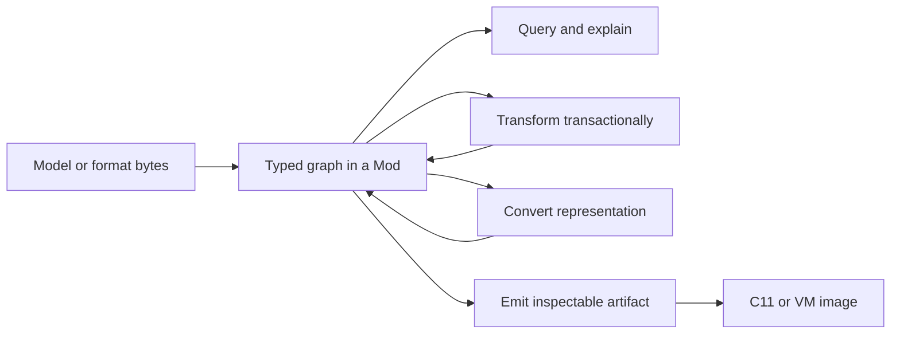

<p align="center">
  <picture>
    <source media="(prefers-color-scheme: dark)" srcset="docs/assets/logo/joggle-dark.svg">
    
  </picture>
</p>

<h1 align="center">Joggle</h1>

<p align="center">
  A typed, inspectable compiler workbench for model optimization and deployment.
</p>

<p align="center">
  
  <a href="https://lancerstadium.github.io/joggle/"></a>
  <a href="https://github.com/lancerstadium/joggle/actions/workflows/ci.yml"></a>
  
  
</p>

Joggle makes the compiler itself programmable in the same typed `.jog` language
used to represent models. An operator implementation, graph analysis,
transformation policy, format converter, and artifact emitter can therefore be
packaged, inspected, tested, and composed through one mechanism.

> [!IMPORTANT]
> Joggle is pre-1.0 research software. The documented surface is implemented
> and tested, but compatibility may change before 1.0.

## Why Joggle

| Capability | What it changes for a developer | Concrete mechanism |
|---|---|---|
| **Unified metaprogramming** | Extend more than operator definitions without learning a separate pass DSL or backend registry | typed compiler functions receive and return `Mod`, `Fn`, `Op`, `Val`, `Ty`, and `Attr` |
| **Graph-scoped mods** | Keep a multi-stage compiler in explicit, replaceable packages instead of one implicit global pipeline | `mod`, `use`, searchable roots, metadata, and callable public functions |
| **Dependency-aware updates** | Reuse unaffected analysis and stages while preserving verification boundaries | revisions, observed dependencies, memoized plans, transactions, and reactive schedules |

These are development and organization properties. Generated-code performance
still depends on the selected implementations, transformations, and target.

## One language from semantics to artifacts

The input may remain semantic:

```jog
mod demo
use tensor

[entry]
fn main(
  a: tensor<f32, [2, 3]>, b: tensor<f32, [3, 2]>
) -> tensor<f32, [2, 2]> {
  return tensor.matmul(a, b)
}
```

An external mod can contribute a compatible implementation:

```jog
[impl: "ikj"]
fn tensor.matmul<E: Ty, M: int, N: int, K: int>(
  a: tensor<E, [M, K]>, b: tensor<E, [K, N]>
) -> tensor<E, [M, N]> {
  var out = tensor<E, [M, N]>(E(0))
  for i in 0..M, k in 0..K, j in 0..N {
    out[i, j] = out[i, j] + a[i, k] * b[k, j]
  }
  return out
}
```

The transformed result remains readable Joggle rather than disappearing into a
backend schedule:

```jog
fn main(a: tensor<f32, [2, 3]>, b: tensor<f32, [3, 2]>)
    -> tensor<f32, [2, 2]> {
  var out = tensor<f32, [2, 2]>(f32(0))
  for i in 0..2, k in 0..3, j in 0..2 {
    out[i, j] = out[i, j] + a[i, k] * b[k, j]
  }
  return out
}
```

That body can be queried, tiled, rewritten, converted, or emitted by later
compiler functions.



## Try it

The default build requires CMake 3.20 or newer and a C++20 compiler. It fetches
no dependencies.

```sh
cmake -S . -B build -DCMAKE_BUILD_TYPE=Release
cmake --build build
ctest --test-dir build --output-on-failure
```

Run the implementation example and keep its intermediate result:

```sh
./build/joggle run ikj.apply examples/mods/ikj/model.jog \
  -M examples/mods -M build/modules > selected.jog
./build/joggle check selected.jog -M examples/mods -M build/modules
```

The first command resolves `ikj.apply`, loads its declared dependencies, selects
the typed implementation, verifies the edit, and prints the new mod. The second
parses and verifies that saved boundary again.

Continue with the [guided first workflow](docs/start/index.md). It explains the
source, command, output, and state change at every step.

## How the pieces fit

| Layer | Owns | Does not hide |
|---|---|---|
| Language | types, functions, control flow, metadata | compiler behavior behind syntax magic |
| Graph store | stable handles and verified mutation | untracked raw-pointer ownership |
| Compiler functions | query, transformation, conversion, emission | a mandatory fixed pipeline |
| Mods | API and dependency boundaries | process-global registration |
| Evaluator | typed execution and memoized plans | mutation outside transactions |
| Artifact mods | preparation and serialization | implicit lowering during output |

The public C++ vocabulary is deliberately small. `Mod`, `Fn`, `Blk`, `Op`,
`Val`, and `Ty` are stable graph identities; `Attr` carries serializable values,
configuration, reports, and profiles. Internal evaluator counters and cache
records do not leak into the public API.

## Built-in and external mods

Bundled mods form explicit layers rather than one monolithic optimizer:

| Group | Examples | Role |
|---|---|---|
| Core reflection | `base`, `ir` | values, handles, graph inspection and edits |
| Semantics | `tensor`, `nn`, `math`, `quant` | typed operator contracts |
| Analysis | `stat`, `bounds` | reusable evidence without hidden mutation |
| Transformation | `opt`, `tile`, `mem` | selection, loop edits, storage planning |
| Frontend | `onnx`, `onnx.nn`, `tflite`, `tflite.nn` | explicit import and semantic conversion |
| Target | `c`, `vm` | explicit preparation and artifact emission |

External source mods use the same language and search mechanism. The executable
examples cover [cost policy](docs/examples/cost.md),
[IKJ MatMul](docs/examples/ikj.md), [compact Conv](docs/examples/compact.md),
[locality policy](docs/examples/locality.md), and
[external C kernels](docs/examples/edge.md).

## Optional format support

| CMake option | Adds | External requirement |
|---|---|---|
| `JOGGLE_BUILD_ONNX=ON` | ONNX reader and conversion tests | Protobuf |
| `JOGGLE_BUILD_TFLITE=ON` | TFLite reader and value tests | FlatBuffers |
| `JOGGLE_BUILD_SAT=ON` | parametric saturating-type example | none |
| `JOGGLE_BUILD_TESTS=OFF` | omits project tests | none |

ONNX and TFLite input are never silently treated as fully supported. Unknown
operations remain visible or produce diagnostics at the responsible boundary.

## Quality gates

| Gate | Platform | Required result |
|---|---|---:|
| Core build and tests | Ubuntu, macOS | 100% |
| Optional ONNX/TFLite/SAT mods | Ubuntu | 100% |
| Address/undefined behavior sanitizers | Ubuntu | 100% |
| Docs graph, layout, and tutorial smoke tests | CI | 100% |

The live [CI badge](https://github.com/lancerstadium/joggle/actions/workflows/ci.yml)
is authoritative. Test organization and tutorial correspondence are documented
in [test/README.md](test/README.md).

## Repository map

| Path | Responsibility |
|---|---|
| `include/joggle/` | compact public C++ API |
| `src/` | parser, graph store, verifier, resolver, evaluator |
| `tool/` | command-line interface |
| `modules/` | bundled source and optional native mods |
| `examples/mods/` | runnable out-of-tree extensions |
| `test/` | unit, CLI, integration, backend, docs, and tutorial gates |
| `docs/` | project design, guides, and API reference |
| `paper/` | separate manuscript workspace |

Generated files belong in a configured `build*` directory and are not tracked.

## Documentation paths

- New user: [Start here](docs/start/index.md) → [Guides](docs/guides/index.md)
- Mod author: [Unified metaprogramming](docs/metaprogramming/index.md) → [Create a mod](docs/guides/create-mod.md)
- Compiler developer: [Compiler internals](docs/compiler/index.md) → [Performance internals](docs/performance/index.md)
- Embedder: [C++ API](docs/api/cpp.md) → [Native mod ABI](docs/api/native.md)
- System comparison: [Related systems and design boundaries](docs/design/related-systems.md)

The full, dark-mode-aware site is available at
[lancerstadium.github.io/joggle](https://lancerstadium.github.io/joggle/).

## Explicit boundaries

- Unknown frontend operations stay visible; importers do not guess.
- Emitters do not hide conversion, scheduling, or storage planning.
- External kernels are explicit typed ABI boundaries.
- Dynamic tensors require proved finite capacities for bounded static storage.
- Reactive reuse is conditional on observed dependencies and verification.
- Joggle does not currently claim a general native-code JIT, an incremental
  object linker, or a production inference runtime.

## License

See [LICENSE](LICENSE).
