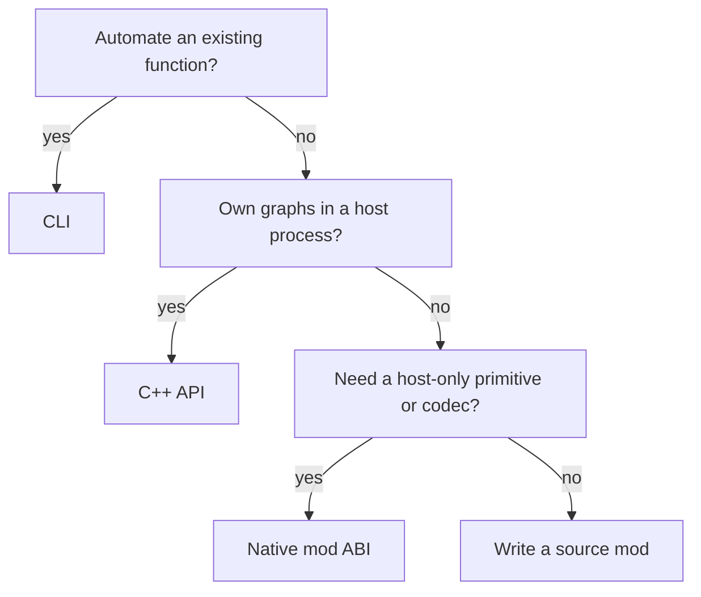

# API

API pages are lookup material after the language and compiler model.

The API has two layers. The core surface provides mechanisms that every project
uses; installed mods provide domain, transformation, format, or artifact
knowledge. A name in the bundled catalogue is not a core special case.

| Surface | Use it when |
| --- | --- |
| [CLI](cli.md) | driving checked workflows from a shell or build system |
| [C++ API](cpp.md) | embedding parsing, graph edits, execution, or reactive updates |
| [Native mod ABI](native.md) | binding a codec or host function across a narrow C ABI |
| [Built-in mods](mods/index.md) | calling installed language, analysis, transform, frontend, or target functions |

## Choose the narrowest surface



Most compiler extensions should begin as source mods. Move a primitive to the
native ABI only when it genuinely requires host/library integration; use C++
embedding only when another process must own the environment and graphs.

## One query through three surfaces

Source mod:

```jog
mod project
use ir

fn summary(m: Mod) -> dict {
  var out: dict = {}
  out["functions"] = len(ir.fns(m))
  out["operations"] = len(ir.ops(m))
  return out
}
```

Shell:

```sh
joggle query project.summary model.jog \
  -M build/modules -M project-mods
```

C++ embedding:

```cpp
joggle::Env env;
env.path("build/modules");
env.path("project-mods");
joggle::Mod mod;
joggle::Attr result;
if (!joggle::parse(env, source, mod, "model.jog") ||
    !joggle::query(env, "project.summary", mod, result)) {
  return mod.print_diags(stderr);
}
std::cout << joggle::print(result) << '\n';
```

All three resolve the same typed function. The CLI is not a second compiler and
the C++ API does not require reimplementing the analysis.

The exact overloads installed in a build are always available through:

```sh
joggle mod info NAME -M build/modules
```

Documentation explains contracts and composition. `mod info` reports the
concrete declarations in the binary/source package on disk.

## Stability boundary

| Stable public concept | Internal implementation detail |
|---|---|
| `Attr`, `Ty`, `Mod`, `Fn`, `Blk`, `Op`, `Val`, `Env` | evaluator frames and plan instructions |
| printed `.jog` and `Attr` syntax | store indices and cache records |
| native C ABI declarations | C++ classes in `src/detail.h` |
| diagnostics and return status | profiling counter layout |

Profiles and reports cross the boundary as `Attr`. This keeps optional telemetry
from expanding the public C++ type vocabulary while retaining structured data.
