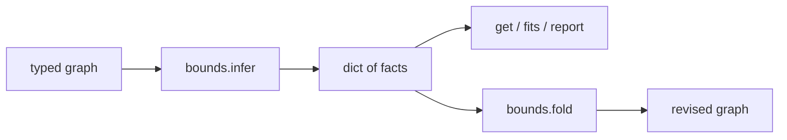
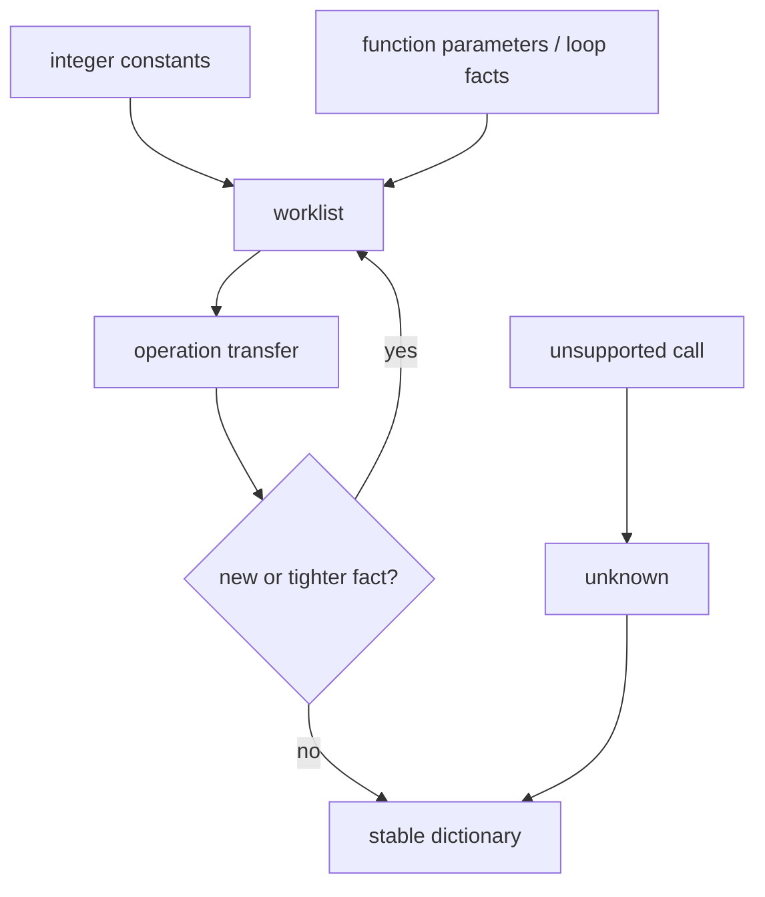

# `bounds`

`bounds` computes conservative integer facts used by dynamic-shape capacity,
guard elimination, and policy decisions.



## API

```jog
fn infer(m: Mod) -> dict;
fn get(known: dict, value: Val) -> list<int>;
fn fits(known: dict, value: Val, type: Ty) -> bool;
fn report(m: Mod) -> dict;
fn fold(m: Mod) -> bool;
```

## Inspect facts

```jog
mod range_policy
use bounds
use ir

fn narrow(m: Mod, value: Val) -> bool {
  let known = bounds.infer(m)
  let range = bounds.get(known, value)
  return len(range) == 2 && range[0] >= 0 && range[1] <= 255
}
```

An empty list means “not proved,” not `[0, 0]`.

For a proved value, the two integers are inclusive lower and upper bounds:

| Result | Interpretation |
| --- | --- |
| `[]` | no sound finite interval was proved |
| `[7, 7]` | exact constant seven |
| `[0, 255]` | any integer from zero through 255 |

This distinction prevents “unknown” from becoming an accidentally precise
zero during capacity planning.

## Report and fold

```sh
joggle query bounds.report model.jog -M build/modules > bounds.attr
joggle run bounds.fold model.jog -M build/modules > folded.jog
```

Read `bounds.attr` before selecting the mutating step. `fold` replaces only
expressions whose value follows from the same conservative analysis.

Example report shape:

```text
{
  "count": 3,
  "integers": 3,
  "values": {
    "limit": [16, 16],
    "offset": [0, 15],
    "width": [16, 16]
  }
}
```

The exact value names come from the input graph. Consumers should use
dictionary keys, not depend on pretty-print order.

## Type fit

```jog
fn can_store(m: Mod, value: Val, storage: Ty) -> bool {
  return bounds.fits(bounds.infer(m), value, storage)
}
```

This is useful before selecting a narrower integer representation. It is not a
cast and does not change `ir.type(value)`.

## Mechanism and limits

Facts propagate through supported integer operations and structured control
flow until stable. The transfer rule for each operation is monotone: it may
discover a sound interval, intersect compatible evidence, or fall back to
unknown, but it cannot invent a narrower interval without proof.



Structured loops seed induction-variable ranges from recognized `range`
inputs. Branch results are joined conservatively. Arithmetic uses checked
interval operations so overflow cannot turn into an unsound proof.

## Using bounds in a transform

Keep analysis and mutation separate:

```jog
fn narrow_safe_values(m: Mod) -> bool {
  let known = bounds.infer(m)
  var changed = false
  for value in ir.vals(m) {
    if bounds.fits(known, value, ty("i8")) {
      changed = ir.set(m, value, "project.narrowable", true) || changed
    }
  }
  return changed
}
```

The analysis dictionary describes one graph revision. After the first edit,
do not reuse it to justify a second structural change whose inputs may have
changed. Re-run `infer` or structure the pass so every decision refers to the
same pre-edit snapshot.

## Failure guide

| Observation | Meaning | Next step |
| --- | --- | --- |
| `get` returns `[]` | unsupported or unproved value | keep the wide representation |
| `fits` is false | interval exceeds storage or is unknown | do not narrow |
| `fold` returns false | no additional exact values | continue; this is not an error |
| report changes after an edit | dependent analysis was invalidated | recompute for the new revision |

> [!WARNING]
> A finite interval is a storage/correctness fact, not a probability
> distribution. It cannot justify “usually fits” optimizations.
