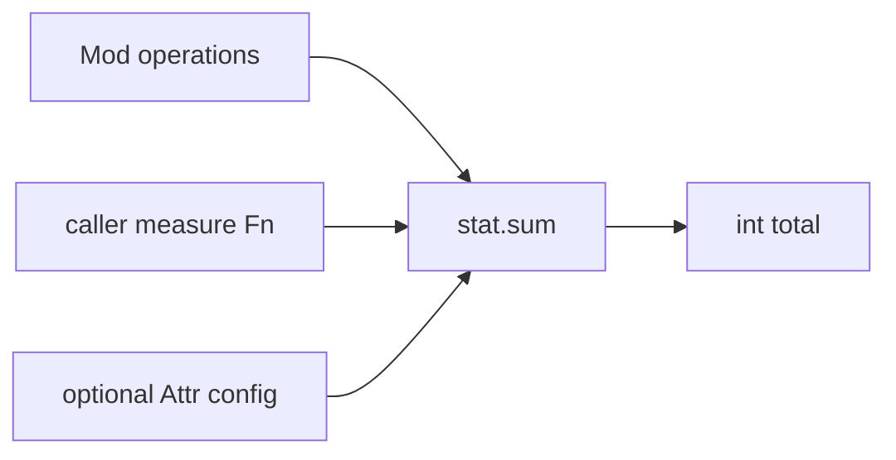
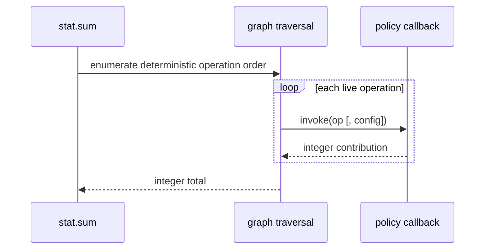

# `stat`

`stat` traverses graph operations and delegates measurement to a typed callback.
The callback owns the unit—operation count, estimated cycles, energy, bytes, or
a research proxy.



## API

```jog
fn sum(m: Mod, measure: Fn) -> int;
fn sum(m: Mod, measure: Fn, arg: Attr) -> int;
fn summary(m: Mod) -> dict;
```

## Simple measurement

```jog
mod my_cost
use ir
use stat

fn weight(op: Op) -> int {
  if ir.kind(op) == "call" { return 4 }
  return 1
}

fn total(m: Mod) -> int {
  return stat.sum(m, ir.find("my_cost.weight"))
}
```

```sh
joggle query my_cost.total model.jog \
  -M build/modules -M local-mods
```

For a graph with two calls and one return-like structural operation, the
callback above contributes `4 + 4 + 1`, so the query prints:

```text
9
```

The number is meaningful only under the callback definition. Name reports and
columns with their unit—`weighted_ops`, `estimated_cycles`, or `bytes`—rather
than presenting every `stat.sum` result as “cost.”

## Configured measurement

```jog
fn configured(op: Op, config: Attr) -> int {
  if ir.kind(op) == "call" { return int(config["call"]) }
  return int(config["other"])
}

fn total(m: Mod, config: dict) -> int {
  return stat.sum(m, ir.find("my_cost.configured"), config)
}
```

This keeps device/research configuration out of the graph and core.

## Summary

```sh
joggle query stat.summary model.jog -M build/modules
```

The result is a canonical dictionary suitable for scripts. Inspect keys in the
current build rather than assuming a presentation order.

Example shape:

```text
{"blocks": 1, "functions": 1, "operations": 4, "values": 3}
```

`summary` is a structural inventory. It does not invoke a user callback and it
does not estimate runtime.

## Mechanism and limits

The measure callback is invoked read-only for each structurally visited
operation. It must not mutate the graph. `stat` adds integers; it does not assign
the unit predicts latency. Calibration and validation belong to the caller.



## Designing a useful policy

1. State the unit in the function and output name.
2. Define how structural operations, constants, and calls contribute.
3. Keep hardware calibration in the optional configuration argument.
4. Return integers so aggregation stays deterministic.
5. Validate the proxy against the phenomenon it is intended to predict.

```jog
fn bytes(op: Op, config: Attr) -> int {
  if ir.kind(op) != "call" { return 0 }
  let default_width = int(config["default_bytes"])
  var total = 0
  for value in ir.args(op) {
    total = total + default_width
  }
  return total
}
```

This is intentionally a simple proxy; a serious traffic model should inspect
tensor shapes and storage behavior rather than count every value equally.

## Failure guide

| Symptom | Cause | Fix |
| --- | --- | --- |
| callback does not resolve | signature is incompatible | accept `Op` and optional `Attr` |
| transaction/mutation diagnostic | callback edited the graph | keep measurement read-only |
| total overflows intended unit | scale or unit too large | select a safer unit/model |
| plausible but inaccurate total | proxy lacks calibration | calibrate against the named unit |

See the complete [cost-policy example](../../../examples/cost.md), including
its package source, model input, commands, and output interpretation.
