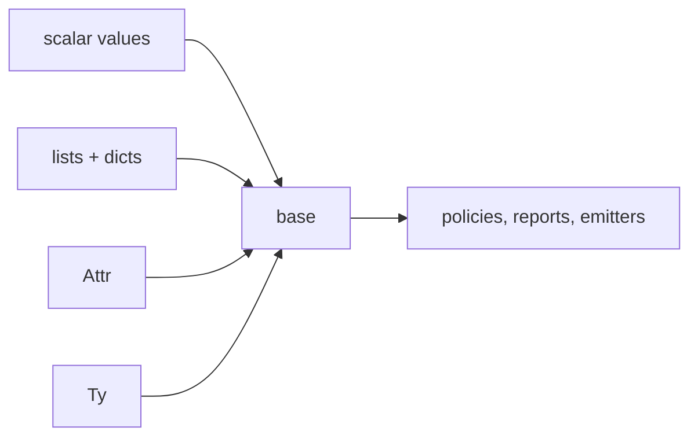

# `base`

`base` is the value-level foundation used by source programs and compiler mods.
It operates on scalars, lists, dictionaries, `Attr`, and `Ty`; it does not
inspect or mutate a `Mod` graph.



## Import and inspect

```jog
mod policy
use base
```

```sh
joggle mod info base -M build/modules
```

## Collection API

| Function family | Input | Result / behavior |
| --- | --- | --- |
| `len` | list, dict, or structural `Attr` | item count |
| `keys` | dict or dict-valued `Attr` | keys in canonical order |
| `has` | dict/`Attr`, key | whether key exists |
| `get` | dict/`Attr`, key, optional fallback | value, `nil`, or fallback |
| `[]` | list index or dict key | strict lookup |
| `[]=` | mutable list/dict assignment | updated value semantics |

```jog
fn read_config(config: dict) -> dict {
  let mode = str(get(config, "mode", "portable"))
  let widths = get(config, "widths", [8, 16])
  assert(len(widths) != 0, "widths must not be empty")
  return {mode: mode, widths: widths}
}
```

Use `get` for optional data. Direct `config["mode"]` is intentionally strict
and fails the current compiler invocation when absent.

## Attribute projection

| Function | Accepts | Returns |
| --- | --- | --- |
| `kind` | `Attr` or `Ty` | runtime structural kind string |
| `int` | integer `Attr` or integer `Ty` term | `int` |
| `real` | floating `Attr` | `f32` |
| `str` | string `Attr` or compatible `Ty` | unquoted string |
| `text` | any `Attr` or `Ty` | canonical source spelling |

```jog
fn explain(value: Attr) -> str {
  if kind(value) == "str" { return str(value) }
  return text(value)
}
```

`str("fast")` returns `fast`; `text("fast")` returns the canonical quoted
spelling `"fast"`.

## Type-term API

```jog
fn tensor_element(type: Ty) -> Ty {
  assert(name(type) == "tensor", "expected tensor")
  let terms = args(type)
  assert(len(terms) == 2, "malformed tensor type")
  return terms[0]
}

fn sat_type(width: int) -> Ty {
  return ty("sat", [ty(width)])
}
```

`ty(text)` parses a complete type; `ty(name, terms)` builds a node without
serializing child terms. Invalid trees fail instead of entering the type system.

## String and byte API

```jog
fn c_symbol(name: str) -> str {
  return ident(replace(name, ".", "_"))
}

fn dump(data: bytes) -> str {
  return hex(data, " ")
}
```

`ident` sanitizes one identifier, `replace` is left-to-right and
non-overlapping, and `hex` renders bytes with an explicit separator. `size` and
`byte` expose byte payload length and indexed values.

## Operators

`base` declares generic scalar arithmetic, comparisons, Boolean logic, ranges,
indexing, and list/string concatenation. Concrete mods may add more-specific
overloads:

```jog
fn +<T: Ty>(left: T, right: T) -> T;
fn +<W: int>(left: sat<W>, right: sat<W>) -> sat<W>;
```

The second wins for `sat<W>` without a saturating-type branch in the resolver.

## Failure boundary

```jog
fn require_positive(value: int) -> bool {
  return assert(value > 0, "value must be positive")
}
```

A failed `assert` stops evaluation. Under `run`, the complete graph transaction
rolls back.

## Internal mechanism

Lists and dictionaries have value semantics. Indexed assignment produces an
updated compile-time value internally, then ordinary mutable-source lowering
carries it forward. `Attr` remains the one open structured interchange format;
there is no separate configuration AST.

## Common mistakes

| Symptom | Cause | Fix |
| --- | --- | --- |
| missing dictionary key error | used strict `[]` for optional data | use `get` with fallback |
| failed `str`/`int` projection | wrong runtime `Attr` kind | check `kind` or validate input |
| malformed type | hand-built child terms are invalid | use `ty` and assert structure |
| ambiguous operator | two equally specific overloads | qualify or specialize signature |
