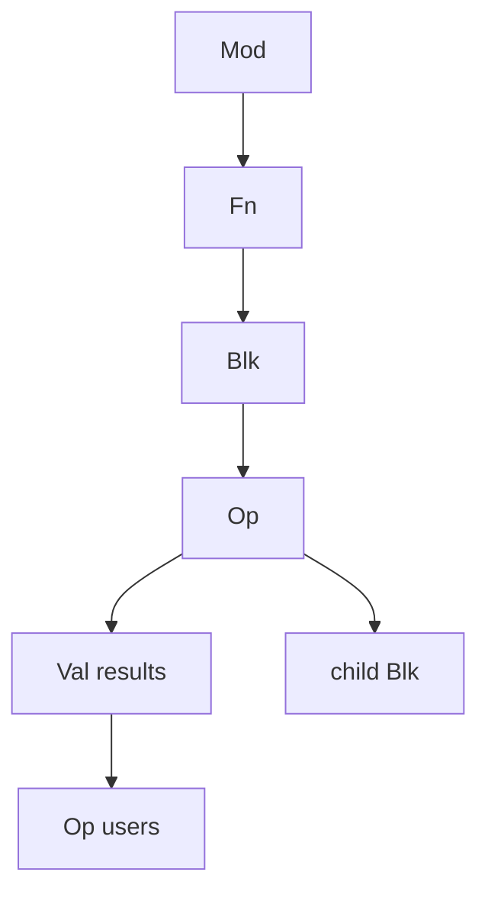

# `ir`

`ir` is the source-level graph API. Every analysis, transform, converter, and
emitter sees the same `Mod / Fn / Blk / Op / Val` objects.



## Discovery and enumeration

```jog
fn inventory(m: Mod) -> dict {
  return {
    functions: len(ir.fns(m)),
    operations: len(ir.ops(m)),
    values: len(ir.vals(m)),
    dependencies: ir.uses(m),
    revision: ir.revision(m)
  }
}
```

| Need | API |
| --- | --- |
| functions | `fns(m)`, `fns(mod_name)`, `find(...)` |
| blocks | `blks(fn/op)`, `blk(op)`, `owner(block)` |
| operations | `ops(m/fn/block)`, kind-filtered/range overloads |
| values | `vals(m/fn)`, `params(fn)`, `args`, `outs` |
| def-use | `def(value)`, `users(value)`, `affected(values)` |

Enumeration is deterministic structural order and includes nested blocks.

## Identify and navigate

```jog
fn call_rows(m: Mod) -> list<dict> {
  var rows: list<dict> = []
  for op in ir.ops(m, ["call"]) {
    rows += [{
      callee: ir.callee(op),
      path: ir.path(m, op),
      inputs: len(ir.args(op)),
      outputs: len(ir.outs(op))
    }]
  }
  return rows
}
```

`path` is a stable structural route within the current graph. `at(m, fn, path)`
resolves it later; it is safer for persistent tooling than emitted text.

Other identity queries include `live`, `key`, `kind`, `form`, `callee`, and
`target`.

## Types and metadata

```jog
fn annotate_open_results(m: Mod) -> bool {
  var changed = false
  for value in ir.vals(m) {
    if text(ir.type(value)) == "_" {
      changed = ir.set(m, value, "needs_type", true) || changed
    }
  }
  return changed
}
```

Reads use `ir.type`, `ir.meta`, and `ir.has`. Edits use the owning `Mod` plus
`ir.type`, `ir.returns`, `ir.generics`, `ir.set`, or `ir.unset`.

## Typed function selection

```jog
fn select(m: Mod, call: Op, candidates: list<Fn>) -> Fn {
  return ir.match(call, candidates)
}
```

| API | Purpose |
| --- | --- |
| `find` | locate a named function or signature |
| `accepts` | test one call/candidate pair |
| `match` | choose the most-specific candidate |
| `invoke<T>` | call a compile-time function with typed handles/values |
| `where` | filter functions by open metadata |

This is the reusable mechanism behind implementation packages; it avoids a
second registry keyed by operator strings.

## Create and edit

```jog
fn replace_with_zero(m: Mod, op: Op) -> bool {
  let outputs = ir.outs(op)
  assert(len(outputs) == 1, "expected one result")
  return ir.replace(m, op, 0)
}
```

Core edits include `call`, `constant`, `clone`, `move`, `args`, `retarget`,
`replace`, `erase`, and `rename`.

### Batch example

```jog
fn erase_dead(m: Mod, ordered: list<Op>, pure: list<Op>) -> bool {
  let dead = ir.unused(ordered, pure)
  if len(dead) == 0 { return false }
  return ir.erase(m, dead)
}
```

Batch edits validate the full set before mutation and avoid rediscovering
shared structure per item.

## Liveness and ownership

```jog
fn safe_name(op: Op) -> str {
  if !ir.live(op) { return "<removed>" }
  return ir.callee(op)
}
```

Handles include store identity, object identity, and generation. Erasure makes
the old handle non-live; slot reuse cannot make it point at an unrelated object.

## Revision behavior

Successful structural/type/metadata edits advance relevant revisions. Queries
record what they observe. A failed `run` restores the graph and prior revision.
Metadata-only edits can use compact undo records; structural edits materialize
the necessary rollback snapshot.

## Common mistakes

| Symptom | Cause | Fix |
| --- | --- | --- |
| foreign handle error | handle comes from another `Mod` | keep ownership explicit |
| stale handle error | operation was erased/rebuilt | test `live`, rediscover or use paths |
| dominance/type rejection | local edit breaks final invariant | build replacement before redirect/erase |
| slow repeated transform | scalar edits repeatedly scan graph | collect targets and use batch overload |
| policy mutates during query | invoked callback violates read-only contract | separate decision from edit |
