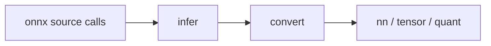
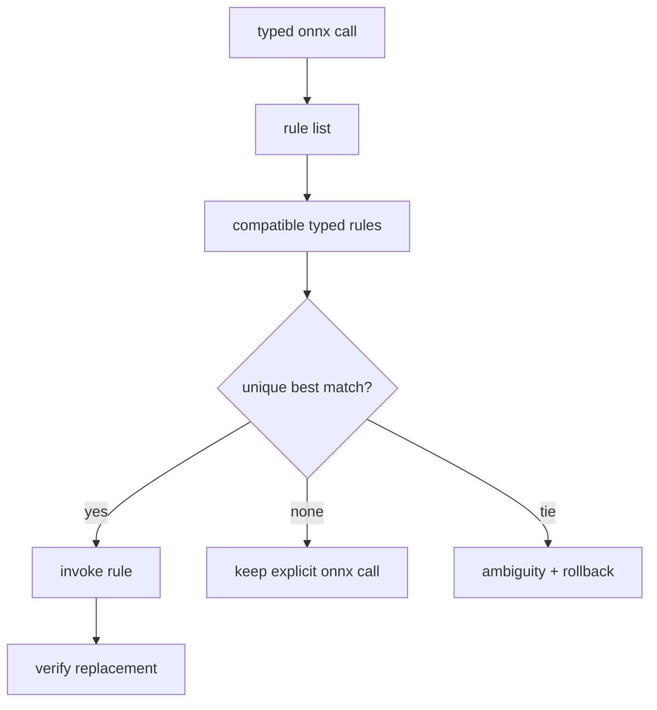

# `onnx.nn`

`onnx.nn` is the explicit bridge from decoded ONNX calls to shared `nn`,
`tensor`, and `quant` semantics.



## API

```jog
fn shape_terms(value: Val) -> list<Ty>;
fn infer(m: Mod) -> bool;
fn infer(m: Mod, rules: list<Fn>) -> bool;
fn convert(m: Mod) -> bool;
fn convert(m: Mod, rules: list<Fn>) -> bool;
```

## Standard pipeline

```sh
joggle run onnx.nn.infer source.jog -M build/modules > inferred.jog
joggle run onnx.nn.convert inferred.jog -M build/modules > semantic.jog
joggle query opt.unresolved semantic.jog -M build/modules
joggle query opt.untyped semantic.jog -M build/modules
```

Keeping stages separate makes missing inference and missing conversion
distinguishable.

## Custom rule list

```jog
mod project_onnx
use ir
use onnx.nn

fn infer(m: Mod) -> bool {
  let rules = ir.where(ir.fns("project_onnx"), "role", "infer")
  return onnx.nn.infer(m, rules)
}
```

Rules are ordinary typed functions selected by the caller. The bridge does not
scan a process-global registration table.

## `shape_terms`

This query traces supported constant/shape-manipulation relations and returns
structural `Ty` terms. An empty result means the shape expression is not proved;
it must not be interpreted as scalar shape.

## Boundary

Conversion rewrites only proved supported calls. Unsupported calls remain ONNX
calls and appear in `opt.unresolved` or a target frontier. Numerical equivalence
requires pinned reference data beyond empty structural queries.

## Rule families

The official bridge separates inference and conversion by operator concern:

| Family | Representative responsibility |
| --- | --- |
| core/literal | graph inputs, constants, identity-like relations |
| unary | activations and elementwise unary calls |
| binary | broadcasting binary arithmetic/comparison |
| shape | reshape, transpose, concat, expand, shape relations |
| slice | slice/gather/top-k and index normalization |
| reduction | axes and keep-dimension behavior |
| convolution | convolution/pooling padding and layout |
| MatMul | MatMul/Gemm dimension and transpose relations |
| quantization | Q/DQ and quantized linear operations |
| control | nested graphs and structured control flow |

Each rule family is ordinary `.jog` source. The list is implementation
organization, not a promise that every ONNX operator/version is covered.

## Inference input and output

Before inference:

```jog
fn main(x: tensor<f32, [1, 4]>) -> _ {
  let y = onnx.Relu(x)
  return y
}
```

After a matching inference rule:

```jog
fn main(x: tensor<f32, [1, 4]>) -> tensor<f32, [1, 4]> {
  let y: tensor<f32, [1, 4]> = onnx.Relu(x)
  return y
}
```

Inference refines result types while retaining ONNX operator identity.

## Conversion input and output

After conversion:

```jog
fn main(x: tensor<f32, [1, 4]>) -> tensor<f32, [1, 4]> {
  let y = nn.relu(x)
  return y
}
```

Conversion changes representation ownership from the source-format bridge to
shared semantics. It must preserve source attributes such as axes, padding,
strides, dilations, transposes, and quantization parameters through the
destination API.

## Rule selection mechanism



The overload taking `list<Fn>` lets a project supply a reviewed rule set.
Bundled zero-argument overloads select official rules. This avoids process-wide
registration and makes experiment configuration visible.

## Extending conversion safely

1. Identify the exact ONNX domain, operator, and opset contract.
2. Add or select an inference rule that proves the output types.
3. Write a narrow conversion rule for those proved inputs/attributes.
4. Construct the destination call before redirecting users.
5. Preserve all semantic attributes explicitly.
6. Leave unsupported variants unchanged.
7. Compare intermediate semantic output and a numerical oracle.

Do not broaden a rule merely to make `opt.unresolved` empty. Explicit residual
source calls are preferable to incorrect shared semantics.

## Failure guide

| Symptom | Meaning | Correction |
| --- | --- | --- |
| inference returns false | graph stable or no matching rule | inspect open outputs/source call |
| `shape_terms` is empty | shape expression unproved | retain `_` or add a sound inference rule |
| conversion leaves call | no supported exact mapping | implement narrow rule or report frontier |
| conversion ambiguity | overlapping rule signatures | specialize by types/metadata/opset |
| converted result mismatches | attribute/layout/version mapping wrong | compare at operator boundary |

> [!WARNING]
> An ONNX operator name alone is insufficient for conversion. Domain, opset,
> input arity, optional inputs, attributes, element types, and shape conventions
> are part of the source contract.
