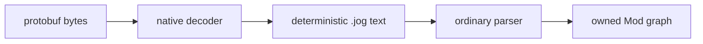

# `onnx`

`onnx` is the optional binary decoder and source-format boundary. Enable it with
`-DJOGGLE_BUILD_ONNX=ON`; it requires Protobuf.

## API

```jog
[role: "read"]
fn read(data: bytes) -> str;
fn model(info: dict) -> _;
fn tensor(type: int, shape: list<int>, data: bytes) -> _;
fn graph(m: Mod, op: Op, name: str) -> Fn;
fn opset(m: Mod, domain: str) -> int;
```

## Decode

```sh
joggle read onnx.read model.onnx -M build/modules > source.jog
joggle check source.jog -M build/modules > /dev/null
```

The generated `.jog` preserves ONNX calls and metadata. It does not silently
map them to `nn` or `tensor`.

The file boundary is therefore explicit:

| Stage | Input | Output | Graph mutation |
| --- | --- | --- | --- |
| `onnx.read` | protobuf bytes | `.jog` source text | creates source text |
| `check` | `.jog` source | canonical `.jog` | none |
| `onnx.nn.infer` | decoded graph | typed decoded graph | transactional |
| `onnx.nn.convert` | typed decoded graph | shared semantics | transactional |

```jog
// Schematic shape of decoded source; actual names come from the model.
fn main(x: tensor<f32, [1, 4]>) -> _ {
  let y = onnx.Relu(x)
  return y
}
```

## Metadata queries

`opset(m, domain)` reads the decoded model declaration. `graph(m, op, name)`
resolves a named nested graph recorded in operation metadata.

```jog
fn default_opset(m: Mod) -> int {
  return onnx.opset(m, "")
}
```

## Boundary

Malformed protobuf, unsupported tensor payloads, and inconsistent graph data
are decoder failures. Unknown ONNX operators are not decode failures: they stay
visible for later conversion/capability reporting.

## What the decoder preserves

- graph inputs, outputs, initializers, and nested graph attributes;
- operator domain and opset information;
- tensor element type, dimensions, and raw payload bytes;
- source names where they can be represented safely;
- unsupported operators as explicit `onnx.*` calls.

It does not claim semantic support merely because bytes were decoded. This is
why the result is useful for diagnostics even when conversion is incomplete.

## Inspect before conversion

```console
$ joggle query onnx.opset source.jog --arg '""' -M build/modules
18

$ joggle query opt.unresolved source.jog -M build/modules
["onnx.CustomOp"]
```

The first query asks for the default-domain opset. The second makes unsupported
source calls visible before any target work begins.

## Internal mechanism

The native decoder validates protobuf structure and renders a deterministic
source representation. It returns text across the narrow native ABI; parsing,
name resolution, type inference, and graph ownership remain in the regular
Joggle engine.



This boundary keeps the binary-format dependency out of the core graph store.
It also means decoder output can be saved, reviewed, minimized, and replayed.

## Failure guide

| Failure | Layer | Meaning |
| --- | --- | --- |
| protobuf parse error | decoder | input is malformed or incompatible |
| invalid tensor payload length | decoder | shape/type and bytes disagree |
| `.jog` parse error in generated text | decoder defect | report with the smallest model |
| unresolved `onnx.*` call | conversion coverage | decode succeeded; add/choose a rule |
| target frontier entry | target coverage | semantic conversion or lowering remains |
