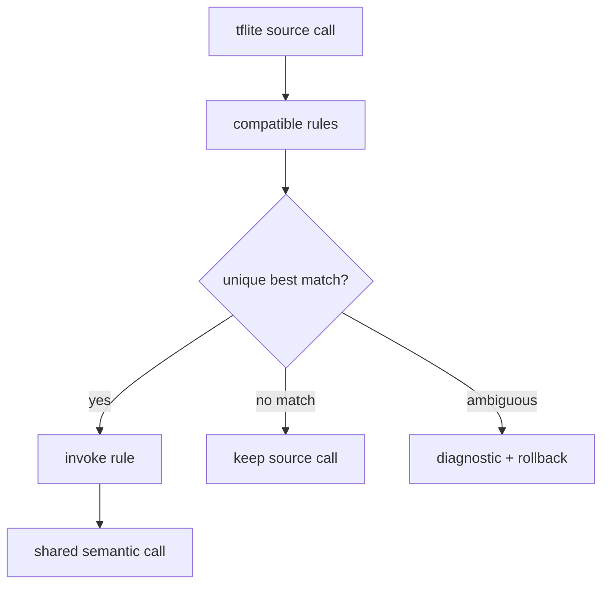

# `tflite.nn`

`tflite.nn` bridges decoded TFLite calls to shared semantics. Its public
surface is deliberately smaller than the ONNX bridge.

## API

```jog
fn convert(m: Mod) -> bool;
fn convert(m: Mod, rules: list<Fn>) -> bool;
```

## Usage

```sh
joggle run tflite.nn.convert source.jog \
  -M build/modules > semantic.jog
joggle query opt.unresolved semantic.jog -M build/modules
joggle query opt.untyped semantic.jog -M build/modules
```

Expected healthy output for both queries is an empty list:

```text
[]
```

If the first list is nonempty, a call has no matching declaration after the
selected conversions. If the second is nonempty, calls may resolve but one or
more result types still contain open terms.

## Custom conversion policy

```jog
fn convert_selected(m: Mod) -> bool {
  let rules = ir.where(ir.fns("my_tflite"), "role", "convert")
  return tflite.nn.convert(m, rules)
}
```

Each rule is visible source and participates in the same transaction. A failed
rule leaves no partial conversion.

Rules normally follow this shape:

```jog
[role: "convert"]
fn relu(m: Mod, source: Op) -> bool {
  // Inspect the source operation and its typed operands.
  // Build the shared semantic replacement before erasing source.
  // Return true only when the graph changed.
  return false
}
```

The snippet shows the callback contract, not a replacement for the bundled
ReLU rule. Project rules should live in a separate mod and be passed explicitly
so upgrading the official bridge does not overwrite local policy.

## Boundary

This mod does not decode FlatBuffers and does not prepare a target. Unknown or
unsupported calls remain in the graph for explicit diagnostics.

## Internal mechanism

`convert(m, rules)` visits live source calls, filters the supplied rule list by
normal typed matching, and invokes the selected rule inside the current graph
transaction. The zero-argument overload supplies the bundled conversion rules.



## Failure guide

| Observation | Meaning | Correction |
| --- | --- | --- |
| `convert` returns false | no selected call changed | inspect unresolved source calls |
| source call remains | no compatible rule | add a narrow rule or retain it intentionally |
| ambiguity diagnostic | equally specific rules | specialize signatures/metadata |
| transaction rolls back | a rule violated graph invariants | build then redirect then erase |

The bridge is intentionally conservative: keeping one explicit unsupported
call is safer than replacing it with a superficially similar operation whose
padding, quantization, or axis rules differ.
