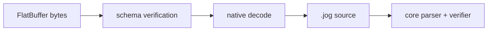

# `tflite`

`tflite` is an optional FlatBuffers decoder. Enable it with
`-DJOGGLE_BUILD_TFLITE=ON` and provide a compatible FlatBuffers package.

## API

```jog
[role: "read"]
fn read(data: bytes) -> str;
fn model(info: dict) -> _;
fn tensor(data: bytes) -> _;
```

## Input and output contract

| Item | Contract |
| --- | --- |
| input | one complete TFLite FlatBuffer as `bytes` |
| output | deterministic `.jog` source text |
| dependency | native `tflite` mod built with FlatBuffers |
| semantic conversion | deliberately not performed by `read` |

## Usage

```sh
joggle read tflite.read model.tflite -M build/modules > source.jog
joggle check source.jog -M build/modules > /dev/null
joggle query opt.unresolved source.jog -M build/modules
```

The output retains source operator identity, model metadata, and tensor
payloads. Decoding is intentionally separate from semantic conversion.

A complete staged use keeps both artifacts:

```console
$ joggle read tflite.read model.tflite -M build/modules > decoded.jog
$ joggle check decoded.jog -M build/modules > canonical.jog
$ joggle run tflite.nn.convert canonical.jog \
    -M build/modules > semantic.jog
$ joggle query opt.unresolved semantic.jog -M build/modules
[]
```

An empty final list means all calls resolve after conversion. It does not yet
mean a particular target accepts every operation; query that target separately.

## Source boundary

```jog
// Schematic only; the decoder prints model-specific calls and attributes.
fn main(x: tensor<f32, [1, 4]>) -> _ {
  let y = tflite.RELU(x)
  return y
}
```

An open result records missing proof rather than invented shape information.

## Internal mechanism



The generated schema reader is confined to the native decoder. It validates
tables, indices, tensor buffers, and builtin option unions before rendering
source. The returned text then follows the same parser and graph ownership path
as a hand-written model.

This separation gives developers two inspectable failure boundaries: binary
decoding and semantic conversion. A converter bug does not require debugging a
FlatBuffer reader at the same time.

## Failure guide

Malformed buffers, invalid indices, or inconsistent tensor payloads fail with
source-oriented diagnostics. Unknown source operators remain visible.

| Symptom | Meaning | Action |
| --- | --- | --- |
| decoder rejects the file | structural/schema failure | verify model and schema version |
| decoded graph contains `_` | type/shape is not yet proved | run conversion/inference or add a rule |
| `tflite.*` remains unresolved | missing semantic conversion | inspect operator options and implement a rule |
| semantic graph hits target frontier | target coverage gap | lower/expand or add target support |

> [!IMPORTANT]
> Successful decoding proves that Joggle can represent the source model. It
> does not by itself prove numerical equivalence or deployment support.
