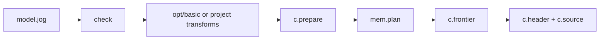
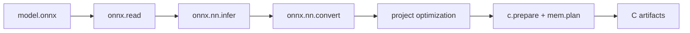
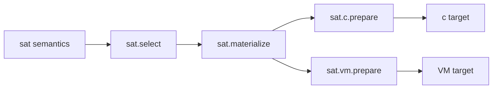

# Built-in mods

Every bundled capability is an ordinary mod loaded through an explicit search
root. There is no privileged pass registry behind this catalogue. The same
package rules apply to official and external mods.

> [!IMPORTANT]
> A mod name identifies one responsibility. Importing a frontend does not
> silently convert it, and importing a target does not silently optimize or
> allocate the graph. Compose those stages explicitly.

## Catalogue

| Layer | Mod | Owns | Does not own |
| --- | --- | --- | --- |
| core | [`base`](core/base.md) | compile-time values, type terms, generic operators | graph traversal |
| core | [`ir`](core/ir.md) | graph reflection and transactional edits | domain semantics |
| semantics | [`tensor`](semantics/tensor.md) | tensor type, shapes, indexing, reductions | NN naming or target layout |
| semantics | [`nn`](semantics/nn.md) | neural-network operator semantics | source-format decoding |
| semantics | [`math`](semantics/math.md) | portable scalar math declarations | target library selection |
| semantics | [`quant`](semantics/quant.md) | explicit quantization arithmetic | device quantization policy |
| analysis | [`stat`](analysis/stat.md) | callback-driven integer aggregation | definition of the cost unit |
| analysis | [`bounds`](analysis/bounds.md) | conservative integer intervals | probabilistic ranges |
| transform | [`opt`](transforms/opt.md) | generic worklists, cleanup, selection | one fixed pipeline |
| transform | [`mem`](transforms/mem.md) | capacity/lifetime-based slot planning | host allocation |
| transform | [`tile`](transforms/tile.md) | legality-checked loop restructuring | target profitability policy |
| frontend | [`onnx`](frontends/onnx.md) | ONNX byte decoding | shared semantic conversion |
| frontend | [`onnx.nn`](frontends/onnx-nn.md) | ONNX inference and conversion rules | protobuf decoding |
| frontend | [`tflite`](frontends/tflite.md) | TFLite byte decoding | shared semantic conversion |
| frontend | [`tflite.nn`](frontends/tflite-nn.md) | TFLite conversion rules | FlatBuffer decoding |
| target | [`c`](targets/c.md) | C capability, ABI, and artifacts | C compiler invocation |
| target | [`vm`](targets/vm.md) | deterministic image and executor | native latency prediction |
| numeric example | [`sat`](numeric/sat.md) | parametric saturating semantics | target representation |
| numeric example | [`sat.c`](numeric/sat-c.md) | saturating-to-C preparation | semantic definition |
| numeric example | [`sat.vm`](numeric/sat-vm.md) | saturating-to-VM preparation | semantic definition |

## How to read a mod page

Each dedicated page answers the same questions in the same order:

1. What responsibility belongs to this mod?
2. Which public functions may a caller use?
3. What complete `.jog` input and command exercise the API?
4. What output should the caller observe and how is it interpreted?
5. Which internal graph mechanism produces that result?
6. Which failures are expected, and which adjacent mod owns the next stage?

The page is the user/developer contract. You should not need to inspect tests to
discover normal usage.

## Inspect the installed build

```console
$ ./build/joggle mod list -M build/modules
base
bounds
c
ir
math
mem
nn
opt
quant
stat
tensor
tile
vm
```

Optional builds add frontend or numeric packages. Inspect one package with:

```console
$ ./build/joggle mod info ir -M build/modules
$ ./build/joggle mod check ir -M build/modules
```

`mod info` derives its overload list from the loaded declarations, so it is the
authoritative surface for that exact build. This website explains how and why
to use the surface; the command resolves configuration-dependent availability.

## Typical compositions

### Hand-written semantic model to C



### ONNX model to C



### Parametric numeric extension



These are compositions, not hard-coded pipelines. A project can insert its own
analysis, policy, transformation, or target package at the visible boundaries.

## Dependency direction

The intended dependency direction prevents frontend/target concerns from
leaking into semantics:

```text
base <- ir <- analyses/transforms
base <- tensor <- nn / quant
source decoder -> source bridge -> shared semantics
shared semantics -> target companion -> target
```

Avoid importing `c` from a semantic mod or importing `onnx` from an optimization
policy. Such edges make reusable definitions depend on one source or target.

## Choosing the next page

- Start with [`base`](core/base.md) when writing value-level policy code.
- Continue with [`ir`](core/ir.md) before mutating a graph.
- Read [`tensor`](semantics/tensor.md) before `nn`, `quant`, or shape-heavy work.
- Read [`opt`](transforms/opt.md) before implementing a custom worklist.
- Read one decoder and its matching bridge together.
- Read `c` or `vm` only after the semantic graph is explicit and typed.
