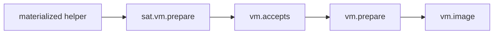

# `sat.vm`

`sat.vm` is the VM representation companion for `sat`.

## API

```jog
fn prepare(m: Mod) -> bool;
```

## Pipeline

```sh
joggle run sat.select model.jog -M build/modules > selected.jog
joggle run sat.materialize selected.jog \
  --arg '[8, 16]' --arg '[i8, i16]' \
  -M build/modules > materialized.jog
joggle run sat.vm.prepare vm.prepare materialized.jog \
  -M build/modules > prepared.jog
joggle emit vm.image prepared.jog -M build/modules > model.vm
```

The semantic selection/materialization stages are shared with C. Only the final
target preparation differs.

The healthy artifact path is:

```text
sat<W> source
  -> selected semantic implementation
  -> materialized width helper
  -> VM representation
  -> prepared VM image
```

Each arrow is an explicit command boundary, so a failure can be attributed to
selection, storage policy, VM representation, or generic VM capability.

## Verification

Execute the image through `vm.run` and compare bytes/results with `sat.sim` or a
pinned reference. The VM step count is useful deterministic evidence but is not
native latency.

For example, a `sat<8>` addition of 120 and 20 must decode to 127 after
execution. Check negative overflow separately; one upper-bound example does not
cover signed saturation.

## Internal mechanism

`sat.vm.prepare` bridges concrete saturating helpers to operations that
`vm.accepts` recognizes. The generic VM mod remains unaware of the original
parametric semantic type.



## Failure guide

| Symptom | Meaning | Correction |
| --- | --- | --- |
| VM still rejects helper | companion did not recognize representation | inspect materialized width/type |
| image entry is absent | wrong entry selection | emit complete image or correct qualified name |
| byte result looks reversed | caller packing/endian mismatch | follow VM ABI packing |
| step count differs after refactor | generated instruction path changed | compare values first, then inspect image |

> [!WARNING]
> Equality with `sat.sim` validates the selected cases only. Cover lower clamp,
> upper clamp, in-range sums, multiple widths, and boundary operands.
