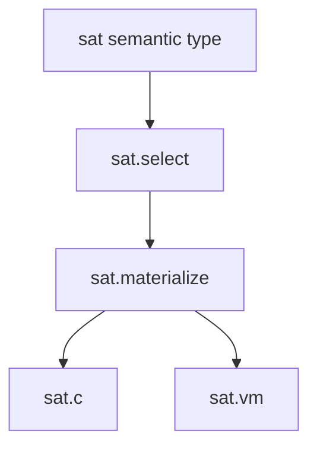
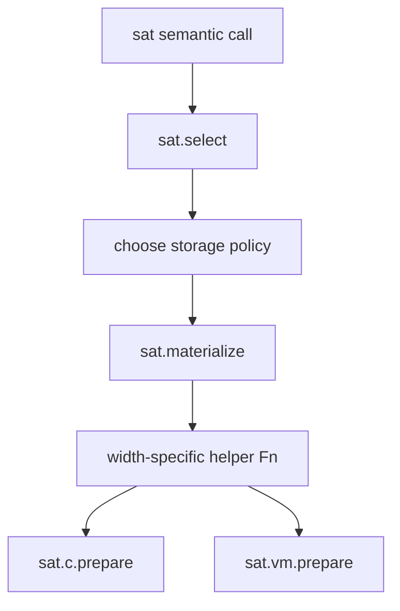

# `sat`

`sat` is an optional worked example of a user-defined parametric numeric type.
Enable it with `-DJOGGLE_BUILD_SAT=ON`.



## Type and semantic API

```jog
fn sat<W: int>() -> Ty;
fn +<W: int>(a: sat<W>, b: sat<W>) -> sat<W>;
fn add<W: int>(a: sat<W>, b: sat<W>) -> sat<W>;
fn supports(type: Ty) -> bool;
```

```jog
mod audio
use sat

fn mix(a: sat<16>, b: sat<16>) -> sat<16> {
  return a + b
}
```

The width is an integer type term. No core enum or class is added for `sat`.

For `sat<8>`, representable values are clamped to the configured signed
eight-bit range. The semantic call remains `sat.add`; storage selection happens
later so the same model can be prepared for multiple targets.

## Reference behavior

```jog
fn sim(width: int, a: int, b: int) -> int;
fn emit(width: int) -> str;
```

```sh
joggle query sat.sim model.jog \
  --arg 8 --arg 120 --arg 20 -M build/modules
```

`sim` is a compile-time scalar reference. `emit` materializes helper source for
one width.

Example result:

```text
$ joggle query sat.sim model.jog --arg 8 --arg 120 --arg 20 -M build/modules
127
```

The mathematical sum is 140; the result clamps at the signed eight-bit upper
bound. Use this scalar reference to understand semantics, not as a replacement
for executing a complete tensor/model path.

## Selection and materialization

```jog
fn select(m: Mod) -> bool;
fn storage(type: Ty, limits: list<int>, types: list<Ty>) -> Ty;
fn stored(type: Ty, limits: list<int>, types: list<Ty>) -> Ty;
fn materialize(m: Mod, limits: list<int>, types: list<Ty>) -> bool;
```

```sh
joggle run sat.select model.jog -M build/modules > selected.jog
joggle run sat.materialize selected.jog \
  --arg '[8, 16]' --arg '[i8, i16]' \
  -M build/modules > materialized.jog
```

`limits` and `types` are a visible policy mapping. Unsupported widths fail or
remain unmaterialized instead of acquiring a hidden machine type.

## Internal mechanism

`sum_template` and `helper` expose function-level building blocks used to clone
width-specific helpers. The resulting functions are normal graph objects and
participate in verification and target preparation.



### Why selection and materialization are separate

`select` finds semantic calls and records the need for an implementation.
`materialize` receives the width limits and candidate storage types explicitly.
The split makes target policy reviewable: changing `[8, 16] -> [i8, i16]` does
not edit the core type system or silently affect another target.

### Function-level extension

`sum_template()` returns the generic helper function. `helper(m, width, type)`
creates or locates a concrete helper for the selected representation. Both are
ordinary `Fn` handles, so other tooling can inspect names, bodies, metadata, and
dependencies through `ir`.

## Failure guide

| Symptom | Meaning | Correction |
| --- | --- | --- |
| unsupported width remains | no limit/storage mapping covers it | extend explicit policy |
| limit/type lists differ in length | malformed materialization policy | provide one type per limit |
| C frontier retains `sat.*` | target companion was not prepared | run `sat.c.prepare` before `c.prepare` |
| VM image rejects operation | VM companion/preparation missing | run `sat.vm.prepare` then `vm.prepare` |
| `sim` differs from model | type width or signed range differs | compare selected materialized type |

> [!NOTE]
> `sat` is both a useful numeric extension and a complete example of adding a
> parametric type without adding a type enum, rewrite registry, or target case
> to the core engine.
