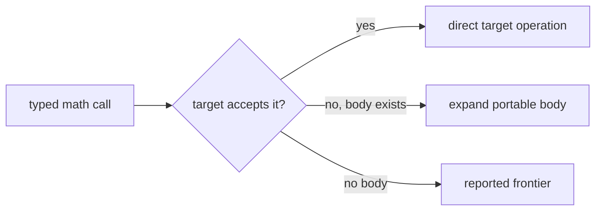

# `math`

`math` declares scalar mathematical functions with `f32` and `f64` overloads.
It gives model/source code a stable semantic name while targets decide how to
represent the call.

## Public families

| Unary | Binary |
| --- | --- |
| `abs`, `ceil`, `cos`, `erf`, `exp`, `floor`, `log`, `sin`, `sqrt`, `tanh`, `round_even` | `fmod`, `pow` |

## Public surface

Every function has an `f32 -> f32` and an `f64 -> f64` overload. Binary
functions take two operands of the same width.

| Function | Mathematical role | Arity | Important domain condition |
| --- | --- | --- | --- |
| `abs` | absolute value | unary | all finite inputs |
| `ceil`, `floor`, `round_even` | integral rounding | unary | result stays floating-point |
| `sin`, `cos`, `tanh` | trigonometric/hyperbolic | unary | radians for `sin`/`cos` |
| `exp`, `log` | exponential/logarithm | unary | `log(x)` expects `x > 0` |
| `sqrt` | square root | unary | expects `x >= 0` |
| `erf` | error function | unary | all finite inputs |
| `fmod` | floating remainder | binary | divisor must be nonzero |
| `pow` | exponentiation | binary | follows target floating semantics |

## Worked example

```jog
mod statistics
use math

fn gaussian(f: f64, x: f64) -> f64 {
  let exponent = -(x * x) / f64(2)
  return math.exp(exponent) / math.sqrt(f64(2) * f)
}
```

Input program:

```jog
mod demo_math
use math

fn main(x: f32) -> f32 {
  let magnitude = math.abs(x)
  return math.sqrt(magnitude)
}
```

Type checking produces the same canonical program because `math` contributes
declarations, not a mandatory lowering pass:

```console
$ joggle check demo_math.jog -M build/modules
mod demo_math
use math

fn main(x: f32) -> f32 {
  let magnitude = math.abs(x)
  return math.sqrt(magnitude)
}
```

The input to `abs` is `f32`, so overload resolution chooses
`math.abs(f32) -> f32`. That result fixes the `sqrt` call to its `f32`
overload. No implicit promotion to `f64` occurs.

Widths must match an overload:

```jog
fn root32(x: f32) -> f32 { return math.sqrt(x) }
fn root64(x: f64) -> f64 { return math.sqrt(x) }
```

## Target behavior

`c.prepare`/`c.source` map supported declarations to C library operations and
add required headers. A target that cannot represent one keeps it on its
frontier or expands a supplied body; the core does not silently change
precision.

```sh
joggle query c.frontier model.jog -M build/modules
```

Common failure: calling `math.sqrt` with `i32` or an unresolved `_` has no
matching overload. Convert explicitly or finish inference.

## Internal mechanism

Most entries are body-less declarations. Their meaning is the combination of
the typed name and the target implementation selected later. `round_even` is
different: it has a portable `.jog` body, so a target may expand it when it has
no direct operation. This illustrates the normal Joggle rule:



The semantic name is never silently rewritten merely because a platform has a
similar instruction. Target preparation owns that decision.

## Failure guide

| Symptom | Meaning | Correction |
| --- | --- | --- |
| no matching overload for `i32` | `math` is floating-point only | convert the value explicitly |
| no matching overload for `_` | inference has not fixed a width | finish frontend/type inference first |
| call appears in `c.frontier` | C preparation cannot represent it yet | expand a body or add a target implementation |
| numerical difference at an edge | target library semantics differ | pin tolerances and edge cases in the application |

> [!IMPORTANT]
> `math` specifies typed operations; it does not promise bit-identical results
> across C libraries, VM implementations, rounding modes, or exceptional
> floating-point inputs.
