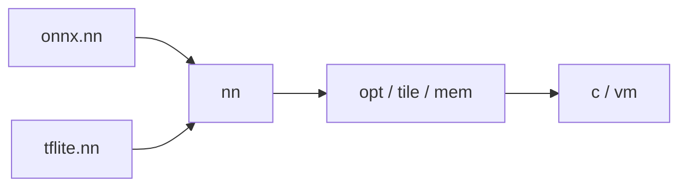
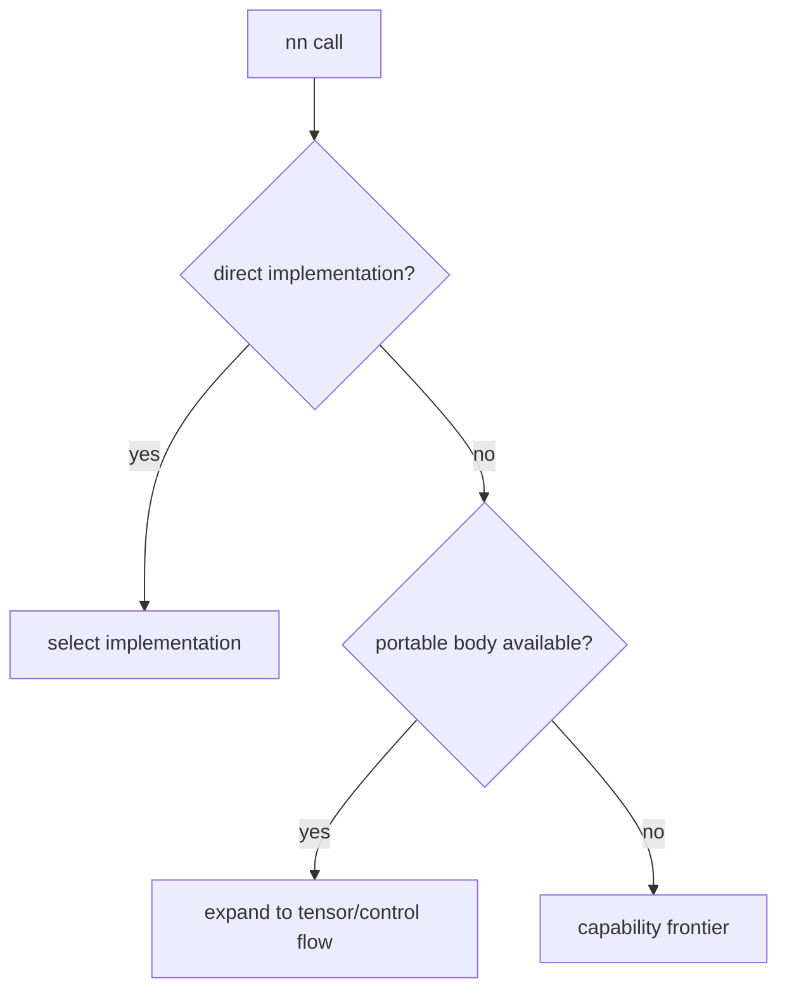

# `nn`

`nn` is the shared semantic vocabulary to which frontends convert. It builds on
`tensor`; it does not decode ONNX/TFLite, choose hardware kernels, or emit code.



## Activation family

```jog
fn relu<E: Ty, S: list<int>>(x: tensor<E, S>) -> tensor<E, S>;
fn leaky_relu<E: Ty, S: list<int>>(
  x: tensor<E, S>, alpha: f64) -> tensor<E, S>;
fn clip<E: Ty, S: list<int>, L: list<int>, H: list<int>>(
  x: tensor<E, S>, lower: tensor<E, L>, upper: tensor<E, H>)
  -> tensor<E, S>;
```

```jog
fn relu6<E: Ty, S: list<int>>(x: tensor<E, S>) -> tensor<E, S> {
  let low = tensor<E, []>(E(0))
  let high = tensor<E, []>(E(6))
  return nn.clip(x, low, high)
}
```

Other public activation/scalar families include `tanh`, `sigmoid`, `sqrt`,
`exp`, `log`, `erf`, and configurable `activate`.

## Elementwise family

`add`, `sub`, `mul`, `div`, `maximum`, `minimum`, `pow`, comparisons, and
`where` have same-shape and broadcast forms.

```jog
fn gated<E: Ty, S: list<int>>(
  condition: tensor<bool, S>,
  left: tensor<E, S>,
  right: tensor<E, S>
) -> tensor<E, S> {
  return nn.where(condition, left, right)
}
```

## Convolution

The general overload makes layout explicit:

```jog
fn conv2d<E: Ty, X: list<int>, K: list<int>, Y: list<int>>(
  x: tensor<E, X>, weight: tensor<E, K>,
  stride: list<int>, pad: list<int>, dilation: list<int>, groups: int,
  x_axes: list<int>, weight_axes: list<int>, out_axes: list<int>
) -> tensor<E, Y>;
```

The NCHW/OIHW convenience overload omits axis lists:

```jog
return nn.conv2d(x, weight, [1, 1], [0, 0, 0, 0], [1, 1], 1)
```

Biased/activated overloads compose `conv2d`, `bias`, and `activate`. The
`examples/mods/compact` package demonstrates selecting an alternative fused
body without changing `nn`.

## Pooling, normalization, detection, and shape-dependent results

The package also contains pooling, normalization, linear/recurrent, reduction,
NMS, and `nonzero` semantics. Some results retain `_` dimensions:

```jog
fn nonzero<E: Ty, S: list<int>, R: int>(
  x: tensor<E, S>
) -> tensor<i64, [R, _]>;
```

The dynamic axis is honest semantic information; bounded allocation requires a
later proof/capacity, not a guessed fixed shape.

## Implementation boundary

1. A frontend converts source calls to `nn` calls.
2. Type inference closes available shape terms.
3. An implementation package may expand/select a body.
4. Structural transforms edit the exposed loop graph.
5. A target checks its frontier and emits.

Inspect full overload families with `joggle mod info nn -M build/modules`.

## A complete small model

```jog
mod classifier
use nn

fn main(
  x: tensor<f32, [1, 4]>,
  weight: tensor<f32, [4, 3]>,
  bias: tensor<f32, [3]>
) -> tensor<f32, [1, 3]> {
  let logits = nn.linear(x, weight, bias)
  return nn.softmax(logits, 1, 1.0)
}
```

```console
$ joggle check classifier.jog -M build/modules > checked.jog
$ joggle query opt.untyped checked.jog -M build/modules
[]
```

The `linear` result has shape `[1, 3]`: `1` comes from the batch axis of `x`,
and `3` from the output axis of `weight`. `softmax(..., 1, 1.0)` normalizes the
last axis with unit beta and preserves shape. The empty query confirms closed types; it does
not claim target support or numerical accuracy.

## Choosing between `nn` and `tensor`

| Intent | Preferred API | Reason |
| --- | --- | --- |
| matrix multiplication without bias | `tensor.matmul` | domain-neutral algebra |
| learned affine projection | `nn.linear` | preserves NN-level intent |
| generic elementwise arithmetic | tensor operators | no NN policy needed |
| ReLU or sigmoid | `nn` activation | shared NN semantics |
| axis reduction | `tensor.sum/mean/min/max` | structural tensor operation |
| convolution, pooling, normalization | `nn` | contract includes NN conventions |

Preserving the highest useful semantic level gives implementation-selection
mods more information. Expand to loops only when a target or transform needs
that representation.

## Internal organization

| Fragment | Responsibility |
| --- | --- |
| `activation.jog` | ReLU, leaky ReLU, clipping, tanh, sigmoid |
| `elementwise.jog` | broadcasting arithmetic and unary maps |
| `linear.jog` | linear and GEMM forms |
| `conv.jog` | convolution, bias/activation composition, padding |
| `pool.jog` | average/max/global pooling and resize |
| `norm.jog` | batch, local-response, softmax, layer normalization |
| `detect.jog` | nonzero and non-maximum suppression |

These are source fragments, not separate runtime dialects. All declarations
load into one mod and resolve through ordinary overloads.

## Mechanism

Many `nn` functions contain portable `.jog` bodies expressed with tensor
operations, loops, and scalar math. A target can accept a high-level call
directly, select a specialized implementation, or expand the body.



No step depends on a string switch inside the core. Typed function matching
selects the body or implementation.

## Failure guide

| Symptom | Likely cause | Correction |
| --- | --- | --- |
| no matching `conv2d` | element/layout/attribute types disagree | inspect exact overloads and arguments |
| result contains `_` | dimension relation is not proved | finish inference or make terms explicit |
| converted op has wrong shape | frontend axis/padding mismatch | fix the frontend bridge |
| target frontier contains `nn.*` | no direct representation | expand or add an implementation |
| mismatch after expansion | semantic body or conversion issue | compare at the `nn` boundary |

> [!IMPORTANT]
> Layout strings, padding, strides, dilations, and axes are semantic inputs.
> Do not discard them merely because a common model uses their defaults.
