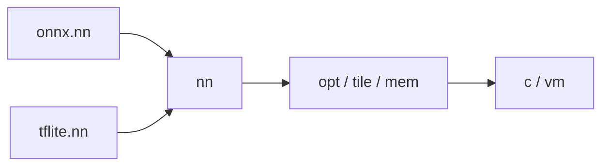
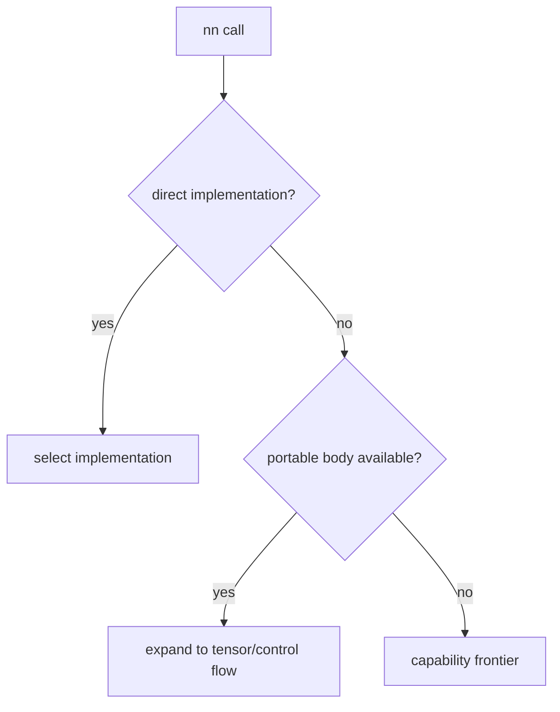

# `nn`

`nn` is the shared semantic vocabulary to which frontends convert. It builds on
`tensor`; it does not decode ONNX/TFLite, choose hardware kernels, or emit code.


```mermaid
flowchart LR
    O[onnx.nn] --> N[nn]
    F[tflite.nn] --> N
    N --> X[opt / tile / mem]
    X --> T[c / vm]
```

## Activation family

```jog
fn relu<E: Ty, S: list<int>>(x: tensor<E, S>) -> tensor<E, S>;
fn leaky_relu<E: Ty, S: list<int>>(
  x: tensor<E, S>, alpha: f64) -> tensor<E, S>;
fn clip<E: Ty, S: list<int>, L: list<int>, H: list<int>>(
  x: tensor<E, S>, lower: tensor<E, L>, upper: tensor<E, H>)
  -> tensor<E, S>;
```

```jog
fn relu6<E: Ty, S: list<int>>(x: tensor<E, S>) -> tensor<E, S> {
  let low = tensor<E, []>(E(0))
  let high = tensor<E, []>(E(6))
  return nn.clip(x, low, high)
}
```

Other public activation/scalar families include `tanh`, `sigmoid`, `sqrt`,
`exp`, `log`, `erf`, and configurable `activate`.

## Elementwise family

`add`, `sub`, `mul`, `div`, `maximum`, `minimum`, `pow`, comparisons, and
`where` have same-shape and broadcast forms.

`neg` preserves a tensor's shape and applies scalar negation elementwise:

```jog
fn reverse_sign(x: tensor<f32, [3]>) -> tensor<f32, [3]> {
  return nn.neg(x)
}
```

For input `[1.5, -2.0, 4.0]`, this returns `[-1.5, 2.0, -4.0]`.
The ONNX frontend maps `Neg` to this operation through the same unary
shape-inference and conversion rules used by the other elementwise functions.

`add`, `sub`, `mul`, and `div` share a runtime broadcast implementation. Extents
and zero-stride indexing determine the shared output shape, including `_`
dimensions; no expanded input tensors are materialized. For example,
`nn.add` maps shapes `[2, 1]` and `[1, 3]` to `[2, 3]`. The same expression
with runtime extents `[0, 1]` and `[1, 3]` produces an empty `[0, 3]` result.

```jog
fn gated<E: Ty, S: list<int>>(
  condition: tensor<bool, S>,
  left: tensor<E, S>,
  right: tensor<E, S>
) -> tensor<E, S> {
  return nn.where(condition, left, right)
}
```

### Runtime broadcasting for arithmetic

The four arithmetic functions specialize rank and scalar operation while
reading logical extents from their inputs. A scalar-to-scalar operation uses
the scalar body directly, without constructing a broadcast layout. `NONE`
activation returns the arithmetic result without another allocation or copy.

```jog
fn outer_sum(x: tensor<i32, [2, 1]>, y: tensor<i32, [1, 3]>,
             rows: index, cols: index) -> tensor<i32, [_, _]> {
  var xs = tensor<index, [2]>(index(1))
  var ys = tensor<index, [2]>(index(1))
  xs[0] = rows
  ys[1] = cols
  let a: tensor<i32, [_, 1]> = tensor.view(x, xs)
  let b: tensor<i32, [1, _]> = tensor.view(y, ys)
  return nn.add(a, b)
}
```

For `x = [[2], [8]]` and `y = [[1, 2, 4]]`, with `rows` in `[0, 2]`
and `cols` in `[0, 3]`:

| `rows`, `cols` | Result | Logical shape |
| --- | --- | --- |
| `2, 3` | `[[3, 4, 6], [9, 10, 12]]` | `[2, 3]` |
| `1, 2` | `[[3, 4]]` | `[1, 2]` |
| `0, 3` | `[]` | `[0, 3]` |
| `2, 0` | `[[], []]` | `[2, 0]` |

Empty results perform no element access. Incompatible extents are rejected
before the element loop; integer division retains the element type's scalar
division semantics.

### Runtime broadcasting for extrema

`maximum` and `minimum` align input dimensions from the trailing axis. Equal
extents match; an extent of one expands to the other extent. The same rule
applies to runtime `_` dimensions, including an empty extent. The implementation
reads the original inputs with zero strides on expanded axes instead of
materializing broadcast copies.

```jog
fn row_maximum(x: tensor<i32, [2, 3]>, floor: tensor<i32, [3]>, rows: index)
    -> tensor<i32, [_, 3]> {
  var shape = tensor<index, [2]>(index(3))
  shape[0] = rows
  let prefix: tensor<i32, [_, 3]> = tensor.view(x, shape)
  return nn.maximum(prefix, floor)
}
```

For `x = [[0, 1, 2], [3, 4, 5]]` and `floor = [1, 4, 5]`:

| `rows` | Result | Shape |
| ---: | --- | --- |
| 0 | `[]` | `[0, 3]` |
| 1 | `[[1, 4, 5]]` | `[1, 3]` |
| 2 | `[[1, 4, 5], [3, 4, 5]]` | `[2, 3]` |

Here `rows` must lie between zero and two, within the source storage capacity.
Incompatible runtime extents are rejected before the element loop. Floating
extrema propagate a NaN from either operand; integer extrema use ordered
comparison without floating-point classification. Empty outputs perform no
element reads or writes.

## Convolution

The general overload makes layout explicit:

```jog
fn conv2d<E: Ty, X: list<int>, K: list<int>, Y: list<int>>(
  x: tensor<E, X>, weight: tensor<E, K>,
  stride: list<int>, pad: list<int>, dilation: list<int>, groups: int,
  x_axes: list<int>, weight_axes: list<int>, out_axes: list<int>
) -> tensor<E, Y>;
```

The NCHW/OIHW convenience overload omits axis lists:

```jog
return nn.conv2d(x, weight, [1, 1], [0, 0, 0, 0], [1, 1], 1)
```

Biased/activated overloads compose `conv2d`, `bias`, and `activate`. The
`examples/mods/compact` package demonstrates selecting an alternative fused
body without changing `nn`.

## Pooling, normalization, detection, and shape-dependent results

The package also contains pooling, normalization, linear/recurrent, reduction,
NMS, and `nonzero` semantics. Some results retain `_` dimensions:

```jog
fn nonzero<E: Ty, S: list<int>, R: int>(
  x: tensor<E, S>
) -> tensor<i64, [R, _]>;
```

The dynamic axis is explicit semantic information; bounded allocation requires a
later proof/capacity, not a guessed fixed shape.

`nms` accepts rank-three boxes and scores with a runtime candidate count, such
as `tensor<f32, [1, _, 4]>` and `tensor<f32, [1, 2, _]>`. Rank comes from the
type structure; candidate counts come from `tensor.dim`. The result contains
`[batch, class, box]` rows with shape `[selected, 3]`. A bounded-storage backend
also needs a capacity bound for its selected-row and suppression buffers.

`nonzero` reads the input's runtime dimensions and returns the coordinates of
nonzero elements in row-major traversal order. Each output row corresponds to
one input axis. Numeric inputs select values unequal to zero; Boolean inputs
select `true` through a private overload of the same predicate.

```jog
fn selected(x: tensor<f32, [4]>, count: index) -> tensor<i64, [1, _]> {
  let shape = tensor<index, [1]>(count)
  let prefix: tensor<f32, [_]> = tensor.view(x, shape)
  let mask: tensor<bool, [_]> = prefix > tensor<f32, []>(f32(0))
  return nn.nonzero(mask)
}
```

For `x = [-1, 2, 0, 3]`, the output depends on the prefix length:

| `count` | Selected coordinates | Output shape |
| ---: | --- | --- |
| 0 | `[]` | `[1, 0]` |
| 3 | `[[1]]` | `[1, 1]` |
| 4 | `[[1, 3]]` | `[1, 2]` |

The implementation first counts selected elements, then writes their coordinates.
Its allocation capacity is bounded by the input element count; its logical output
extent is the selected count. Here the view retains the four-element source
capacity while `count` controls the runtime extent. A two-dimensional input
`[[0, 1, 0], [2, 3, 0]]` produces `[[0, 1, 1], [1, 0, 1]]`, not flattened
indices. Empty inputs produce an empty coordinate result without reading input
elements or writing coordinate entries.

## Implementation boundary

1. A frontend converts source calls to `nn` calls.
2. Type inference closes available shape terms.
3. An implementation package may expand/select a body.
4. Structural transforms edit the exposed loop graph.
5. A target checks its frontier and emits.

Inspect full overload families with `joggle mod info nn -M build/modules`.

## A complete small model

```jog
mod classifier
use nn

fn main(
  x: tensor<f32, [1, 4]>,
  weight: tensor<f32, [4, 3]>,
  bias: tensor<f32, [3]>
) -> tensor<f32, [1, 3]> {
  let logits = nn.linear(x, weight, bias)
  return nn.softmax(logits, 1, 1.0)
}
```

```console
$ joggle check classifier.jog -M build/modules > checked.jog
$ joggle query opt.untyped checked.jog -M build/modules
[]
```

The `linear` result has shape `[1, 3]`: `1` comes from the batch axis of `x`,
and `3` from the output axis of `weight`. `softmax(..., 1, 1.0)` normalizes the
last axis with unit beta and preserves shape. The empty query confirms closed
types; artifact-mod coverage and numerical accuracy are separate checks.

## Choosing between `nn` and `tensor`

| Intent | Preferred API | Reason |
| --- | --- | --- |
| matrix multiplication without bias | `tensor.matmul` | domain-neutral algebra |
| learned affine projection | `nn.linear` | preserves NN-level intent |
| generic elementwise arithmetic | tensor operators | no NN policy needed |
| ReLU or sigmoid | `nn` activation | shared NN semantics |
| axis reduction | `tensor.sum/mean/min/max` | structural tensor operation |
| convolution, pooling, normalization | `nn` | contract includes NN conventions |

Preserving the highest useful semantic level gives implementation-selection
mods more information. Expand to loops only when a target or transform needs
that representation.

## Internal organization

| Fragment | Responsibility |
| --- | --- |
| `activation.jog` | ReLU, leaky ReLU, clipping, tanh, sigmoid |
| `elementwise.jog` | broadcasting arithmetic and unary maps |
| `linear.jog` | linear and GEMM forms |
| `conv.jog` | convolution, bias/activation composition, padding |
| `pool.jog` | average/max/global pooling and resize |
| `norm.jog` | batch, local-response, softmax, layer normalization |
| `detect.jog` | nonzero and non-maximum suppression |

These are source fragments, not separate runtime dialects. All declarations
load into one mod and resolve through ordinary overloads.

## Mechanism

Many `nn` functions contain portable `.jog` bodies expressed with tensor
operations, loops, and scalar math. A target can accept a high-level call
directly, select a specialized implementation, or expand the body.


```mermaid
flowchart TD
  N[nn call] --> D{direct implementation?}
  D -->|yes| I[select implementation]
  D -->|no| B{portable body available?}
  B -->|yes| E[expand to tensor/control flow]
  B -->|no| F[capability frontier]
```

No step depends on a string switch inside the core. Typed function matching
selects the body or implementation.

## Failure guide

| Symptom | Likely cause | Correction |
| --- | --- | --- |
| no matching `conv2d` | element/layout/attribute types disagree | inspect exact overloads and arguments |
| result contains `_` | dimension relation is not proved | finish inference or make terms explicit |
| converted op has wrong shape | frontend axis/padding mismatch | fix the frontend bridge |
| target frontier contains `nn.*` | no direct representation | expand or add an implementation |
| mismatch after expansion | semantic body or conversion issue | compare at the `nn` boundary |

> [!IMPORTANT]
> Layout strings, padding, strides, dilations, and axes are semantic inputs.
> Do not discard them merely because a common model uses their defaults.
