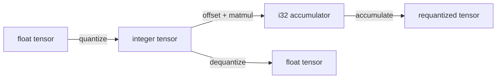
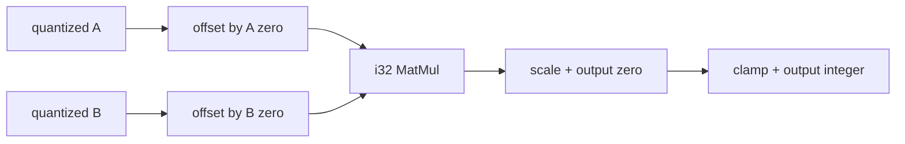

# `quant`

`quant` makes scale, zero point, axis, and integer range explicit. It owns
quantized semantics, not a particular instruction set.



## Quantize and dequantize

```jog
fn quantize<E: Ty, Q: Ty, S: list<int>, P: list<int>>(
  x: tensor<E, S>, scale: tensor<E, P>, zero: tensor<Q, P>,
  axis: int, low: int, high: int
) -> tensor<Q, S>;

fn dequantize<Q: Ty, E: Ty, S: list<int>, P: list<int>>(
  x: tensor<Q, S>, scale: tensor<E, P>, zero: tensor<Q, P>, axis: int
) -> tensor<E, S>;
```

```jog
fn restore<S: list<int>>(
  input: tensor<u8, S>,
  scale: tensor<f32, []>,
  zero: tensor<u8, []>
) -> tensor<f32, S> {
  return quant.dequantize(input, scale, zero, 0)
}
```

## Quantized MatMul

```jog
fn matmul<A: Ty, B: Ty,
          L: list<int>, R: list<int>, Y: list<int>,
          ZA: list<int>, ZB: list<int>>(
  a: tensor<A, L>, b: tensor<B, R>,
  a_zero: tensor<A, ZA>, b_zero: tensor<B, ZB>
) -> tensor<i32, Y>;
```

The result is an `i32` accumulator. `accumulate` applies scale/zero-point and
clamps to an explicit output range.

## Dynamic quantization

```jog
fn dynamic<E: Ty, S: list<int>>(
  x: tensor<E, S>
) -> (tensor<u8, S>, tensor<E, []>, tensor<u8, []>);
```

It returns data, scale, and zero point as separate typed results.

## Boundary

Per-tensor parameters use scalar shape `[]`; per-axis parameters use a shape
compatible with the named axis. Invalid parameter shape/axis relationships
must be rejected rather than broadcast by accident.

## Complete per-tensor example

```jog
mod quant_demo
use quant

fn round_trip<S: list<int>>(
  x: tensor<f32, S>,
  scale: tensor<f32, []>,
  zero: tensor<u8, []>
) -> tensor<f32, S> {
  let q = quant.quantize(x, scale, zero, 0, 0, 255)
  return quant.dequantize(q, scale, zero, 0)
}
```

| Input | Meaning |
| --- | --- |
| `x` | floating data to represent |
| `scale` | scalar step size |
| `zero` | integer value corresponding to real zero |
| axis `0` | ignored as a varying parameter axis for scalar parameters |
| range `0..255` | explicit unsigned output clamp |

The output has the same structural shape as `x`. It is generally not bit-equal
to `x`; quantization rounds and clamps before dequantization.

## Per-axis parameters

For channel-wise quantization, parameter tensors carry one element along the
selected axis. The bridge or caller must preserve the source format's axis
convention.

```text
data shape:       [1, 16, 32, 32]
parameter shape:  [16]
axis:             1
```

The example describes NCHW channel parameters. Using axis 3 would change the
meaning; it is not a harmless layout detail.

## Quantized MatMul path



`quant.matmul` produces an `i32` accumulation tensor. `quant.accumulate`
applies the combined scale and output zero point and clamps to explicit bounds.
Keeping the accumulator visible lets a target select a fused instruction or
expand the portable semantics without losing the intermediate contract.

## Dynamic quantization outputs

`dynamic` returns three values:

```jog
let data, scale, zero = quant.dynamic(x)
```

| Result | Type role |
| --- | --- |
| `data` | `tensor<u8, S>` quantized payload |
| `scale` | scalar tensor with the input floating element type |
| `zero` | scalar `u8` tensor |

Multi-result calls are ordinary graph operations. Each result has its own
`Val`, type, users, and metadata.

## Internal mechanism

Portable bodies use tensor indexing, scalar conversion, rounding, offsetting,
clamping, and MatMul. The mod does not query a device. Target-specific fused
quantization belongs in an implementation/target package selected later.

## Failure guide

| Symptom | Meaning | Correction |
| --- | --- | --- |
| parameter shape rejected | not scalar or incompatible with axis | correct source conversion/axis |
| zero-point type mismatch | data and zero representations disagree | use matching integer type |
| accumulator overflow concern | selected semantics/storage insufficient | analyze range or choose wider path |
| target frontier contains quant call | no fused/direct representation | expand or add target implementation |
| numerical mismatch | rounding/clamp/axis convention differs | compare each explicit quant stage |

> [!IMPORTANT]
> Quantization parameters are semantic values. Do not bury scale, zero point,
> axis, or clamp range in target-only metadata.
