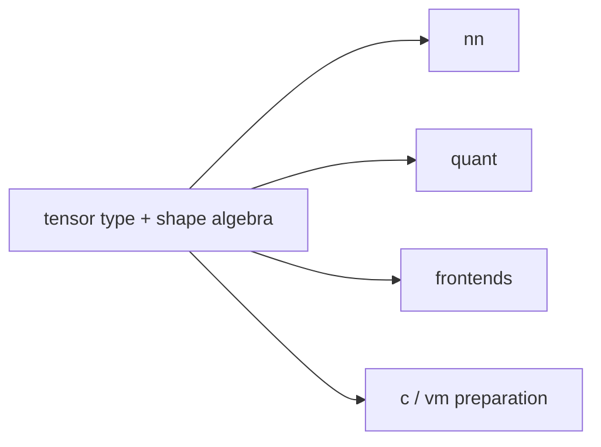

# `tensor`

`tensor` defines the semantic type `tensor<E, S>` and operations whose meaning
is independent of a neural-network frontend or target.



## Type and construction

```jog
fn tensor<E: Ty, S: list<int>>() -> Ty;
fn tensor<E: Ty, S: list<int>>(fill: E) -> tensor<E, S>;
fn make<E: Ty, I: Ty, S: list<int>, R: int>(
  fill: E, shape: tensor<I, [R]>) -> tensor<E, S>;
fn view<E: Ty, I: Ty, S: list<int>, T: list<int>, R: int>(
  data: tensor<E, S>, shape: tensor<I, [R]>) -> tensor<E, T>;
```

Static construction:

```jog
fn zeros<T: Ty, M: int, N: int>() -> tensor<T, [M, N]> {
  return tensor<T, [M, N]>(T(0))
}
```

`make` and `view` keep a dynamic shape value explicit while the result type
records the proved structural shape terms.

## Indexing and updates

```jog
fn diagonal<T: Ty, N: int>(x: tensor<T, [N, N]>) -> tensor<T, [N]> {
  var out = tensor<T, [N]>(T(0))
  for i in 0..N {
    out[i] = x[i, i]
  }
  return out
}
```

`[]` and `[]=` are overloads. Source assignment returns an updated tensor value
internally, so loops carry the new state explicitly.

## Shape and layout algebra

| Family | Purpose |
| --- | --- |
| `broadcastable`, `broadcast_shape`, `broadcast_offset` | prove/map broadcasting |
| `permutation`, `permuted`, `permute` | axis validation and transpose |
| `inserted`, `replaced`, `concatenated`, `concat` | derive result shapes |
| `tiled`, `tile_offset`, `tile` | repetition semantics |
| `slice` helpers | normalize and execute slicing |
| `line_offset` | row/axis address relation |

```jog
fn transpose<T: Ty, M: int, N: int>(
  x: tensor<T, [M, N]>
) -> tensor<T, [N, M]> {
  return tensor.permute(x, [1, 0])
}
```

## Elementwise and broadcasting

```jog
fn add_bias<T: Ty, M: int, N: int>(
  x: tensor<T, [M, N]>,
  bias: tensor<T, [N]>
) -> tensor<T, [M, N]> {
  let full: tensor<T, [M, N]> = tensor.broadcast(bias)
  return x + full
}
```

Same-shape overloads preserve `S`; broadcast overloads infer a result shape
`Y` from two structural shapes.

## MatMul

```jog
fn product<T: Ty, M: int, N: int, K: int>(
  a: tensor<T, [M, K]>,
  b: tensor<T, [K, N]>
) -> tensor<T, [M, N]> {
  return tensor.matmul(a, b)
}
```

The shared body is inspectable and can later be expanded, structurally tiled,
or replaced by an external implementation mod.

## Boundary and failure modes

- `tensor` owns semantics, not memory slots (`mem`) or loop profitability;
- shape helpers reject invalid axes/permutations instead of guessing;
- `_` dimensions may persist until inference proves them;
- target capability is checked separately with `c.frontier` or `vm.accepts`.

Inspect all overloads with `joggle mod info tensor -M build/modules`.

## Complete shape-preserving example

```jog
mod normalize
use tensor

fn center<T: Ty, M: int, N: int>(
  x: tensor<T, [M, N]>,
  mean: tensor<T, [N]>
) -> tensor<T, [M, N]> {
  let expanded: tensor<T, [M, N]> = tensor.broadcast(mean)
  return x - expanded
}
```

| Value | Type | Role |
| --- | --- | --- |
| `x` | `tensor<T, [M, N]>` | two-dimensional data |
| `mean` | `tensor<T, [N]>` | one value per trailing position |
| `expanded` | `tensor<T, [M, N]>` | explicit broadcast result |
| return | `tensor<T, [M, N]>` | centered data |

The annotation on `expanded` supplies the target shape to the broadcast
overload. That makes both the proof and a failure easy to locate.

## Shape terms versus runtime shape values

Joggle represents two different ideas:

- `[M, N]` inside `tensor<T, [M, N]>` is structural type information;
- a `tensor<i64, [2]>` value can carry two dimensions at runtime.

`tensor.shape(x)` produces a runtime shape tensor. `tensor.dims(type)` exposes
structural `Ty` terms to compiler code. Do not exchange the two accidentally.

```jog
fn structural(type: Ty) -> list<Ty> {
  assert(tensor.valid(type), "expected tensor type")
  return tensor.dims(type)
}
```

## Public families

| Family | Representative functions | Result invariant |
| --- | --- | --- |
| introspection | `valid`, `static`, `elem`, `shape`, `dims`, `type` | describes type structure |
| shape algebra | `refined`, `product`, `quotient`, `reduced` | returns structural terms |
| indexing | `[]`, `[]=`, `offset`, `coord`, `line_offset` | checked element access/update |
| layout | `reshape`, `permute`, `concat`, `tile`, `broadcast` | preserves mapped elements |
| slicing | `slice`, `gather`, `topk` | result follows indices and axes |
| reduction | `sum`, `mean`, `min`, `max` | reduces selected axes |
| linear algebra | `matmul` | contracts compatible inner dimensions |
| arithmetic | `cast`, `fill`, operators | elementwise work |

## Internal organization

| Fragment | Main concern |
| --- | --- |
| `shape.jog` | tensor recognition and dimension algebra |
| `index.jog` | indexed reads/writes and line offsets |
| `broadcast.jog` | broadcast and repetition mappings |
| `layout.jog` | concatenation, permutation, one-hot |
| `slice.jog` | gather, slice, top-k helpers |
| `reduce.jog` | reductions and MatMul |
| `arith.jog` | elementwise operations and casts |

The fragments load into one namespace. They keep implementation ownership
understandable without exposing seven packages to users.

## Mechanism

Tensor bodies express address and shape relations in normal `.jog`. This gives
`tile` analyzable loops and gives targets a choice between direct calls and
expansion. Structural type terms remain attached throughout edits and are
reverified transactionally.

## Failure guide

| Symptom | Meaning | Correction |
| --- | --- | --- |
| invalid permutation | duplicate/out-of-range axis | provide every axis exactly once |
| broadcast rejection | trailing dimensions incompatible | reshape or correct input |
| unresolved reshape dimension | product equality unproved | provide static/runtime evidence |
| index rejection | rank or coordinate mismatch | match the indexing overload |
| target rejects tensor call | semantics valid but unsupported | expand/select implementation |

> [!WARNING]
> A shape transformation must preserve its documented element mapping. Equal
> element counts alone do not justify permutation, slicing, or broadcasting.
