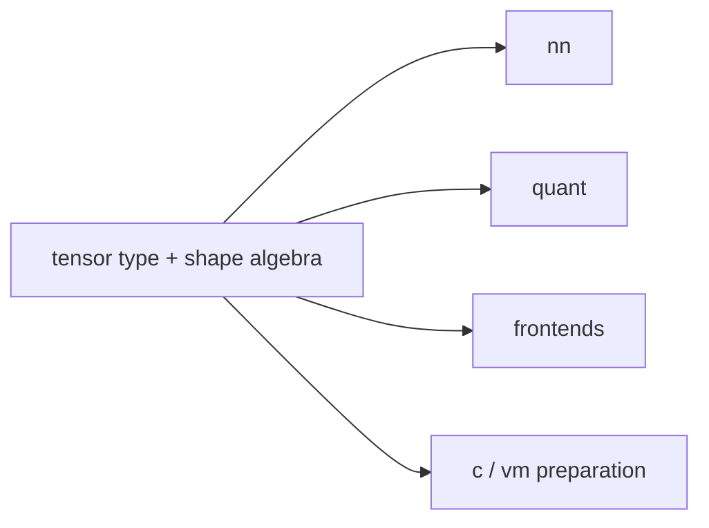

# `tensor`

`tensor` defines the semantic type `tensor<E, S>` and operations whose meaning
is independent of a neural-network frontend or target.


```mermaid
flowchart LR
    T[tensor type + shape algebra] --> N[nn]
    T --> Q[quant]
    T --> F[frontends]
    T --> C[c / vm preparation]
```

## Type and construction

```jog
fn tensor<E: Ty, S: list<int>>() -> Ty;
fn tensor<E: Ty, S: list<int>>(fill: E) -> tensor<E, S>;
fn make<E: Ty, I: Ty, S: list<int>, R: int>(
  fill: E, shape: tensor<I, [R]>) -> tensor<E, S>;
fn view<E: Ty, I: Ty, S: list<int>, T: list<int>, R: int>(
  data: tensor<E, S>, shape: tensor<I, [R]>) -> tensor<E, T>;
```

Static construction:

```jog
fn zeros<T: Ty, M: int, N: int>() -> tensor<T, [M, N]> {
  return tensor<T, [M, N]>(T(0))
}
```

`make` and `view` keep a dynamic shape value explicit while the result type
records the proved structural shape terms.

## Indexing and updates

```jog
fn diagonal<T: Ty, N: int>(x: tensor<T, [N, N]>) -> tensor<T, [N]> {
  var out = tensor<T, [N]>(T(0))
  for i in 0..N {
    out[i] = x[i, i]
  }
  return out
}
```

`[]` and `[]=` are overloads. Source assignment returns an updated tensor value
internally, so loops carry the new state explicitly.

## Shape and layout algebra

| Family | Purpose |
| --- | --- |
| `broadcastable`, `broadcast_shape`, `broadcast_offset` | prove/map broadcasting |
| `broadcast_layout` | runtime extents, paired input strides, and output count |
| `permutation`, `permuted`, `permute` | axis validation and transpose |
| `inserted`, `replaced`, `concatenated`, `concat` | derive result shapes |
| `tiled`, `tile_offset`, `tile` | repetition semantics |
| `slice` helpers | normalize and execute slicing |
| `line_offset` | row/axis address relation |

```jog
fn transpose<T: Ty, M: int, N: int>(
  x: tensor<T, [M, N]>
) -> tensor<T, [N, M]> {
  return tensor.permute(x, [1, 0])
}
```

## Comparisons with runtime broadcasting

`broadcast_layout<A, B, L, R, P, Q, D>(a, b)` is shared by tensor comparisons
and NN extrema. Set `P = len<L>`, `Q = len<R>`, and `D` to the result rank.
It returns `(shape, left_strides, right_strides, count)`: the first three
values are `tensor<index, [D]>`, and `count` is an `index`. Expanded axes have
zero input stride. Rank is specialized while dimensions may remain runtime
values; dimension compatibility and size overflow are checked before indexing.

Tensor `==`, `<`, and `>` return Boolean tensors. Their shapes are aligned
from the trailing axis: two extents must be equal or one must be one. An
extent of one broadcasts to the other extent, including zero. This rule uses
runtime dimensions when a type contains `_`.

```jog
fn positive_prefix(x: tensor<f32, [4]>, count: index) -> tensor<bool, [_]> {
  let shape = tensor<index, [1]>(count)
  let prefix: tensor<f32, [_]> = tensor.view(x, shape)
  return prefix > tensor<f32, []>(f32(0))
}
```

For `x = [-1, 0, 2, NaN]` and a valid prefix length:

| `count` | Result shape | Result |
| ---: | --- | --- |
| 0 | `[0]` | `[]` |
| 1 | `[1]` | `[false]` |
| 3 | `[3]` | `[false, false, true]` |
| 4 | `[4]` | `[false, false, true, false]` |

Floating-point comparisons follow scalar semantics: equality and ordered
comparisons with NaN are false. The empty result has no element reads or
writes. A zero-dimensional tensor is a scalar, distinct from an empty tensor.

Broadcasting also applies to multiple axes:

```jog
fn below_row(x: tensor<i32, [2, 3]>, threshold: tensor<i32, [1, 3]>,
             rows: index) -> tensor<bool, [_, 3]> {
  var shape = tensor<index, [2]>(index(3))
  shape[0] = rows
  let prefix: tensor<i32, [_, 3]> = tensor.view(x, shape)
  return prefix < threshold
}
```

With `x = [[0, 1, 2], [3, 4, 5]]`, `threshold = [[1, 4, 5]]`, and
`rows = 2`, the output is `[[true, true, true], [false, false, false]]`.
The implementation derives aligned extents and source strides, then indexes
the original tensors directly. It does not allocate broadcasted copies of
the inputs. Rank traversals are marked as shape work and specialized during
preparation; element loops retain runtime bounds.

For bounded C storage, the result capacity follows the input allocations and
the merged shape bounds. Conditional extents require bounds for every
reachable branch. Incompatible shapes, negative extents, and size overflow
are rejected before the element loop.

## Reshape with runtime extents

`reshape(x)` takes its complete destination shape from the result type.
For runtime dimensions, pass a shape tensor and the zero-dimension policy:

```jog
fn reshape<E: Ty, S: list<int>, T: list<int>, I: Ty, R: int>(
  x: tensor<E, S>, requested: tensor<I, [R]>, allowzero: bool
) -> tensor<E, T>;

fn regroup(x: tensor<i32, [2, 3]>, requested: tensor<i64, [2]>)
    -> tensor<i32, [_, _]> {
  return tensor.reshape(x, requested, false)
}
```

For `x = [[1, 2, 3], [4, 5, 6]]`:

| `requested` | Result shape | Result values |
| --- | --- | --- |
| `[3, 2]` | `[3, 2]` | `[[1, 2], [3, 4], [5, 6]]` |
| `[-1, 2]` | `[3, 2]` | `[[1, 2], [3, 4], [5, 6]]` |
| `[0, -1]` | `[2, 3]` | `[[1, 2, 3], [4, 5, 6]]` |

One `-1` infers an extent from the element count. With `allowzero = false`,
`0` copies the input extent at the same axis. With `allowzero = true`, `0`
is an empty dimension: an input of shape `[0, 3]` can become `[3, 0]`.
Two inferred axes, a non-divisible inferred size, negative extents other than
`-1`, integer overflow, and a changed element count are rejected.

The runtime overload constructs a checked shape and returns a view. It
preserves linear element order and does not allocate a second data buffer.
The C target retains the input's read-only qualifier for borrowed input views;
make a value copy before modifying the result.

## Runtime repetition

The two-argument `tile` reads every axis of its repeats tensor. The result may
have dynamic extents; C preparation uses the shape expressions' upper bounds
to size its storage.

```jog
fn repeat_grid(x: tensor<i32, [2, 3]>, twice: bool)
    -> tensor<i32, [_, _]> {
  var factor = index(1)
  if twice { factor = index(2) }
  var repeats = tensor<index, [2]>(factor)
  return tensor.tile(x, repeats)
}
```

For `x = [[1, 2, 3], [4, 5, 6]]`, `twice = false` produces the same `[2, 3]`
values. `twice = true` produces shape `[4, 6]`:

```text
1 2 3 1 2 3
4 5 6 4 5 6
1 2 3 1 2 3
4 5 6 4 5 6
```

The allocation holds at most 24 elements in both cases, while the returned
extents describe the selected shape. A zero repeat produces an empty axis.
Negative repeats, dimension/product overflow, and disagreement with a fixed
result shape are rejected before the copy loop.

## Concatenation

`concat(left, right, axis)` joins equal-rank tensors along one axis. Negative
axes count from the end. All other runtime extents must agree.

```jog
fn join_columns(left: tensor<i32, [2, 2]>, right: tensor<i32, [2, 1]>)
    -> tensor<i32, [2, 3]> {
  return tensor.concat(left, right, -1)
}
```

For `left = [[1, 2], [3, 4]]` and `right = [[5], [6]]`, the result is
`[[1, 2, 5], [3, 4, 6]]`. The implementation reads extents with `tensor.dim`,
builds the destination shape, and copies each axis segment in row-major order.
The same implementation accepts dynamic extents when their storage capacities
are bounded. Empty segments contribute no elements; invalid axes, mismatched
non-concatenated dimensions, and overflowing sizes are rejected.

## Elementwise and broadcasting

`cast` converts each logical element and preserves runtime extents. For
example, a bounded `tensor<i32, [1, _, 1]>` with logical shape `[1, 4, 1]`
becomes a `tensor<f32, [1, _, 1]>` with the same shape and four converted
values. If the open axis is zero, the result is empty and the conversion loop
performs no element access.

```jog
fn add_bias<T: Ty, M: int, N: int>(
  x: tensor<T, [M, N]>,
  bias: tensor<T, [N]>
) -> tensor<T, [M, N]> {
  let full: tensor<T, [M, N]> = tensor.broadcast(bias)
  return x + full
}
```

Same-shape overloads preserve `S`; broadcast overloads infer a result shape
`Y` from two structural shapes.

## MatMul

```jog
fn product<T: Ty, M: int, N: int, K: int>(
  a: tensor<T, [M, K]>,
  b: tensor<T, [K, N]>
) -> tensor<T, [M, N]> {
  return tensor.matmul(a, b)
}
```

The shared body is inspectable and can later be expanded, structurally tiled,
or replaced by an external implementation mod.

## Boundary and failure modes

- `tensor` owns semantics, not memory slots (`mem`) or loop profitability;
- shape helpers reject invalid axes/permutations instead of guessing;
- `_` dimensions may persist until inference proves them;
- target capability is checked separately with `c.frontier` or `vm.accepts`.

Inspect all overloads with `joggle mod info tensor -M build/modules`.

## Complete shape-preserving example

```jog
mod normalize
use tensor

fn center<T: Ty, M: int, N: int>(
  x: tensor<T, [M, N]>,
  mean: tensor<T, [N]>
) -> tensor<T, [M, N]> {
  let expanded: tensor<T, [M, N]> = tensor.broadcast(mean)
  return x - expanded
}
```

| Value | Type | Role |
| --- | --- | --- |
| `x` | `tensor<T, [M, N]>` | two-dimensional data |
| `mean` | `tensor<T, [N]>` | one value per trailing position |
| `expanded` | `tensor<T, [M, N]>` | explicit broadcast result |
| return | `tensor<T, [M, N]>` | centered data |

The annotation on `expanded` supplies the target shape to the broadcast
overload. That makes both the proof and a failure easy to locate.

## Shape terms versus runtime shape values

Joggle represents two different ideas:

- `[M, N]` inside `tensor<T, [M, N]>` is structural type information;
- a `tensor<i64, [2]>` value can carry two dimensions at runtime.

`tensor.shape(x)` produces a runtime shape tensor. `tensor.dims(type)` exposes
structural `Ty` terms to compiler code. Do not exchange the two accidentally.

```jog
fn structural(type: Ty) -> list<Ty> {
  assert(tensor.valid(type), "expected tensor type")
  return tensor.dims(type)
}
```

## Public families

| Family | Representative functions | Result invariant |
| --- | --- | --- |
| introspection | `valid`, `static`, `elem`, `shape`, `dims`, `type` | describes type structure |
| shape algebra | `refined`, `product`, `quotient`, `reduced` | returns structural terms |
| indexing | `[]`, `[]=`, `offset`, `coord`, `line_offset` | checked element access/update |
| layout | `reshape`, `permute`, `concat`, `tile`, `broadcast` | preserves mapped elements |
| slicing | `slice`, `gather`, `topk` | result follows indices and axes |
| reduction | `sum`, `mean`, `min`, `max` | reduces selected axes |
| linear algebra | `matmul` | contracts compatible inner dimensions |
| arithmetic | `cast`, `fill`, operators | elementwise work |

### Runtime-shape indexing and layout

`gather` and `permute` carry runtime dimensions into their result allocation.
The result type records the rank and known extents; its `_` axes are populated
from the input dimensions rather than replaced with a fixed size.

```jog
fn selected_rows(x: tensor<i32, [3, 2]>, indices: tensor<index, [2]>, n: index)
    -> tensor<i32, [_, 2]> {
  let shape = tensor<index, [1]>(n)
  let selected: tensor<index, [_]> = tensor.view(indices, shape)
  return tensor.gather(x, selected, 0)
}

fn transpose_prefix(x: tensor<i32, [2, 3]>, n: index)
    -> tensor<i32, [3, _]> {
  var shape = tensor<index, [2]>(index(3))
  shape[0] = n
  let prefix: tensor<i32, [_, 3]> = tensor.view(x, shape)
  return tensor.permute(prefix, [1, 0])
}
```

For `selected_rows`, use `x = [[0, 1], [2, 3], [4, 5]]` and
`indices = [-1, 0]`. Negative indices count from the selected axis's end:
`n = 1` returns `[[4, 5]]`, `n = 2` returns `[[4, 5], [0, 1]]`, and
`n = 0` returns a `[0, 2]` tensor. Scalar indices remove the selected axis;
an index tensor's axes replace that axis.

For `transpose_prefix`, use `x = [[0, 1, 2], [3, 4, 5]]`.
`n = 2` returns `[[0, 3], [1, 4], [2, 5]]`; `n = 1` returns
`[[0], [1], [2]]`; `n = 0` returns a `[3, 0]` tensor. `permute` validates
that its axis list contains each input axis exactly once and precomputes
source strides before copying elements. Both operations preserve logical
sizes separately from allocation capacities.

## Internal organization

| Fragment | Main concern |
| --- | --- |
| `shape.jog` | tensor recognition and dimension algebra |
| `index.jog` | indexed reads/writes and line offsets |
| `broadcast.jog` | broadcast and repetition mappings |
| `layout.jog` | concatenation, permutation, one-hot |
| `slice.jog` | gather, slice, top-k helpers |
| `reduce.jog` | reductions and MatMul |
| `arith.jog` | elementwise operations and casts |

The fragments load into one namespace. They keep implementation ownership
understandable without exposing seven packages to users.

## Mechanism

Tensor bodies express address and shape relations in normal `.jog`. This gives
`tile` analyzable loops and gives targets a choice between direct calls and
expansion. Structural type terms remain attached throughout edits and are
reverified transactionally.

## Failure guide

| Symptom | Meaning | Correction |
| --- | --- | --- |
| invalid permutation | duplicate/out-of-range axis | provide every axis exactly once |
| broadcast rejection | trailing dimensions incompatible | reshape or correct input |
| unresolved reshape dimension | product equality unproved | provide static/runtime evidence |
| index rejection | rank or coordinate mismatch | match the indexing overload |
| target rejects tensor call | semantics valid but unsupported | expand/select implementation |

> [!WARNING]
> A shape transformation must preserve its documented element mapping. Equal
> element counts alone do not justify permutation, slicing, or broadcasting.
