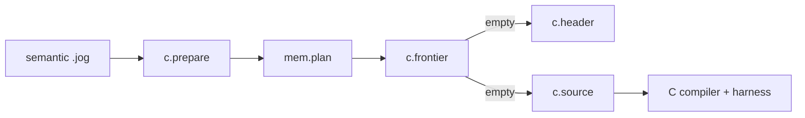
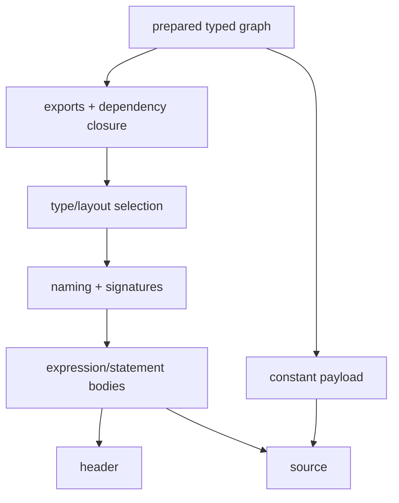

# `c`

`c` is a target mod, not a hidden lowering pipeline. Preparation edits are
explicit; artifact functions are read-only.



## Capability API

```jog
fn accepts(m: Mod, op: Op) -> bool;
fn accepts(m: Mod, op: Op, config: dict) -> bool;
fn frontier(m: Mod) -> list<str>;
fn frontier(m: Mod, config: dict) -> list<str>;
fn prepare(m: Mod) -> bool;
fn prepare(m: Mod, config: dict) -> bool;
```

```sh
joggle run c.prepare mem.plan model.jog -M build/modules > planned.jog
joggle query c.frontier planned.jog -M build/modules
```

Only an empty frontier is ready for emission.

## Complete artifacts

```jog
fn abi() -> dict;
fn api(m: Mod) -> list<dict>;
fn header(m: Mod) -> str;
fn source(m: Mod) -> str;
fn data(m: Mod) -> bytes;
```

Each has configuration and/or external-blob overloads where applicable.

```sh
joggle emit c.header planned.jog -M build/modules > model.h
joggle emit c.source planned.jog -M build/modules > model.c
cc -std=c11 -Wall -Wextra -Werror -pedantic-errors \
  -include model.h model.c harness.c -lm -o model
./model
```

`c.api` returns structured parameter/result descriptors so a host need not
scrape C text.

## Function-granular artifacts

| API | Result |
| --- | --- |
| `preamble` | includes and cross-function declarations |
| `declaration(name)` | one declaration |
| `definition(name/index)` | one complete definition |
| `definition_binding` | declaration plus definition head |
| `definition_head/storage/body/tail` | stable ordered pieces |
| `definition_body_chunk` | top-level operation range |
| `definition_nested_chunk/partition` | nested structural region |

Concatenating documented pieces reproduces the corresponding complete
artifact. Persistent tooling must still invalidate preamble/signatures when an
edit changes ABI, calls, headers, or payload policy.

## ABI contracts

```jog
[c: {name: "vendor_entry", noalias: true}]
fn entry(x: tensor<f32, [4]>) -> tensor<f32, [4]> {
  return x
}
```

`c.bind` changes `name`; `c.noalias` records a caller guarantee;
`c.restrict` proves eligible private calls; `c.place` controls storage scope.
Do not add `noalias` as a speculative speed hint.

## Dynamic shapes and data

Dynamic axes use adjacent extent parameters. A result may expose logical `_`
shape plus separate proved `mem.capacity`. External constant blobs use one
explicit data argument only for functions that transitively need it.

## Complete input/output path

Input model:

```jog
mod scalar_model
use base

[entry: true]
fn main(x: f32, y: f32) -> f32 {
  return x + y
}
```

Commands:

```console
$ joggle run c.prepare mem.plan scalar_model.jog \
    -M build/modules > planned.jog
$ joggle query c.frontier planned.jog -M build/modules
[]
$ joggle emit c.header planned.jog -M build/modules > model.h
$ joggle emit c.source planned.jog -M build/modules > model.c
```

Representative public declaration:

```c
float scalar_model_main(float x, float y);
```

The exact symbol follows the package/function name and any explicit `c.name`
binding. Include the emitted header; do not reproduce the signature manually in
a harness.

## Structured API output

`c.api(m)` returns data suitable for binding generators. A scalar entry has the
following conceptual shape:

```text
[
  {
    "name": "scalar_model_main",
    "params": [{"name": "x", "type": "f32"}, {"name": "y", "type": "f32"}],
    "results": [{"type": "f32"}]
  }
]
```

Use the actual dictionary fields from the installed build rather than parsing
this explanatory formatting. The important contract is that `c.api` is
structured while `c.header` and `c.source` are artifacts.

## Configuration

Artifact overloads accept a `dict` so target choices remain explicit. Typical
configuration affects scalar spelling, payload policy, declaration details, or
capability. Pass the same configuration to frontier, header, API, data, and
source functions; mixing configurations can make a checked frontier disagree
with emitted artifacts.

```jog
fn ready(m: Mod, config: dict) -> bool {
  return len(c.frontier(m, config)) == 0
}
```

## Internal organization

| Fragment | Responsibility |
| --- | --- |
| `capability.jog` | accepted operations and exposure |
| `contract.jog` | binding/noalias/restrict/place metadata |
| `types.jog` | Joggle-to-C representation |
| `naming.jog` | deterministic safe symbols |
| `signature.jog` | parameters, results, storage, function pieces |
| `expr.jog` | expression emission |
| `stmt.jog` | statements and structured control flow |
| `layout.jog` | tensor offsets, payloads, storage layout |
| `header.jog` | includes, declarations, type requirements |
| `api.jog` | structured API, data, and complete source artifacts |

All are `.jog` fragments in one `c` mod. The core engine does not contain a C
AST or an operator-by-operator C switch.

## Emission mechanism



Artifact functions are read-only. Any lowering needed to make the graph
representable belongs in `prepare` or an earlier explicit transform.

## Failure guide

| Symptom | Meaning | Correction |
| --- | --- | --- |
| nonempty frontier | unsupported semantic call remains | expand/select/add representation |
| header/source signature mismatch | artifacts used different graph/config | emit both from one prepared input |
| unbounded dynamic buffer | finite capacity not proved | run bounds/memory analysis or change ABI |
| C compiler warns/errors | emitter contract or unsupported platform detail | keep strict flags and inspect artifact |
| numerical output differs | semantic/lowering/data bug | compare staged graph and VM/reference |
| `restrict` would be unsafe | separation proof missing | do not force alias metadata |

> [!IMPORTANT]
> An empty frontier is a representability statement for one prepared graph and
> configuration. It is not proof that a host harness packed arguments correctly
> or that numerical results match a reference model.
