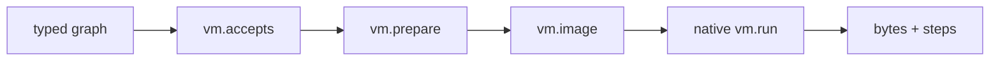

# `vm`

`vm` provides a compact deterministic artifact and executor useful for
cross-checking semantics independently of a system C compiler.

## API

```jog
fn accepts(m: Mod, op: Op) -> bool;
fn prepare(m: Mod) -> bool;
fn image(m: Mod) -> str;
fn image(m: Mod, entry: str) -> str;
fn run(image: str, entry: str, input: bytes) -> (bytes, int);
```

## Prepare and emit

```sh
joggle run vm.prepare model.jog -M build/modules > prepared.jog
joggle emit vm.image prepared.jog -M build/modules > model.vm
```

The entry overload emits the dependency closure of one function:

```sh
joggle emit vm.image prepared.jog \
  --arg '"model.main"' -M build/modules > main.vm
```

The emitted text starts with a versioned header and then contains deterministic
function records. Treat the image as a generated artifact: inspect it for
debugging, but produce it again from the prepared graph rather than hand-editing
instructions.

## Execute from Joggle code

```jog
fn execute(image: str, input: bytes) -> dict {
  let output, steps = vm.run(image, "model.main", input)
  return {output: output, steps: steps}
}
```

The step count is deterministic execution evidence, not wall-clock time.

Inputs and outputs are byte strings because the VM ABI is intentionally narrow:

| Value | Meaning |
| --- | --- |
| `image` | complete text returned by `vm.image` |
| `entry` | fully qualified function name |
| `input` | ABI-packed argument bytes |
| first result | ABI-packed output bytes |
| second result | deterministic executed-step count |

The caller owns packing and unpacking according to the entry signature. This
keeps the native executor independent of Joggle graph handles.

## Mechanism and boundary

`prepare` exposes/rewrites calls the VM image cannot represent. `image` is
read-only after preparation. The native component executes the stable image
format; it receives no privileged graph access.

Unsupported operations stay visible until preparation or produce a capability
failure.



`accepts` is a read-only capability predicate. `prepare` uses ordinary
expansion/rewriting to expose supported primitives. `image` serializes only
after preparation; `run` knows the image format but never receives `Mod`, `Op`,
or `Val` handles.

## Failure guide

| Symptom | Layer | Correction |
| --- | --- | --- |
| `accepts` is false | capability | prepare or add a representation |
| image emission names a missing entry | selection | use a fully qualified live function name |
| `run` rejects input length | ABI packing | pack all parameters at declared widths |
| output differs but step count is stable | semantics/data | compare typed values and byte order |
| high step count | instruction volume | it is not proof of high native latency |

> [!NOTE]
> Use the VM as a deterministic execution oracle and debugging backend. Use a
> hardware target and a controlled benchmark for deployment performance.
