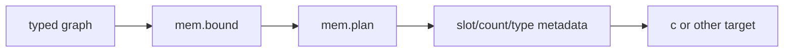
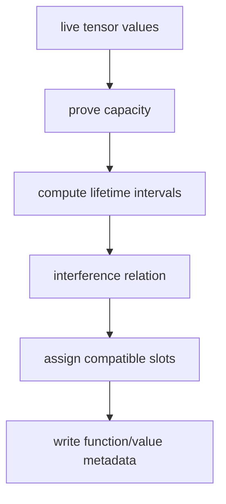

# `mem`

`mem` turns typed value lifetimes and capacity evidence into explicit storage
metadata. It does not allocate host memory or emit a target ABI.



## API

```jog
fn capacity(m: Mod, value: Val) -> list<int>;
fn bound(m: Mod) -> bool;
fn plan(m: Mod) -> bool;
fn plan(m: Mod, fn: Fn) -> bool;
fn planned(value: Val) -> bool;
fn slot(value: Val) -> int;
fn separate(op: Op) -> bool;
fn slots(fn: Fn) -> int;
fn type(fn: Fn, slot: int) -> Ty;
fn count(fn: Fn, slot: int) -> int;
fn buffers(m: Mod) -> int;
```

## Plan and inspect

```sh
joggle run mem.plan model.jog -M build/modules > planned.jog
joggle query mem.buffers planned.jog -M build/modules
```

Visible result:

```jog
[mem.counts: [2], mem.types: ["f32"]]
fn use_copy(x: tensor<f32, [2]>) -> f32 {
  let [mem.slot: 0] copy, first = duplicate(x)
  return copy[1] + first
}
```

The function metadata describes slots; the value metadata selects one. Another
transform can still inspect and edit this `.jog` before emission.

Read the annotation as follows:

| Field | Meaning |
| --- | --- |
| `mem.slot: 0` | value is assigned to logical workspace slot zero |
| `mem.types[0]` | element/storage type of slot zero |
| `mem.counts[0]` | proved element capacity of slot zero |
| absence of `mem.slot` | value is not backed by planned workspace |

The slot number is local to a function plan. It is not a process-wide address.

## Policy query

```jog
fn needs_workspace(m: Mod) -> bool {
  return mem.buffers(m) > 0
}
```

`capacity` distinguishes logical dynamic extents from a proved finite storage
bound. `separate` proves disjointness at a call and is consumed by `c.restrict`.

## Mechanism and limits

Planning computes lifetimes and reuses compatible slots only where overlap is
excluded. Unknown/unbounded capacity is not silently rounded to a fixed size.
Replanning replaces derived metadata deterministically.



### Capacity versus logical shape

A logical type may contain a dynamic dimension while analysis proves a finite
maximum storage requirement. `capacity(m, value)` returns that storage shape.
It does not rewrite `ir.type(value)` and must not be used as the logical result
shape seen by callers.

### Reuse versus aliasing

Two values can share a slot only when their live ranges do not overlap and
their storage requirements are compatible. `separate(op)` is a stronger call
boundary fact used by a target to justify non-aliasing contracts. Slot reuse by
itself is not a `restrict` proof.

## Developer query example

```jog
fn plan_report(m: Mod) -> dict {
  mem.plan(m)
  var planned = 0
  for value in ir.vals(m) {
    if mem.planned(value) { planned = planned + 1 }
  }
  return {buffers: mem.buffers(m), values: planned}
}
```

For production tooling, keep mutation (`mem.plan`) and reporting in separate
commands so a query remains read-only. The combined example only illustrates
the relationship between APIs.

## Failure guide

| Symptom | Meaning | Correction |
| --- | --- | --- |
| capacity is empty | finite storage was not proved | add bounds or keep allocation dynamic |
| `planned(value)` is false | no workspace slot applies | inspect value role/lifetime |
| planning returns false | plan already stable or nothing eligible | not necessarily an error |
| C emission rejects plan | ABI/capability requirement remains | inspect `c.frontier` and metadata |
| slot count unexpectedly high | lifetimes overlap or types conflict | inspect uses before changing policy |

> [!IMPORTANT]
> Memory planning is a correctness transformation. Never merge slots merely to
> reduce a count unless non-overlap and representation compatibility are proved.
