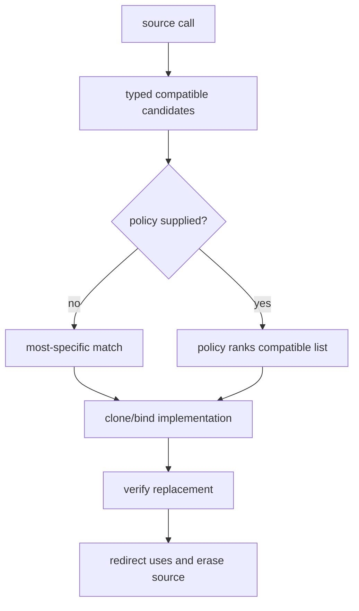

# `opt`

`opt` contains reusable graph algorithms. It operates on calls, types,
capabilities, and supplied policy functions; it does not own a target pipeline.

## API map

| Area | Functions |
| --- | --- |
| folding/cleanup | `fold`, `fold_identity`, `fold_add_zero`, `dce`, `cse`, `hoist`, `basic`, `fix` |
| specialization | `specialize`, `bind`, `signature`, `instantiate`, `copy` |
| health | `count`, `unresolved`, `untyped` |
| capability | `supports`, `frontier`, `legalize`, `expose`, `expand` |
| implementation | `candidates`, `apply`, `instantiate` |
| structural update | `update`, `rename`, `fuse` |

## Cleanup

Input:

```jog
fn add_zero(x: i32) -> i32 {
  let y = x + 0
  return y
}
```

```sh
joggle run opt.fold_add_zero opt.basic model.jog \
  -M build/modules > clean.jog
```

Output:

```jog
fn add_zero(x: i32) -> i32 {
  return x
}
```

`basic` removes only operations already classified safe; effects are not
dropped merely because a result is unused.

## Health queries

```sh
joggle query opt.count model.jog --arg '"nn.relu"' -M build/modules
joggle query opt.unresolved model.jog -M build/modules
joggle query opt.untyped model.jog -M build/modules
```

These queries are useful stage contracts and do not edit the graph.

Example output:

```text
$ joggle query opt.count model.jog --arg '"nn.relu"' -M build/modules
3
$ joggle query opt.untyped model.jog -M build/modules
[]
```

`count` counts matching calls; an empty `untyped` result means every inspected
result has a closed type. Neither says the target supports the graph.

## Capability frontier

```jog
fn ready(m: Mod, accepts: Fn) -> bool {
  return len(opt.frontier(m, accepts)) == 0
}
```

`supports` checks one operation. `frontier` reports distinct unsupported calls.
`expand` exposes bodies rejected by a capability; `legalize` repeats supplied
capabilities up to an explicit limit.

## Implementation selection

```jog
fn apply(m: Mod) -> bool {
  let impls = ir.where(ir.fns("my_impl"), "role", "implementation")
  return opt.apply(m, impls)
}
```

Candidate matching uses normal overload resolution. Policy overloads may rank
the compatible list but must return members of that list and remain read-only.

The selection process is intentionally inspectable:



A policy cannot nominate a function that was absent from the compatible list.
That keeps profitability extensible without moving type safety into policy code.

## Mechanism and limits

Worklists re-check live operations after structural edits and stop at explicit
limits. Failure rolls back the enclosing run. `opt` never assumes that every
model should follow one fixed order of functions.

### Fixed points are explicit

Functions that may repeat accept or enforce a limit. A limit is part of the
observable compiler configuration: it prevents a pair of valid rewrites from
oscillating forever and makes failure reproducible.

```jog
fn project_cleanup(m: Mod) -> bool {
  // Pure callees are a project decision, not guessed by opt.
  return opt.fix(m, ["base.copy", "tensor.broadcast"], 16)
}
```

### Health before and after a stage

```console
$ joggle query opt.unresolved imported.jog -M build/modules
["onnx.CustomOp"]
$ joggle run project.convert imported.jog -M build/modules -M project-mods > converted.jog
$ joggle query opt.unresolved converted.jog -M build/modules -M project-mods
[]
```

This pattern turns a vague “conversion succeeded” statement into an explicit
stage contract.

## Failure guide

| Symptom | Cause | Fix |
| --- | --- | --- |
| cleanup changes nothing | graph is stable or purity list is incomplete | inspect calls; do not assume failure |
| legalize reaches limit | no convergent path under capabilities | inspect frontier and rewrite cycle |
| implementation ambiguity | equally specific candidates | narrow signatures or add policy |
| stale operation during policy | policy retained handles across edits | rediscover from live graph/path |
| partial-looking output after error | command failed before commit | use diagnostic; transaction rolled back |

> [!WARNING]
> `dce`, `cse`, and hoisting require correct purity/safety information. Do not
> classify an effecting call as pure to obtain a smaller graph.
