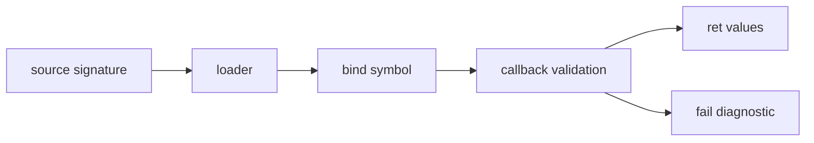

# Native mod ABI

Use the native ABI only when `.jog` must cross a binary boundary, such as
Protobuf/FlatBuffers decoding or VM execution. Analyses and transforms should
normally remain source mods.

## Source declaration first

```jog
mod codec

[role: "read"]
fn read(data: bytes) -> str;
```

The source declaration is the type contract and visible API. Native code binds
the body-less symbol; it does not register a pass or operator kind.

## ABI objects

| Object | Purpose |
| --- | --- |
| `joggle_api` | versioned host function table |
| `joggle_module` | opaque binding context |
| `joggle_call` | one invocation state |
| `joggle_value` | nil/bool/i64/f64/string/handle/bytes transport |
| `joggle_fn` | bound native function callback |

## Entry point

```cpp
static bool read(joggle_call* call, void*) {
  if (call->api->arg_count(call) != 1)
    return call->api->fail(call, "codec.read expects one argument");

  joggle_value input{};
  if (!call->api->arg(call, 0, &input) || input.kind != JOGGLE_BYTES)
    return call->api->fail(call, "codec.read expects bytes");

  // Decode and keep returned storage alive for the required call lifetime.
  return true;
}

JOGGLE_MODULE_EXPORT bool joggle_module(
    const joggle_api* api, joggle_module* module) {
  if (!joggle::compatible(api)) return false;
  return api->bind(module, "read", &read, nullptr);
}
```

The abbreviated callback shows validation order. Maintained complete examples
are `modules/onnx/src/onnx.cpp`, `modules/tflite/src/tflite.cpp`, and
`modules/vm/src/vm.cpp`.

## Complete scalar binding

Source declaration:

```jog
mod probe

fn twice(value: i64) -> i64;
```

Native implementation:

```cpp
#include <joggle/joggle.h>

namespace {

bool twice(joggle_call* call, void*) {
  if (call->api->arg_count(call) != 1)
    return call->api->fail(call, "probe.twice expects one argument");

  joggle_value input{};
  if (!call->api->arg(call, 0, &input) || input.kind != JOGGLE_I64)
    return call->api->fail(call, "probe.twice expects i64");

  joggle_value output{};
  output.kind = JOGGLE_I64;
  output.data.integer = input.data.integer * 2;
  return call->api->ret(call, 0, &output);
}

}  // namespace

JOGGLE_MODULE_EXPORT bool joggle_module(
    const joggle_api* api, joggle_module* module) {
  return joggle::compatible(api) &&
         api->bind(module, "probe.twice", twice, nullptr);
}
```

C++ host call:

```cpp
std::vector<joggle::Attr> args{joggle::Attr(std::int64_t{21})};
std::vector<joggle::Attr> returns;
if (!env.call("probe.twice", args, returns)) return 1;
// returns == [42]
```

The source declaration remains the public type contract. Native binding only
provides its body.

## Value transport

| `joggle_value_kind` | Union member | Public `Attr` form |
| --- | --- | --- |
| `JOGGLE_NIL` | none | nil |
| `JOGGLE_BOOL` | `boolean` | bool |
| `JOGGLE_I64` | `integer` | integer |
| `JOGGLE_F64` | `real` | real |
| `JOGGLE_STR` | `string` slice | string |
| `JOGGLE_BYTES` | `bytes` slice | byte string |
| `JOGGLE_HANDLE` | opaque `handle` | evaluator capability only |

Lists and dictionaries do not cross this lowest-level union as arbitrary C
containers. Keep a native boundary narrow or encode a documented byte format.
Source `.jog` wrappers can reconstruct richer `Attr` structures when needed.

## String and byte lifetime

Input slices are borrowed for the callback. A result slice must remain valid
while `ret` consumes it. Returning a pointer to a destroyed temporary is a
bug. The simplest safe pattern is to keep the produced `std::string` or byte
vector alive in the callback until `ret` returns:

```cpp
std::string output = decode(input);
joggle_value value{};
value.kind = JOGGLE_STR;
value.data.string = {output.data(), output.size()};
return call->api->ret(call, 0, &value);
```

Do not store borrowed input pointers in `data` for later invocations.

## Multiple results

The source signature fixes result count and order. Publish each result by its
zero-based index only after all computation that can fail has succeeded:

```cpp
joggle_value low{};
low.kind = JOGGLE_F64;
low.data.real = minimum;
joggle_value high{};
high.kind = JOGGLE_F64;
high.data.real = maximum;
return call->api->ret(call, 0, &low) &&
       call->api->ret(call, 1, &high);
```

Partial publication followed by failure is rejected by the invocation
boundary; still, compute first to keep callbacks easy to audit.

## Loading layout

```text
probe/
├── module.jog
└── native/
    ├── joggle_probe.so      # Linux
    ├── joggle_probe.dylib   # macOS naming as configured
    └── joggle_probe.dll     # Windows
```

The package loader validates the source mod and resolves the native library for
the platform. Binding a symbol not declared by the package, omitting a required
body, or binding the same symbol inconsistently is a load error.

## ABI design rules



- check `version` and `size` with `joggle::compatible`;
- use only the function table entries present in the negotiated table size;
- never throw across the C ABI;
- never expose C++ standard-library objects in exported signatures;
- validate count, kind, range, and payload length before decoding;
- include the qualified function name in actionable errors;
- make callback-owned context lifetime explicit when passing `data`;
- keep graph transformation logic in source mods unless native execution is
  essential.

## Layout and verification

```text
codec/
  module.jog
  src/codec.cpp
  native/
    joggle_codec.so
```

- reject an incompatible API version/table size;
- check argument count and kind before reading unions;
- call `fail` with stable actionable diagnostics;
- publish results only after successful work;
- expose no C++ objects across the C ABI;
- test source checking, load failure, invalid arguments, and a real invocation.

## Failure guide

| Symptom | Likely defect | Correction |
| --- | --- | --- |
| package loads but call is unresolved | bound symbol differs from source declaration | use the exact qualified symbol |
| incompatible ABI | version/table size mismatch | rebuild host and native mod together |
| result kind mismatch | callback published wrong union tag | mirror the source result type |
| intermittent corrupted text | result slice outlived backing storage | retain storage until `ret` completes |
| exception terminates process | C++ exception crossed ABI | catch and call `fail` |
| callback accepts malformed bytes | validation performed after decoding | check length/schema first |
