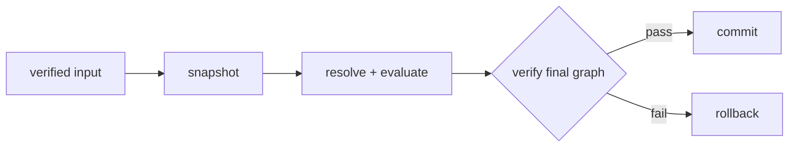
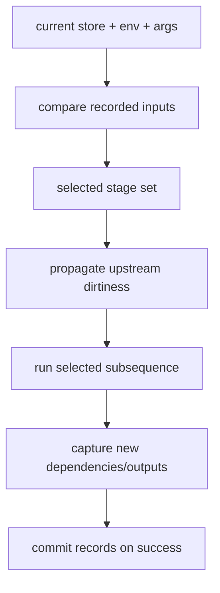

# Execution and updates

Joggle has three different reuse mechanisms. Keeping them distinct avoids
incorrect performance claims and stale results:

| Mechanism | Scope | Reuses | Invalidated by |
| --- | --- | --- | --- |
| function memoization | one top-level evaluation | pure function result | argument/dependency version |
| evaluation-plan cache | environment evaluator cache | decoded function execution plan | environment/function shape changes |
| reactive schedule | repeated schedule calls | whole compiler stages | observed graph/package/upstream changes |

## Transaction



Several named functions in one `run` share this boundary. A failure restores
structure and revision; partial edits do not leak.

### Snapshot strategy

The executor does not require every run to pay for an unconditional deep graph
copy. It records mutation state and reports whether a structural snapshot was
needed. Metadata-only changes can use narrower undo information; structural
edits preserve the state required for complete rollback.

`RunTiming.structural_snapshot` and `snapshot` make that cost visible to C++
tools without changing execution semantics.

## Revisions and observations

Execution records observed functions, collections, operations, values, mods,
intrinsics, structure, and arguments. A cached answer or stage is reusable only
when those dependencies remain current.

```jog
[memo]
local fn product(shape: list<int>) -> int {
  var out = 1
  for extent in shape { out *= extent }
  return out
}
```

`[memo]` is an author promise of purity. Its cache lasts one top-level run;
capability arguments include store identity and revision.

Do not attach `[memo]` to a function that mutates the graph, reads external
state, depends on time, or expects invocation count to be observable. The
evaluator cannot make an impure function pure by caching it.

### Evaluation plans

The evaluator compiles repeatedly executed function bodies into internal plans
covering calls, branches, loops, returns, and yields. Plans preserve language
semantics and fall back when a supported fast path is not valid. They are an
execution implementation, not a new IR exposed to mods.

`RunStepTiming` reports plan compiles/hits/fallbacks, dispatch hits/misses,
branch and loop counts, argument/result materialization, frame reuse, and
per-function invocation/memo statistics. Use these counters to locate evaluator
overhead before changing the core.

## Reactive schedule

```cpp
joggle::ReactiveSchedule schedule({
    "source.infer", "source.convert", "opt.basic", "mem.plan"});
joggle::ReactiveRunReport report;
if (!schedule.run(env, mod, {}, &report)) return false;
```

Later runs reuse a stage only when its observations and upstream input remain
valid. The report distinguishes executed/reused stages and records miss reasons
such as arguments, package dependencies, structure, or a specific object
revision. `reset()` explicitly returns to a cold state.

## Reactive miss reasons

| Miss | Meaning |
| --- | --- |
| `cold` | schedule is new, reset, or bound to another store |
| `environment` | environment identity/cache epoch changed |
| `arguments` | schedule arguments differ from the recorded run |
| `whole_revision` | stage observed the complete mod and it changed |
| `structure_revision` | stage observed graph structure and it changed |
| `package_dependencies` | visible `use` set changed |
| `function_generation` | observed function disappeared or slot was reused |
| `function_revision` | observed function content changed |
| `function_shape` | observed collection membership changed |
| `operation_generation` | observed operation was erased/replaced |
| `operation_revision` | observed operation data changed |
| `value_generation` | observed value was erased/replaced |
| `value_revision` | observed value type/metadata changed |
| `upstream` | an executed earlier stage may affect this stage's observations |

The schedule first computes selected stages from recorded dependencies, then
runs only that subsequence in one evaluator transaction. Outputs of selected
stages propagate dirty function/structure/package information to later stages.



## C++ report interpretation

```cpp
joggle::ReactiveRunReport report;
if (!schedule.run(env, mod, {}, &report)) {
  env.print_diags(stderr);
  return false;
}
for (const auto& stage : report.stages) {
  std::cout << stage.function << ": "
            << (stage.executed ? "executed" : "reused") << '\n';
}
```

`changed_functions` counts functions the stage actually affected. Observed
counts describe dependency breadth, not execution cost. Consult
`report.execution.steps` for evaluator counters and timings.

## Query reuse

Read-only C++ queries can receive `QueryReport`. Its miss taxonomy mirrors the
fine-grained graph dependencies and separately reports lookup, snapshot,
verification, evaluation, validation, and total execute time.

```cpp
joggle::Attr result;
joggle::QueryReport report;
if (!joggle::query(env, "stat.summary", mod, result, {}, &report)) {
  env.print_diags(stderr);
}
```

A cached query result is valid only for its recorded environment and observed
objects. Never retain an `Attr` containing handles as if it were independent of
the owning store.

## Deterministic evidence

```sh
joggle run opt.basic model.jog \
  --report run.attr --timing timing.attr -M modules > optimized.jog
```

`run.attr` is deterministic structural evidence. Timing is separate and must
be measured across controlled repetitions; it is not suitable for byte-wise
regression comparison.

## Performance measurement checklist

- Separate cold and warm schedule runs.
- Report which stages executed and why.
- Keep graph input, environment, arguments, and build configuration fixed.
- Measure wall time over repetitions outside correctness assertions.
- Retain structural reports and evaluator counters with timing samples.
- Do not call plan-cache reuse a machine-code JIT.
- Verify output equivalence after every optimization of the evaluator.

## Common implementation mistakes

| Mistake | Consequence | Correct approach |
| --- | --- | --- |
| cache by function name only | stale result after signature/body change | record generations/revisions/observations |
| treat metadata edit as invisible | stage reuses invalid decision | route edit through tracked mutation API |
| rerun only directly missed stage | later dependent stage can stay stale | propagate `upstream` selection |
| update cache before commit | failed run poisons next reuse | publish dependency records after success |
| compare only timing | speedup may change output | pair performance with structural/numerical oracle |
