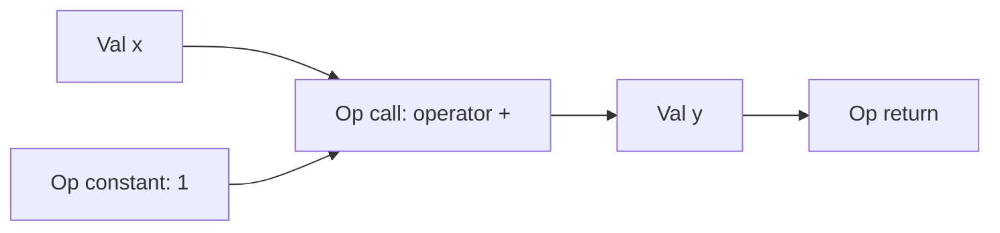

# Graph

## Objects

| Handle | Owns or denotes | Common queries |
| --- | --- | --- |
| `Mod` | package uses, functions, store, revisions | `ir.fns`, `ir.ops`, `ir.uses` |
| `Fn` | signature, metadata, optional body | `ir.params`, `ir.returns`, `ir.blks` |
| `Blk` | arguments and ordered operations | `ir.args`, `ir.ops`, `ir.owner` |
| `Op` | constant, call, loop, branch, return, yield | `ir.kind`, `ir.args`, `ir.outs` |
| `Val` | parameter, block argument, or operation result | `ir.type`, `ir.def`, `ir.users` |

## Source and graph

```jog
fn add_one(x: i32) -> i32 {
  let y = x + 1
  return y
}
```



The source binding `y` is a value, not a mutable AST name. The call and return
are operations in one function body block.

## Structured control flow

Loops and branches own child blocks. Values crossing their boundaries become
block arguments and operation results. The printer recovers `var`, `if`, and
`for`; transforms see explicit dataflow.

## Invariants

- every handle belongs to one store and identity generation;
- removed or foreign handles are rejected;
- operands dominate their uses;
- calls resolve against visible typed overloads;
- every return matches the declared result types;
- structured blocks and carried values have consistent arity and types.

A mutation helper checks local preconditions. The complete `run` transaction is
verified again before commit.

## Operation forms

| `ir.kind(op)` | Meaning | Nested blocks | Results |
| --- | --- | --- | --- |
| `constant` | structural literal with declared type | none | one |
| `call` | typed invocation by semantic spelling | none | zero or more |
| `assign` | explicit update in lowered mutable source | none | updated value |
| `loop` | iteration ranges plus carried state | body | carried results |
| `branch` | condition plus carried state | arms | joined results |
| `return` | function terminator | none | none |
| `yield` | nested-block terminator | none | none |

`ir.form(op)` adds finer representation information where the kind alone is
not enough. Compiler code should still use typed queries rather than depend on
printer spelling.

## Def-use navigation

For every non-parameter value, `ir.def(value)` returns its defining operation.
`ir.users(value)` returns live operations that consume it. This relation is the
foundation for replacement, dead-code discovery, affected-region scheduling,
and many legality checks.

```jog
fn fanout(value: Val) -> int {
  return len(ir.users(value))
}

fn dead_result(op: Op) -> bool {
  for value in ir.outs(op) {
    if len(ir.users(value)) != 0 { return false }
  }
  return true
}
```

A result with no users is not automatically erasable: effecting calls and
terminators remain semantically required. Let a transform's explicit purity
contract decide removal.

## Function declarations and definitions

A function may be:

- a public declaration with no body;
- a public body-bearing definition;
- a `local fn` helper visible only inside its mod;
- a native-bound declaration whose implementation comes from the package ABI.

These use one `Fn` object. `Fn::external()`/body presence distinguishes the
implementation form without creating separate operator/pass/emitter classes.

## Value categories

Values arise from function parameters, block arguments, and operation results.
The category affects dominance and mutation:

- parameters dominate the complete function body;
- block arguments dominate only their block and nested regions;
- operation results dominate later operations in the same block and valid
  descendants;
- branch/loop results become values in the parent block.

Names are presentation metadata. Identity is the store slot/generation, so
renaming a value does not change its def-use relation.

## Metadata

Functions, operations, and values carry open key/value dictionaries. The core
stores metadata and tracks its revisions; mods define meanings such as
`entry`, `role`, `artifact`, `storage.slot`, or project-specific annotations.

Use namespaced keys for external policy to avoid collisions:

```jog
ir.set(m, op, "acme.device", "dsp")
```

Metadata must not be used to bypass type or dominance invariants. A target hint
is not proof unless the consuming API defines and validates it as such.

## Ordering and determinism

Function, block, operation, and value enumeration follows deterministic
structural order. This supports stable reports and source output. Do not infer
semantic independence merely because two operations are adjacent; inspect
def-use and effects.

## Paths versus handles

Handles are efficient within one live mutation sequence. Structural paths are
better for external tools that need to identify a location across serialization
or rediscovery. Both require validation after structure changes.

See [Store, handles, and edits](storage.md) for generations, revisions, and safe
mutation order.
