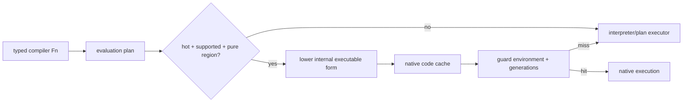
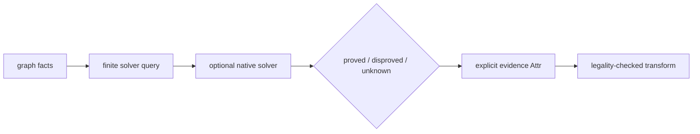

# Improvement directions

This page is a developer roadmap, not an implemented-feature list. It starts
from current mechanisms and states the evidence required before an optimization
should be adopted.

## Status vocabulary

| Label | Meaning |
| --- | --- |
| implemented | present in the current code and exercised by project gates |
| candidate | compatible with the design but not promised or complete |
| experiment | requires measurement before choosing an implementation |

> [!IMPORTANT]
> Documentation pages for APIs describe implemented behavior. Items on this
> page must not be cited or used as if they already exist.

## Current performance mechanisms

Implemented today:

- deterministic graph storage with revision/generation tracking;
- batch graph edits for several high-frequency transformations;
- transaction-aware mutation with structural snapshot reporting;
- evaluator frame reuse and compiled evaluation plans;
- direct dispatch links and dispatch caches;
- per-run pure-function memoization;
- fine-grained query observation records;
- dependency-tracked reactive stage reuse;
- function-granular C artifact APIs for downstream incremental tooling;
- timing/counter reports separate from deterministic structural reports.

These mechanisms should be profiled before adding a new execution layer.

## 1. Evaluator specialization

### Candidate

Extend existing evaluation plans with more specialized instruction forms for
common typed operations, fixed arities, direct yields, and predictable loops.

### Why it fits

Plans are internal to compiler-function evaluation and already preserve a
fallback path. Specialization can improve execution without creating another
user-visible IR or changing `.jog` semantics.

### Required evidence

- plan compile time and hit rate;
- executed-op/frame/argument-materialization counters;
- cold versus repeated-run wall time;
- identical graph, diagnostics, report, and artifact outputs;
- performance across small policies and large model conversions.

### Risk

Over-specializing rare bodies can increase compile/cache cost and code
complexity more than it saves.

## 2. Native-code JIT for compiler functions

### Experiment, not current behavior

A machine-code JIT could lower hot, pure, type-specialized compiler-function
regions after the evaluator identifies stable plans. This is materially
different from the current evaluation-plan cache.

### Possible boundary

### Do not do first

Do not introduce a second general MIR merely to rename the existing graph. A
JIT needs a narrow executable representation with explicit guards, deopt/fallback,
diagnostics, and transaction hooks.

### Required evidence

- hot-region frequency and share of evaluator time;
- compile-time break-even point;
- guard/invalidation cost;
- fallback correctness under graph mutation;
- platform maintenance burden;
- comparison with continued plan specialization.

## 3. More precise reactive invalidation

### Candidate

Improve observation granularity where current stages conservatively observe a
whole function, collection, or structure.

### Method

1. use `ReactiveStageReport` observed counts and miss reasons;
2. identify stages repeatedly invalidated by broad observations;
3. locate the API call that records the broad dependency;
4. add a narrower safe query only if its semantic contract is clear;
5. verify that edits affecting the result still invalidate it.

### Risk

Missing one dependency creates stale compiler output—a correctness failure. A
conservative rerun is preferable to unsound reuse.

## 4. Incremental C artifacts

### Implemented foundation

`c` exposes preamble, declaration, definition, body chunk, nested partition,
storage, and tail functions.

### Candidate integration

An embedding tool can combine reactive changed-function reports with these
artifact functions to regenerate only affected definitions, then use an
external incremental compiler/object linker.

### Boundary

Joggle does not currently claim an incremental object linker. ABI, headers,
cross-function declarations, payload layout, or call-graph changes can require
broader regeneration than the changed function body.

## 5. Graph edit indexing

### Candidate

Maintain or lazily construct indices for frequently repeated queries such as
callee lookup, metadata predicates, and def-use affected regions.

### Required design constraints

- updates participate in every mutation and rollback;
- index memory stays proportional and measurable;
- deterministic enumeration order remains unchanged;
- small graphs do not pay a large fixed cost;
- bulk edits can update indices once rather than per item.

Profile existing scans first. An index that accelerates one pass while slowing
all mutation is not automatically beneficial.

## 6. Parallel read-only analysis

### Experiment

Independent read-only queries or policy evaluations could run concurrently on
one immutable revision or cloned snapshots.

### Constraints

- no concurrent mutation through the same `Mod` store;
- deterministic result ordering;
- thread-safe environment/native callbacks or isolated environments;
- observation merging with clear ownership;
- no data race through borrowed handles/locations.

Parallel mutation is not implied and should remain out of scope until a much
stronger ownership model exists.

## 7. Solver-assisted proofs

### Candidate use

SMT can help prove bounded integer relations, affine legality, shape equality,
or guard redundancy when local interval/affine analyses return unknown.

### Recommended architecture

Treat a solver as an optional analysis mod/native boundary:

Do not put solver calls in the verifier's mandatory correctness path. Timeouts,
unknown results, and unavailable dependencies must conservatively preserve the
original graph.

### Required evidence

- proof/query construction time;
- timeout and cache policy;
- sound mapping from graph semantics to formulas;
- reproducible solver/version configuration;
- benefit on real models where existing analyses are insufficient.

## 8. Frontend coverage and diagnostics

### Candidate improvements

- operator/opset coverage matrices generated from actual rules;
- conversion residual reports grouped by domain/operator/type signature;
- smaller automatically minimized failing model fragments;
- shape-inference evidence explaining why a term stayed open;
- stage-by-stage numerical differential harness generation.

The goal is not to hide unsupported operators; it is to make the remaining
boundary precise and actionable.

## 9. Target implementation selection

### Candidate improvements

- measured policy packages per device/profile;
- external-kernel catalogues with exact typed predicates;
- layout and quantization constraints as explicit parameters/evidence;
- cost reports that include calibration provenance;
- fallback expansion retained as a correctness baseline.

Keep legality in reusable transforms and profitability in replaceable policy
mods.

## 10. Memory planning

### Candidate improvements

- richer dynamic-capacity proofs;
- alignment and address-space-aware slot compatibility;
- target-specific placement policies consuming generic lifetime evidence;
- explicit memory-budget failure reports;
- incremental replanning limited to affected functions.

Any tighter reuse must preserve non-overlap and representation compatibility.

## 11. Documentation and tooling

High-leverage developer improvements include:

- generating signature tables from `mod info` while keeping hand-written
  semantics/examples;
- extracting and executing fenced examples in isolated fixtures;
- rendering before/after graph diffs for guide stages;
- linking diagnostics to the owning API and failure guide;
- exposing report schemas with field-by-field examples;
- adding a web playground only when execution sandboxing is clear.

Generated API lists should not replace explanation, and tests should not become
the user manual.

## Prioritization rubric

Score a proposed optimization on:

| Dimension | Question |
| --- | --- |
| measured share | how much current time/memory does it address? |
| breadth | how many workflows/models benefit? |
| semantic risk | can it produce stale or incorrect output? |
| maintenance | how much platform/core complexity is added? |
| observability | can counters/reports explain its behavior? |
| fallback | is there a simple correct path when unsupported? |
| reproducibility | can the experiment and configuration be replayed? |

Prefer the smallest mechanism that attacks a measured bottleneck while keeping
graphs, stage boundaries, and diagnostics inspectable.
