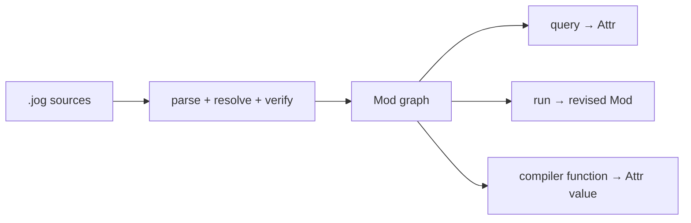
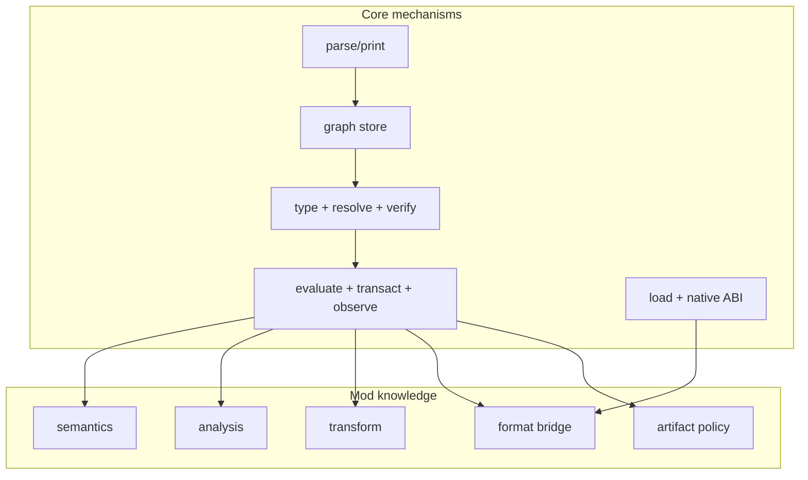

# Compiler model

This section explains the compiler independently of any model domain. Scalar
examples are used where possible; tensor semantics belong to the `tensor` and
`nn` API pages.

| Topic | Boundary |
| --- | --- |
| [Program lifecycle](lifecycle.md) | loading, parsing, checking, running, committing, and emitting |
| [Graph](graph.md) | `Mod / Fn / Blk / Op / Val` and invariants |
| [Resolution and typing](resolution.md) | visibility, overloads, generics, open terms, and ambiguity |
| [Store, handles, and edits](storage.md) | ownership, generations, revisions, mutation order, and rollback |
| [Compiler functions](functions.md) | query, transform, conversion, artifact functions |
| [Mod system](mods.md) | installed capabilities and external composition |
| [Execution](execution.md) | transactions, revisions, caching, reactive stages |
| [Subsystems](subsystems.md) | C++ source ownership and extension seams |
| [Improvement directions](improvement-directions.md) | measured optimization opportunities and non-claims |
| [Performance internals](../performance/index.md) | storage cost, evaluator plans, invalidation, profiling, and API boundaries |

There is one graph and one function language. Joggle does not require a fixed
ladder of IR dialects or a separate pass-registration system.

## Read by role

| Reader | Recommended path |
| --- | --- |
| mod author | graph → compiler functions → mod system → relevant API page |
| core developer | lifecycle → graph → resolution → store → execution → subsystems |
| embedding developer | lifecycle → C++ API → execution → diagnostics |
| frontend developer | mod system → resolution → frontend/bridge API pages |
| artifact-mod developer | compiler functions → execution → relevant mod API → native ABI when needed |

## Architectural rules

1. The core owns mechanisms: graph storage, types, resolution, verification,
   evaluation, transactions, loading, and printing.
2. Mods own compiler knowledge: semantics, analyses, transformations,
   conversions, representations, and artifacts.
3. A stage is an ordinary typed function; installation never schedules it.
4. Intermediate graphs stay printable and verifiable.
5. Mutation commits only after whole-graph verification.
6. Cached/reused work is valid only while recorded dependencies remain current.
7. Source formats and targets meet through shared semantics, not direct cases
   in the core.

