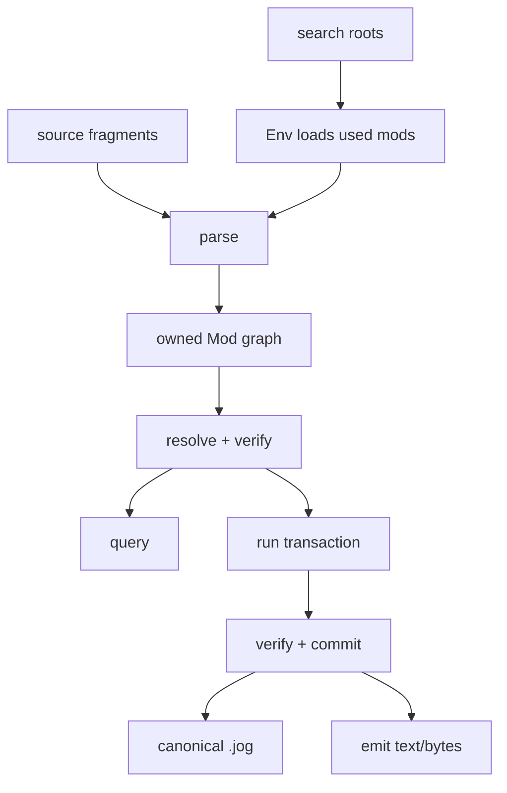
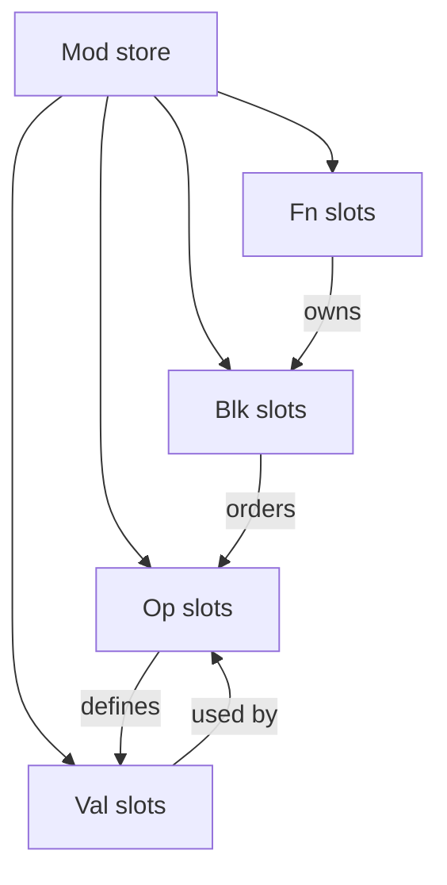
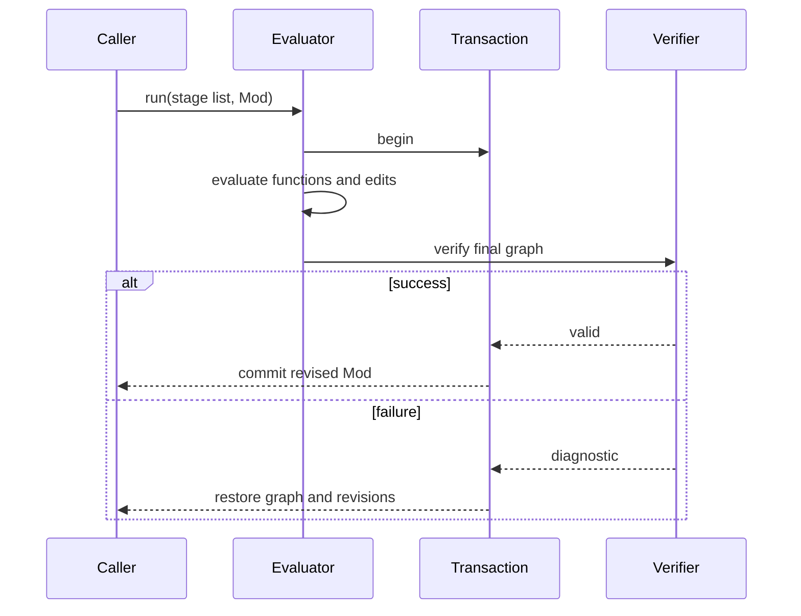

# Program lifecycle

This chapter follows ownership rather than a prescribed optimization pipeline.
It answers where data lives, which step may mutate it, and which diagnostic
boundary a developer should inspect.

## Lifecycle at a glance



The core lifecycle ends with a typed graph. Frontend conversion, optimization,
memory planning, and target preparation are ordinary functions that a caller
chooses to run on that graph.

## 1. Construct the environment

`Env` owns installed package definitions, native bindings, resolution state,
diagnostics, and evaluator caches. Add roots in intentional priority order:

```cpp
joggle::Env env;
env.path("./build/modules");
env.path("./project-mods");
```

A root makes a package discoverable; it does not import every package. Parsing
the program's `use` declarations causes required packages and their dependency
closure to load.

### Environment invalidation

Loading or changing the available package environment advances an environment
cache epoch. Query and reactive caches record that identity. They are not reused
across a different `Env` or after relevant package state changes.

## 2. Parse source fragments

The C++ API accepts one source or an ordered span:

```cpp
std::vector<joggle::Source> sources{
    {"mod demo\nuse base\n", "mod.jog"},
    {"fn main(x: i32) -> i32 { return x + 1 }\n", "lib/main.jog"},
};
joggle::Mod mod;
if (!joggle::parse(env, sources, mod)) {
  mod.print_diags(stderr);
  return 1;
}
```

Locations retain the supplied filename. Source fragments share one package
namespace, so duplicate definitions and inconsistent package declarations are
diagnosed as one program.

## 3. Build graph objects

Parsing creates functions, blocks, operations, and values in a `Mod`-owned
store. Handles are lightweight references to store, slot, and generation. They
do not own nodes and must not outlive the graph.



The store representation makes ownership checks, generation checks, structural
paths, revision tracking, and batch edits available to every subsystem.

## 4. Resolve names and types

Resolution considers the current package, declared dependencies, visibility,
function name, arity, generic constraints, parameter types, and result context.
It returns one most-specific compatible function or a diagnostic.

Body-less declarations are valid semantic or native boundaries. Body-bearing
functions can execute at compile time or be expanded into a model graph.

See [Resolution and typing](resolution.md) for overload selection and open type
terms.

## 5. Verify invariants

Verification is not only a parser step. It checks graph invariants after
parsing and again before a mutating run commits.

| Invariant family | Examples |
| --- | --- |
| ownership | every operand and target belongs to the expected store |
| liveness | no erased generation is referenced |
| dominance | a value is defined before and in scope for every use |
| calls | selected callee accepts generics, arguments, and results |
| blocks | branch/loop block arity and carried values agree |
| functions | returns match declared result types |
| metadata | structured values have accepted runtime kinds where required |

A mutation helper may perform narrow precondition checks, but final verification
protects the entire transaction from combinations of locally valid edits that
produce an invalid graph.

## 6. Choose an execution mode

| Mode | Input graph | Result | Mutation contract |
| --- | --- | --- | --- |
| `query` | const `Mod` | one `Attr` | published graph must not change |
| `run` | mutable `Mod` | updated graph + optional report | all stages commit or roll back |
| `emit` | graph through artifact function | `str` or `bytes` | artifact function is read-only |
| `ReactiveSchedule` | mutable `Mod` | selectively updated graph | invalidated stages run transactionally |

These modes reuse the same evaluator and typed functions. They differ at the
API boundary and in what output the caller requests.

## 7. Commit or roll back

Before evaluation, the executor prepares transaction state. Metadata-only
changes can be tracked compactly; structural mutation activates the structural
snapshot path. On failure, edits and revisions are restored. On success, the
final graph is verified and committed.



## 8. Print or emit

`print(mod)` reconstructs canonical `.jog` from the graph. This is how commands
make intermediate state visible. An emitter is different: it calls a selected
artifact function such as `project.source` or `project.image` and returns its
string/bytes.

Canonical graph printing must round-trip. Target artifacts follow the target
mod's contract and may require explicit preparation first.

## Debugging by the last good boundary

| Last successful boundary | Investigate next |
| --- | --- |
| package loads | source syntax and dependency names |
| parse succeeds | name/type resolution diagnostics |
| check succeeds | selected transform arguments and policy |
| run succeeds | capability frontier for the target |
| frontier is empty | artifact generation/configuration |
| artifact compiles | ABI packing and numerical oracle |

Saving named intermediate `.jog` files is useful during development because it
turns an end-to-end failure into one stage transition.

## Extension seams

- Add semantics with typed `.jog` declarations/bodies.
- Add analysis or transformation with `ir` and ordinary functions.
- Add binary decoding through the native ABI returning deterministic source.
- Add target representation through capability, preparation, and artifact
  functions.
- Extend the C++ core only when the operation cannot be expressed safely with
  the public graph and evaluator primitives.

The [Subsystems](subsystems.md) chapter maps those decisions to source files.
