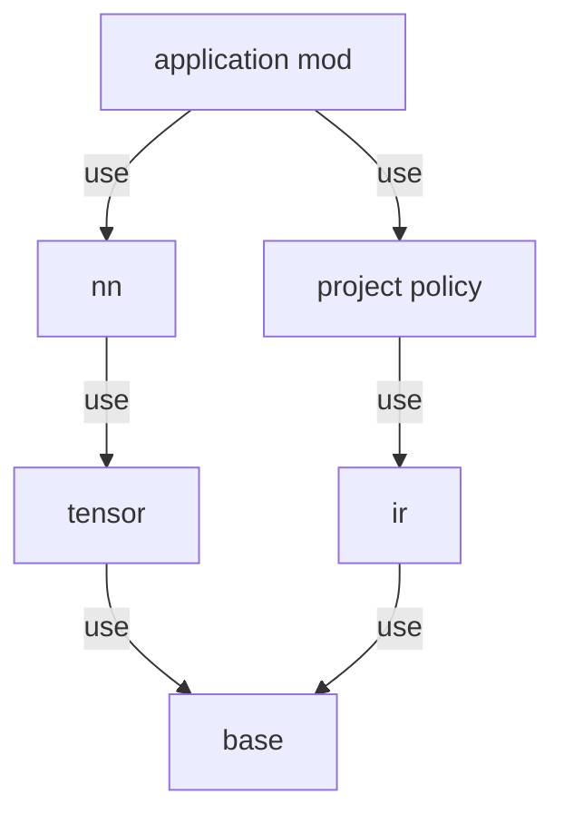
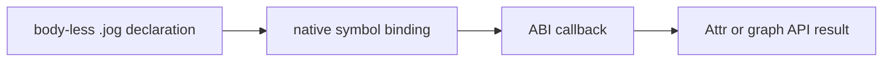

# Mod system

## Three repository roles

| Location | Meaning | User dependency |
| --- | --- | --- |
| `modules/` | bundled, installed compiler capability | yes, when declared with `use` |
| `examples/mods/` | complete third-party-style examples | only when added with `-M` |
| `test/data/` | focused regression inputs | no public API or template promise |

External examples are not placed under `test/` because their source layout and
README are part of the developer experience. Tests execute them to prevent
drift, but they remain usable templates.

## Composition

```jog
mod my_policy
use ir
use tile
```

```sh
joggle mod check my_policy -M build/modules -M examples/mods
joggle run my_policy.apply model.jog \
  -M build/modules -M examples/mods > result.jog
```

Search roots locate packages; `use` declares dependencies. These concerns are
separate so an installation is closed over named roots rather than accidental
filesystem adjacency.

## What belongs where

| Change | Location |
| --- | --- |
| reusable semantic or transform capability shipped with Joggle | `modules/` |
| replaceable policy or integration demonstration | `examples/mods/` |
| malformed source or narrow regression fixture | `test/data/` |
| generic test runner/helper | `test/` or `test/tools/` |

See [Built-in mods](../api/mods/index.md) and
[External mod examples](../examples/index.md).

## Package structure

```text
my_policy/
├── module.jog      # required package declaration and public surface
├── lib/            # optional sorted .jog fragments
│   ├── analyze.jog
│   └── apply.jog
└── native/         # optional platform shared library
```

The source keyword is `mod`; `module.jog` is the package entry filename. The
entry is loaded first, followed by `lib/*.jog` in deterministic sorted order.
All fragments must declare/extend the same mod namespace.

## Dependency loading



Loading validates the complete dependency closure. Missing packages, cycles,
duplicate dependencies, mismatched package names, unreadable fragments, and
native binding failures are diagnostics, not silently skipped features.

## Search roots

Roots are searched for a directory matching the requested package name. Keep
built artifacts and project/external packages in separate roots so precedence
is intentional:

```console
$ joggle mod check my_policy \
    -M build/modules \
    -M project-mods
```

Do not rely on the process working directory to imply dependencies. The command
must name roots and source must name `use` edges.

## Public and local API

Public functions become visible to dependent mods. `local fn` supports
implementation fragments without expanding the API surface. A public function
can call local helpers; cloning/expanding a body preserves the required private
closure under controlled names.

This lets a semantic package expose a small stable surface while internally
splitting complex bodies across fragments.

## Native bindings

A `native/` library can bind declarations through the published ABI. Native
code should provide mechanisms that require external libraries or byte-level
integration; source code should retain policy and graph composition.



The loaded native component is scoped to the package environment. There is no
global plugin registry.

## Installation operations

`joggle mod install`, `upgrade`, and `uninstall` operate on package directories.
They validate the package and affected dependency graph before publishing the
change. An incompatible or invalid upgrade must leave the installed package
unchanged.

Use `mod info` to inspect the installed public surface and `mod check` to
validate a package against explicit roots.

## Versioning before 1.0

Joggle currently makes no forward-compatibility promise. Package authors should
pin a known project revision/version, keep policy mods small, and validate the
full dependency closure during upgrades. Do not ship compatibility aliases in
the core unless the project explicitly adopts such a policy later.

## Package design checklist

- Does the mod own one coherent responsibility?
- Are dependencies minimal and declared?
- Is the public API smaller than its implementation?
- Are frontend and target concerns kept out of reusable semantics?
- Are project policies external rather than patched into official mods?
- Are unsupported cases visible and diagnosable?
- Can a user understand input/output without reading tests?
- Can a developer locate each implementation fragment from the API page?
