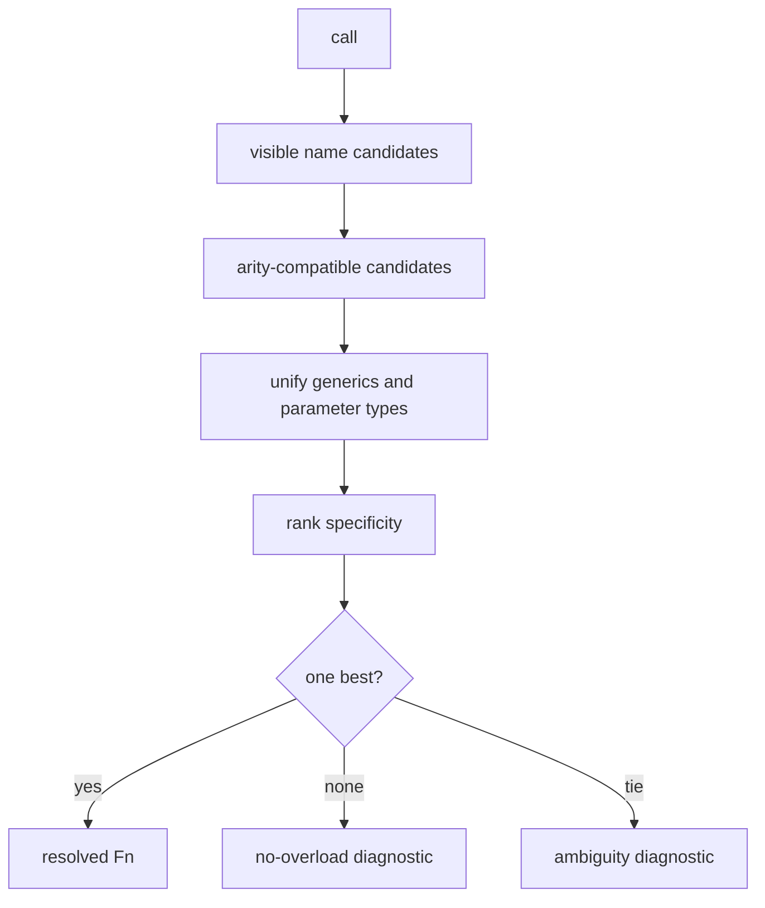

# Resolution and typing

Resolution is the connective mechanism that lets operator definitions,
compiler policies, converters, and target implementations share one function
model.

## Visibility before matching

A call can see:

1. functions in its own mod;
2. public functions in mods named by `use` and their visible dependency graph;
3. an explicitly qualified package function when that package is visible.

`local fn` never becomes another mod's public API. A search root does not grant
visibility by itself.

```jog
mod policy
use ir

local fn helper(op: Op) -> bool { return ir.kind(op) == "call" }
fn apply(m: Mod) -> bool { return false }
```

Another package can resolve `policy.apply`, but not `policy.helper`.

## Candidate formation

The resolver first forms a candidate set by visible name and arity. It then
matches generic terms and concrete parameter types.

```jog
fn choose<T: Ty>(x: T) -> T;
fn choose<W: int>(x: sat<W>) -> sat<W>;
```

For `sat<8>`, both signatures may be compatible. The second is more specific
because it constrains the outer constructor and width term.



## Structural type matching

A type is a tree, not a closed enum. Matching recursively binds generic terms:

```text
candidate: tensor<E, [M, K]>
argument:  tensor<f32, [2, 4]>
bindings:  E=f32, M=2, K=4
```

Later parameters and the expected result must agree with those bindings. A
second argument `tensor<f32, [4, 3]>` can bind `N=3` in a MatMul-like signature;
`tensor<i32, [4, 3]>` conflicts with `E=f32`.

## Result context

Source annotations and enclosing function returns can constrain overload
results. Prefer explicit intermediate annotations when they communicate an
important shape proof:

```jog
let expanded: tensor<f32, [2, 4]> = tensor.broadcast(bias)
```

Without a target shape, a broadcast call may have several possible structural
results. The annotation is part of the program contract, not a cast.

## Open type terms

`_` records information that is genuinely not proved:

```jog
fn source(x: tensor<f32, [_, 4]>) -> tensor<f32, [_, 3]>;
```

Open terms can be refined when compatible evidence arrives. They must not be
silently replaced with a convenient constant. `opt.untyped` reports values that
still contain open terms at a stage boundary.

## Calls, targets, and semantics

An `Op` stores the called spelling and typed operands/results. `Env::resolve`
or `ir.resolve` obtains the selected `Fn`. `ir.target` gives the resolved symbol
used by capability and implementation logic.

Do not dispatch transformations solely on raw spelling when typed resolution
matters. Two packages may expose the same short name, and overloads may encode
different semantics.

## Programmatic matching

The C++ API exposes the same mechanism:

```cpp
joggle::Fn target = env.resolve(mod, call);
bool ok = env.accepts(call, candidate);
bool ambiguous = false;
joggle::Fn best = env.match(call, candidates, &ambiguous);
std::vector<joggle::Ty> bindings = env.match(call, candidate);
```

The `.jog` `ir.accepts`, `ir.match`, and `ir.resolve` functions bind to these
concepts so source mods and native tooling agree.

## Resolution cache boundary

Resolution and evaluation plans may cache decisions while their dependencies
remain current. Function generation, signature shape, package dependencies,
environment epoch, and observed graph revisions participate in invalidation.

A cache hit is therefore conditional reuse, not permanent memoization of a
symbol string.

## Designing overload families

Good families have a clear specificity order:

- start with the most general semantic contract;
- add narrower forms when they add real type information or behavior;
- avoid two signatures that constrain different incomparable dimensions;
- use a separate policy function when the choice is profitability, not type;
- keep target-specific metadata out of reusable semantic signatures.

## Diagnosing failures

| Diagnostic | Inspect | Typical correction |
| --- | --- | --- |
| unresolved function | `use`, qualification, spelling | load/declare the intended dependency |
| no overload accepts | actual operand/result types | correct types or add a precise overload |
| ambiguous overload | competing compatible signatures | make one more specific or remove overlap |
| private/local target | visibility boundary | expose public wrapper or keep call local |
| open result remains | missing inference evidence | add annotation or inference rule |
| stale resolved handle | graph/function generation changed | resolve again against live graph |

> [!CAUTION]
> Do not resolve once, mutate signatures or dependencies, and keep using the old
> decision. Let the environment resolve against current handles and revisions.
