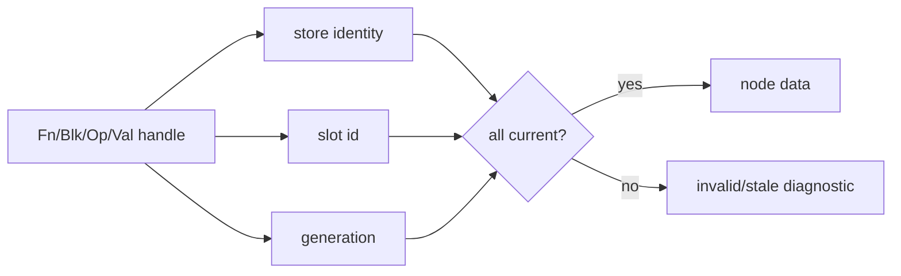
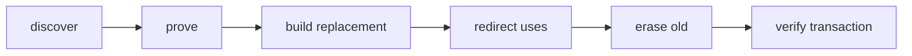

# Store, handles, and edits

This chapter is for developers adding core graph operations or embedding Joggle
through C++. It complements the public [`ir` mod](../api/mods/core/ir.md).

## Store ownership

Each `Mod` owns one internal store containing function, block, operation, and
value slots. Public handles carry:

- a pointer to the owning store;
- a slot identifier;
- a generation counter.

That triple lets the API reject handles from another graph and handles whose
slot was erased then reused.

Default-constructed handles are invalid. `operator bool()`/`valid()` lets C++
code check a result before reading it.

## Borrowed data

Collections returned by public methods are value copies of handles. Some
references, such as `Fn::loc()`, are borrowed from the store and must not be
retained across mutation. Copy strings or locations when persistent ownership
is required.

## Revisions

The store has a whole revision and a structure revision. Functions and observed
objects carry finer-grained revision/generation information. Mutations update
the narrowest relevant state while preserving enough global information for
verification and conservative invalidation.

| Change | Example invalidation |
| --- | --- |
| metadata on one value | observers of that value/function |
| call operands or target | operation and owning function observers |
| insert/erase/reorder operation | structural/collection observers |
| add/remove dependency | package dependency observers |
| erase and reuse slot | generation observers |

Consumers should not compare revision numbers to infer semantics; use them only
as freshness tokens.

## Structural paths

`Mod::path(op)` returns alternating operation and child-block indices beginning
at the owning function body. `Mod::at(fn, path)` resolves the route later.

Paths are useful for serialized tooling state because they do not expose slot
IDs. They are stable only while earlier siblings and enclosing block structure
remain unchanged. After a structural edit, resolve and validate again.

## Safe replacement order

A robust transformation constructs and validates the replacement before
disconnecting the original:

1. collect candidate handles from the current graph;
2. prove local legality without mutation;
3. create replacement operations before the original terminator/source;
4. redirect uses in one operation or validated batch;
5. erase now-dead operations in dependency-safe order;
6. allow transaction-level verification to check the whole graph.

Erasing first produces stale operands and makes rollback/error reporting harder.

## Batch operations

When several nodes change together, use batch forms such as `replace(span,
span)`, `erase(span)`, or batch expansion. They validate shared ownership and
arity once, reduce repeated graph scans, and preserve atomicity at the intended
scope.

Batch APIs do not waive invariants. An invalid item rejects the batch unless an
API explicitly documents best-effort behavior.

## Nested control flow

Branches and loops own child blocks. Cloning an operation with blocks requires
mapping block arguments, nested results, carried values, and terminators. Use
the provided clone/loop/branch helpers rather than copying only the outer `Op`.

For loops, distinguish:

- iterator block arguments;
- carried-state block arguments;
- yielded carried values;
- loop result values.

A mismatch among these lists is a verifier error even when scalar types happen
to agree.

## Transaction integration

Core mutation helpers notify the active evaluator transaction. The transaction
records compact undo information where possible and activates structural
snapshot support when required. A helper implemented outside this mechanism can
break rollback and must not be added.

When adding a public edit:

1. validate store ownership and liveness;
2. validate dominance, arity, types, and structural preconditions;
3. register mutation with transaction/revision tracking;
4. perform the smallest coherent mutation;
5. return failure without leaving a partial graph;
6. expose both C++ and `ir` bindings if source mods need the primitive;
7. add stale/foreign-handle and rollback coverage.

## Diagnostics

Prefer diagnostics at the first violated contract with a source `Loc` from the
most relevant function, operation, or value. Avoid a late generic verifier
message when a mutation helper already knows the precise issue.

| Bad diagnostic | Better diagnostic |
| --- | --- |
| `invalid operation` | `replacement value belongs to another Mod` |
| `type error` | `retarget result 1 expects tensor<f32,[4]> but got ...` |
| `cannot clone` | `clone encountered unmapped block argument ...` |

## Concurrency and lifetime

`Mod` is move-only. Do not mutate one store concurrently through several
threads. Native callbacks receive opaque handles whose lifetime is bounded by
the call and owning environment/graph. Copy external data if it must outlive
that boundary.

## Checklist for a new edit primitive

- Is it impossible or inefficient to express with existing primitives?
- Is ownership checked for every handle and list element?
- Are stale generations rejected?
- Is dominance preserved at every published point?
- Are structured blocks and carried values covered?
- Does failure restore revisions and graph data?
- Are batch semantics explicit?
- Is the corresponding `ir` signature typed narrowly?
- Does the developer documentation show before/after graph state?
