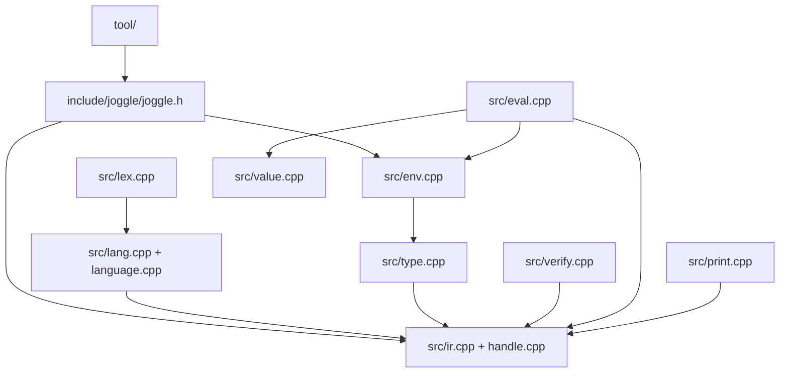

# Subsystems

The C++ core provides language, graph, evaluation, and loading mechanisms. Most
compiler-domain behavior belongs in `.jog` mods. Use this map to find the
narrowest correct change location.

| Path | Owns | Does not own |
| --- | --- | --- |
| `include/joggle/` | public C++ API and C native ABI | parser internals |
| `src/lex.cpp` | tokens and locations | type resolution |
| `src/lang.cpp`, `src/language.cpp` | syntax and graph construction | target policy |
| `src/ir.cpp`, `src/handle.cpp` | store, handles, structural edits | model semantics |
| `src/type.cpp`, `src/verify.cpp` | matching and graph invariants | frontend cases |
| `src/eval.cpp`, `src/value.cpp` | compile-time execution | hidden fixed pipeline |
| `src/env.cpp` | roots, loading, native binding, diagnostics | implicit imports |
| `src/print.cpp` | canonical source and attributes | mutation |

## Dependency map

Arrows mean “uses,” not ownership. The public header is the stable embedding
surface; `src/detail.h`, syntax nodes, and evaluator internals are not public.

## Lexer and parser

`lex.cpp` converts source bytes to location-carrying tokens. `syntax.h` and the
language parser represent declarations, expressions, statements, attributes,
and structural type terms long enough to build the graph.

When adding syntax, update as one change:

1. tokenization and source locations;
2. parser acceptance and targeted diagnostics;
3. graph construction/lowering;
4. canonical printer;
5. round-trip and malformed-input coverage;
6. language documentation.

Avoid syntax for concepts already expressible as typed functions or metadata.

## Graph and handles

`ir.cpp` implements the store and mutation API; `handle.cpp` implements safe
public handle access. Every edit must preserve ownership, liveness, dominance,
structured block invariants, revision tracking, and transaction rollback.

Read [Store, handles, and edits](storage.md) before adding an edit primitive.

## Types and verification

`type.cpp` performs structural type matching, generic binding, specificity, and
related resolution work. `verify.cpp` validates complete graph invariants.

Do not add a C++ type enum for a mod-defined type such as `tensor` or `sat`.
The core understands structural `Ty`; mods give constructors semantic meaning.

Read [Resolution and typing](resolution.md) for the public behavior.

## Evaluator

`eval.cpp` executes compiler functions, implements fundamental/native calls,
manages frames and evaluation plans, records observations, handles memoization,
coordinates mutation transactions, and implements reactive schedules.

It must not encode a preferred compiler pipeline. A new optimization belongs in
a mod unless it improves execution of all compiler functions without changing
their semantics.

Read [Execution and updates](execution.md) before changing caching or plans.

## Values and metadata

`value.cpp` owns evaluator/runtime representations of scalars, collections,
handles, attributes, and type terms. `meta.cpp` implements open metadata access
and canonical behavior.

Adding a new fundamental value kind is a broad language/ABI decision. Prefer a
structural `Attr` or mod-defined `Ty` when the data can be expressed there.

## Environment and package loading

`env.cpp` owns search roots, package dependency loading, native library binding,
resolution caches, environment epochs, and diagnostics shared by loaded mods.

Package loading must remain explicit and graph-scoped. Do not introduce a
process-global registration table that bypasses `use` or `-M` roots.

## Printer

`print.cpp` emits canonical `.jog` and `Attr` text. It is part of the observable
round-trip contract, not presentation-only code. Printer changes can affect
fixtures, diffs, cache keys used by external tools, and documentation output.

The printer must not mutate or infer the graph.

## CLI

`tool/main.cpp` parses file commands, streams, arguments, reports, and search
roots. `tool/module.cpp` owns `mod list/info/check/install/upgrade/uninstall`.
`tool/diag.cpp` formats human or structured diagnostics.

The CLI should be a thin client of the public C++ API. If a capability exists
only inside `tool/`, embedded users cannot reproduce it.

## Change routing

| Desired capability | Correct layer |
| --- | --- |
| define an operation or type | semantic mod |
| write an analysis or policy | source mod |
| add a reusable structural edit | `Mod` API + `ir` binding + tests |
| decode binary data | optional native mod plus source declarations |
| represent a target ABI | target mod |
| add syntax | lexer/parser/printer/verifier and round-trip tests together |

## Adding a native mod

A native mod is appropriate for binary decoding, OS/library integration, or a
primitive whose implementation cannot be expressed in `.jog`. It consists of:

- source declarations in the package entry;
- a shared library in the package's `native/` directory;
- one ABI registration function binding fully qualified symbols;
- narrow callbacks exchanging `Attr`/bytes/handles through the C API;
- source-level wrappers when policy can remain in `.jog`.

Do not give native code untracked access to internal store data. Use only the
published ABI and report errors through its diagnostic path.

## Adding a graph primitive

Use this stricter checklist before editing the core:

1. demonstrate that existing `ir` operations cannot express the change safely;
2. design a narrow C++ method with explicit ownership and failure result;
3. implement local validation and transaction/revision integration;
4. add the typed `ir` declaration/binding if source mods need it;
5. cover success, foreign handles, stale handles, malformed structure, and
   rollback;
6. document before/after semantics and batch behavior.

## Reviewing a subsystem change

| Review question | Why it matters |
| --- | --- |
| does it add hidden domain/target knowledge to core? | harms extensibility |
| does every mutation update dependency state? | protects reactive reuse |
| can failure leave partial state? | protects transactions |
| does public API expose internal lifetime? | risks stale references |
| does CLI behavior exist in the library API? | protects embedders |
| does canonical printing round-trip? | protects inspectability |
| is a native dependency optional and isolated? | protects default build |

> [!CAUTION]
> Do not add an operator, frontend, or target-name branch to the core when a
> typed function, structural query, capability predicate, or open attribute can
> express the decision.
