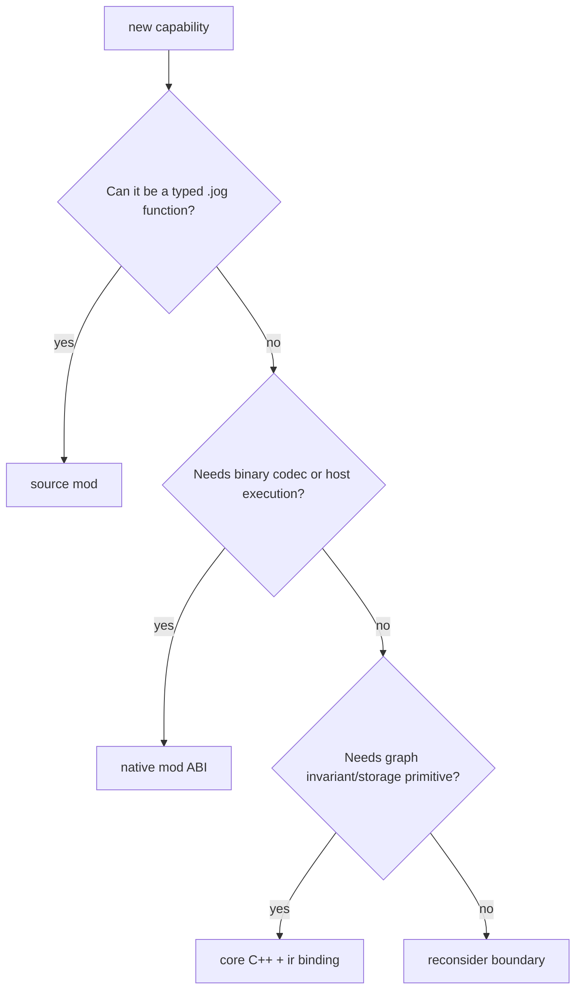

# Contributing

## Repository ownership

| Path | Role |
| --- | --- |
| `include/joggle/` | supported C++ and native ABI |
| `src/` | core implementation |
| `modules/` | installed official mods |
| `examples/mods/` | runnable external-author examples |
| `test/data/` | regression inputs, not user templates |
| `test/tools/` | fixture generators/download helpers |
| `docs/` | user/developer documentation site |
| `paper/` | separate manuscript workspace |

## Change checklist

1. Choose the owning subsystem or mod before editing.
2. Keep public behavior in supported headers/functions, not `src/` internals.
3. Add the narrowest executable oracle.
4. Document input, output, and failure boundary without requiring test reading.
5. Run focused labels, then the complete configured suite.

See [Testing](testing.md) for suite organization.

## Choose the correct extension layer

Most analysis, policy, conversion, rewrite, and emission work belongs in a
source mod. Add core C++ only when the operation cannot be expressed safely or
efficiently with existing graph primitives. Add native code only at a genuine
binary/host boundary.

## Definition of done

| Area | Required evidence |
| --- | --- |
| behavior | smallest executable oracle plus failure case |
| graph edit | rollback, stale/foreign handle, and final verification |
| public mod API | `mod info`, complete code example, input/output, diagnostics |
| public C++ API | installed consumer build and lifetime documentation |
| frontend/target | explicit unsupported frontier and end-to-end fixture |
| performance | phase/counter evidence and unchanged correctness oracle |
| docs | links/assets/site render and example correspondence |

## Change flow

1. Reproduce the behavior with a focused command or unit fixture.
2. Identify the owner: core mechanism, official mod, external example, or doc.
3. Implement one coherent change without compatibility aliases.
4. Add the narrowest test that would fail before the change.
5. Update the relevant reference and one task-oriented guide if public.
6. Run focused tests, non-model tests, then configured model tests.
7. Inspect generated artifacts and repository diff before committing.

## Documentation ownership

| Content | Location |
| --- | --- |
| first successful workflow | `docs/start/` |
| language grammar/semantics | `docs/language/` |
| core design and invariants | `docs/compiler/`, `docs/performance/` |
| task from input to output | `docs/guides/` |
| exact callable inventory | `docs/api/` |
| complete third-party patterns | `docs/examples/` |
| manuscript material | `paper/` only; never mixed into project docs |

Do not make readers open a test file to understand an API. Documentation must
show the code, input, output, and explanation directly; tests independently
keep the documented path from drifting.
