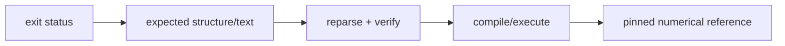

# Testing

Tests are organized by observable behavior, not by implementation source file.

| Label | Scope |
| --- | --- |
| `unit` | language, IR, evaluator, verifier, codecs, VM |
| `cli` | commands, streams, diagnostics, reports, mod administration |
| `analysis` | statistics, bounds, optimization policy |
| `example-mod` | runnable packages in `examples/mods/` |
| `c` | prepare, emit, strict compile, execute |
| `tutorial` | exact public guide path |
| `lint` | documentation graph and repository layout |
| `model` | configured pinned external model corpus |

```sh
ctest --test-dir build -LE model --output-on-failure
ctest --test-dir build -L model --output-on-failure
```

## Oracle strength



Use the strongest affordable oracle. Shared CMake helpers live in
`test/joggle_test.cmake`; C pipelines reuse `test/c_pipeline.cmake`. Optional
downloads stay under `test/tools/` and are absent from the default offline run.

## Configure and list

```sh
cmake -S . -B build -DCMAKE_BUILD_TYPE=Debug -DBUILD_TESTING=ON
cmake --build build -j
ctest --test-dir build -N
```

CTest names describe behavior (`cli-report`, `example-locality`,
`qlinear-c-execution`), while labels select a family.

## Focus before breadth

```sh
# one exact behavior
ctest --test-dir build -R '^tutorial-smoke$' --output-on-failure

# related families
ctest --test-dir build -L 'lint|tutorial' --output-on-failure

# default offline/product suite
ctest --test-dir build -LE model -j4 --output-on-failure

# configured pinned model corpus
ctest --test-dir build -L model -j4 --output-on-failure
```

An anchored `-R` avoids accidentally running similarly named tests.

## Fixture boundary

| Path | Use |
| --- | --- |
| `test/data/*.jog` | small regression programs |
| `test/tutorial/` | source printed by public tutorials |
| `examples/mods/` | user-facing complete external packages |
| `test/tools/` | optional download/generation helpers |
| build tree | generated `.jog`, C, headers, binaries, reports |

Never place generated output back into a source fixture directory. A script
test should receive an explicit build-root variable and publish intermediates
there for diagnosis.

## Test a transform

A strong transform test checks more than process success:

1. parse and verify the input;
2. run the exact public entry;
3. inspect the expected structural difference;
4. reparse/verify the printed output;
5. rerun if idempotence is part of the contract;
6. exercise a rejected case and confirm rollback.

For target pipelines, add frontier closure, strict compilation, execution, and
a numerical oracle where applicable.

## Documentation correspondence

Tutorial tests invoke the same functions, roots, and fixture source shown in
the website. The docs remain self-contained; the test is not part of the
reader journey.

When changing a tutorial command:

- update the page and its mirrored fixture together;
- check expected output, not only exit status;
- keep the example small enough to read but complete enough to execute;
- avoid platform-specific shell behavior inside the explanation.

## Sanitizers and release builds

Use a sanitizer/debug build for ownership, lifetime, and undefined-behavior
checks. Use Release or RelWithDebInfo for performance investigation. A
sanitizer number is not comparable with a release benchmark.

## Failure triage

| Failure class | First action |
| --- | --- |
| parser/type test | reduce to the smallest `.jog` source and inspect `Loc` |
| transform rollback | compare printed graph and revision before/after |
| C pipeline | retain prepared/planned/source/header artifacts |
| model test | record model identity, stage, unresolved/untyped/frontier output |
| docs test | fix link/asset/Liquid delimiter at the source page |
| flaky timing | remove wall-clock threshold from shared CI; keep correctness |

## Before pushing

```sh
python3 test/docs.py .
node --check docs/assets/js/docs.js
git diff --check
ctest --test-dir build -LE model -j4 --output-on-failure
ctest --test-dir build -L model -j4 --output-on-failure
```
