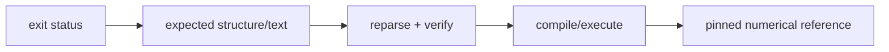

# Testing

Tests are organized by observable behavior, not by implementation source file.

| Label | Scope |
| --- | --- |
| `unit` | language, IR, evaluator, verifier, codecs, VM |
| `cli` | commands, streams, diagnostics, reports, mod administration |
| `analysis` | statistics, bounds, optimization policy |
| `example-mod` | runnable packages in `examples/mods/` |
| `c` | prepare, emit, strict compile, execute |
| `tutorial` | exact public guide path |
| `lint` | documentation graph and repository layout |
| `model` | configured pinned external model corpus |

```sh
ctest --test-dir build -LE model --output-on-failure
ctest --test-dir build -L model --output-on-failure
```

## Oracle strength



Use the strongest affordable oracle. Shared CMake helpers live in
`test/joggle_test.cmake`; C pipelines reuse `test/c_pipeline.cmake`. Optional
downloads stay under `test/tools/` and are absent from the default offline run.
