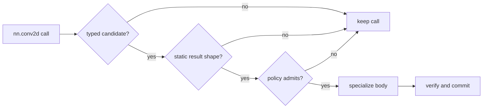

# `compact`: policy-driven Conv selection

`compact` demonstrates a larger implementation candidate: convolution, bias,
and activation are expressed as one visible body, then selected only when an
explicit resource policy permits it.

> [!NOTE]
> “Compact” describes the intended intermediate-storage tradeoff. It is not a
> universal performance claim. Validate latency and memory on the target.

## The semantic boundary

The candidate deliberately overloads `nn.conv2d` with the same typed contract as
the shared biased-convolution path:

```jog
[impl: "compact"]
fn nn.conv2d<
  E: Ty,
  X: list<int>, K: list<int>, B: list<int>, Y: list<int>
>(
  x: tensor<E, X>, weight: tensor<E, K>, values: tensor<E, B>,
  stride: list<int>, pad: list<int>, dilation: list<int>,
  groups: int, x_axes: list<int>, weight_axes: list<int>,
  out_axes: list<int>, activation: str
) -> tensor<E, Y> {
  // convolution accumulation, bias, and activation share one output
}
```

The full body lives in `examples/mods/compact/module.jog`. It derives extents
through `tensor.extent`, calculates layout-aware offsets through `tensor.offset`,
and implements the named activation. The generic type/shape parameters let the
resolver specialize constants before later loop transforms.

## Candidate discovery

```jog
local fn choices() -> list<Fn> {
  return ir.where(ir.fns("compact"), "impl", "compact")
}

fn apply(m: Mod) -> bool {
  return opt.instantiate(m, choices())
}
```

`local` keeps `choices` out of the public API. `opt.instantiate` selects only
type-compatible calls and exposes the specialized body inside the input mod.

## Add a memory policy

The configurable selector receives the call, its compatible candidates, and an
ordinary `dict`:

```jog
fn select(m: Mod, op: Op, candidates: list<Fn>, config: dict)
    -> list<Fn> {
  let compact = ir.where(candidates, "impl", "compact")
  if len(compact) != 1 {
    return []
  }
  let outputs = ir.outs(op)
  if len(outputs) != 1 || !tensor.valid(ir.type(outputs[0])) ||
     !tensor.static(ir.type(outputs[0])) {
    return []
  }
  let budget = base.get(config, "max_extra_elems", 0)
  assert(budget >= 0, "compact: max_extra_elems must not be negative")
  var elements = 1
  for extent in tensor.shape(ir.type(outputs[0])) {
    elements *= extent
  }
  if elements > budget / 2 {
    return compact
  }
  return []
}
```

An empty list means “keep the current implementation”; it is not an error. The
policy rejects dynamic shapes because it cannot establish the required element
count from compile-time evidence.

```jog
fn apply(m: Mod, config: dict) -> bool {
  return opt.instantiate(
    m, choices(), ir.find("compact.select"), config
  )
}
```

## Run it

Select every compatible candidate:

```sh
joggle run compact.apply semantic.jog \
  -M examples/mods -M build/modules > selected.jog
```

Select under an explicit budget:

```sh
joggle run compact.apply semantic.jog \
  --arg '{max_extra_elems: 262144}' \
  -M examples/mods -M build/modules > selected.jog
```

The input must contain a typed biased `nn.conv2d` call. The output contains the
specialized accumulation and activation loops when selected; unmatched calls
remain semantic. Always inspect the output before scheduling or emission.



## Responsibility map

| Concern | Owner |
|---|---|
| Conv semantics and shared signatures | `nn` |
| Tensor shape/layout helpers | `tensor` |
| Compact implementation and profitability | `compact` |
| Candidate matching and transactional instantiation | `opt` |
| Subsequent loop legality | `tile` |
| C artifact generation | `c` |

Do not copy Conv legality into the selector. The selector should answer only the
project-specific question it owns. If the model needs measured device latency,
replace the element heuristic with calibrated data and preserve the same API.

## Debugging checklist

- Confirm the input uses the biased-and-activated overload, not bare Conv.
- Query or print inferred output types if `tensor.static` rejects the call.
- Check the candidate list is scoped to the `compact` mod.
- Treat a `false` changed flag as a valid no-op until evidence says otherwise.
- Compare generated results against the semantic implementation before timing.
