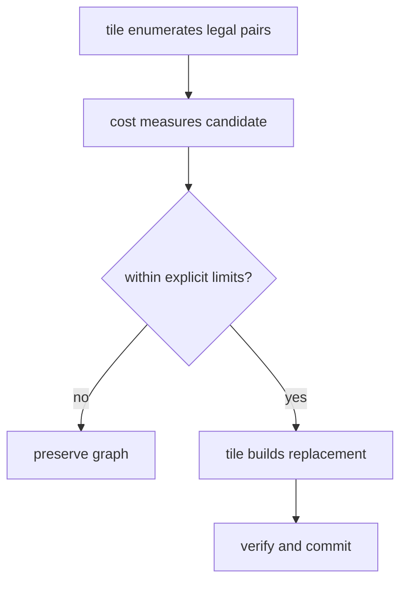

# `cost`: separate measurement from mechanism

The compiler cannot decide whether “cost” means calls, cycles, bytes, energy, or
a device-specific score. The `cost` example keeps that choice in a source mod
while reusing `stat` for traversal and `tile` for legal transformation.

## Contract at a glance

| Function | Input | Output | Mutates the mod? |
|---|---|---|---|
| `cost.weight` | `Mod`, `Op`, configuration | integer weight | no |
| `cost.total` | `Mod`, optional weights | integer sum | no |
| `cost.profitable` | producer/consumer pair, limits | decision | no |
| `cost.fuse` | `Mod`, limits | changed flag | yes, transactionally |

This is the intended pattern: callbacks return ordinary values; generic mods
own traversal, legality, and mutation.

## A complete measurement

Input:

```jog
mod model

fn main(x: i32) -> i32 {
  let y: i32 = opaque(x)
  return y
}
```

The callback assigns one weight to calls and another to every other operation:

```jog
fn weight(m: Mod, op: Op, config: dict) -> int {
  if ir.kind(op) == "call" {
    return int(get(config, "call"))
  }
  return int(get(config, "other"))
}
```

The public query constructs configuration as normal compile-time data and hands
the callback to `stat.sum`:

```jog
fn total(m: Mod, call: int, other: int) -> int {
  var config: dict = {}
  config["call"] = call
  config["other"] = other
  return stat.sum(m, ir.find("cost.weight"), config)
}
```

Run the default configuration:

```sh
./build/joggle query cost.total examples/mods/cost/model.jog \
  -M examples/mods -M build/modules
```

Output:

```text
5
```

Use explicit invocation arguments:

```sh
./build/joggle query cost.total examples/mods/cost/model.jog \
  --arg 7 --arg 2 -M examples/mods -M build/modules
```

Output:

```text
9
```

The weights are visible at the call site. They are not environment variables or
metadata silently attached to the graph.

## Reusing evidence as a policy

`cost.profitable` receives a legal producer/consumer candidate from `tile.fuse`:

```jog
fn profitable(m: Mod, pair: list<Op>, config: dict) -> bool {
  assert(len(pair) == 2,
         "cost.profitable requires a producer/consumer pair")
  let elements = extent(pair[0])
  let work = calls(pair[0])
  return elements >= 0 &&
         elements <= base.int(base.get(config, "max_extent")) &&
         work <= base.int(base.get(config, "max_calls"))
}
```

The wrapper supplies limits and delegates the edit:

```jog
fn fuse(m: Mod, max_extent: int, max_calls: int) -> bool {
  var config: dict = {}
  config["max_extent"] = max_extent
  config["max_calls"] = max_calls
  return tile.fuse(m, ir.find("cost.profitable"), config)
}
```

```sh
joggle run cost.fuse prepared.jog \
  --arg 65536 --arg 100 \
  -M examples/mods -M build/modules > selected.jog
```



## Why not put the model in C++?

A source-level callback can be inspected, versioned with the project, passed as
a `Fn`, and composed with the same metaprogramming facilities as a rewrite or
emitter. C++ remains appropriate for primitives that require host integration;
it is not necessary for a project-specific integer formula.

## Replace the toy metric

The example deliberately measures structure, not time. A real policy can load a
calibrated table into a `dict`, combine tensor extents with target properties,
or reject candidates for which evidence is missing. Preserve these rules:

1. Name the unit and target of every value.
2. Treat missing evidence as unknown, not zero.
3. Keep measurement pure so a query cannot change graph revision.
4. Keep legality in the mechanism mod.
5. Validate performance after emission; a policy score is only a prediction.

> [!WARNING]
> The value `5` above is a deterministic tutorial score, not latency or
> instruction count.
