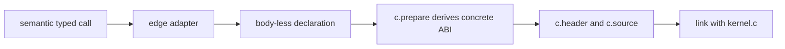

# `edge`: bind typed calls to external kernels

Use `edge` when computation already exists in a C library or device runtime. It
is an ABI boundary, not the path for structurally optimizing an exposed Joggle
body.

## Package anatomy

```text
examples/mods/edge/
├── module.jog  # typed declarations, adapters, and selection predicate
├── model.jog   # semantic calls used as input
├── kernel.c    # external implementations
└── main.c      # numerical caller and oracle
```

The Joggle file describes the contract. C implements it. The generated header
keeps the generated source, external kernels, and caller on one derived ABI.

## Declare an external symbol

```jog
[c: {name: "edge_matmul"}]
fn matmul<E: Ty, M: int, N: int, K: int>(
  a: tensor<E, [M, K]>,
  b: tensor<E, [K, N]>,
  rows: int,
  columns: int,
  inner: int
) -> tensor<E, [M, N]>;
```

A declaration has no Joggle body. The `c.name` attribute binds it to a linker
symbol. Its typed signature remains available to normal overload resolution.

## Adapt a semantic operation

```jog
fn tensor.matmul<E: Ty, M: int, N: int, K: int>(
  a: tensor<E, [M, K]>, b: tensor<E, [K, N]>
) -> tensor<E, [M, N]> {
  return matmul(a, b, M, N, K)
}
```

This implementation has the semantic `tensor.matmul` signature but forwards to
the ABI-level declaration with explicit dimensions. `opt.apply` can therefore
select it exactly like a source implementation.

For convolution, the adapter also derives concrete strides and passes them to
`edge_conv2d`. That makes layout assumptions visible in the call instead of
hiding them in the emitter.

## Guard layout assumptions

The sample external Conv kernel supports NCHW/OIHW. Its predicate accepts the
simple overload and checks literal axis lists for the richer overload:

```jog
fn accepts(m: Mod, op: Op, impl: Fn) -> bool {
  if ir.symbol(impl) != "edge.nn.conv2d" {
    return true
  }
  let args = ir.args(op)
  if len(args) == 6 {
    return true
  }
  return len(args) == 11 &&
         literal(args[7], [0, 1, 2, 3]) &&
         literal(args[8], [0, 1, 2, 3]) &&
         literal(args[9], [0, 1, 2, 3])
}

fn apply(m: Mod) -> bool {
  return opt.apply(m, ir.fns("edge"), ir.find("edge.accepts"))
}
```

Unsupported layouts remain on the shared path. Silent reinterpretation would be
incorrect, so “not selected” is the safe result.

## End-to-end build

```sh
mkdir -p build/examples/edge
./build/joggle run edge.apply c.prepare examples/mods/edge/model.jog \
  -M examples/mods -M build/modules > build/examples/edge/model.jog
./build/joggle emit c.header build/examples/edge/model.jog \
  -M examples/mods -M build/modules > build/examples/edge/model.h
./build/joggle emit c.source build/examples/edge/model.jog \
  -M examples/mods -M build/modules > build/examples/edge/model.c
cc -std=c11 -Wall -Wextra -Werror \
  -include build/examples/edge/model.h build/examples/edge/model.c \
  examples/mods/edge/kernel.c examples/mods/edge/main.c \
  -o build/examples/edge/model
build/examples/edge/model
```

The input includes two MatMul shapes, convolution variants, and a multiple-result
`measure` declaration. The caller checks numerical results and returns nonzero
on failure.



## ABI guarantees and checks

`c.prepare` derives erased concrete prototypes from call sites, deduplicates
identical signatures, and rejects one external symbol used with incompatible
ABIs. Force-including the generated header makes all translation units compile
against the same prototype.

| Symptom | Likely cause | Check |
|---|---|---|
| candidate not selected | type or predicate mismatch | inspect axes and call signature |
| duplicate C declaration | inconsistent specialization | inspect prepared Joggle output |
| link failure | missing/wrong `c.name` symbol | compare header and `kernel.c` |
| numerical mismatch | layout/stride contract differs | validate adapter arguments |

## When to use another mechanism

Use a source implementation like `ikj` when later passes must inspect its loops.
Use a native mod only when the compiler itself needs a host primitive. Use
`edge` for an existing runtime kernel whose ABI can be described by typed Joggle
declarations and metadata.
