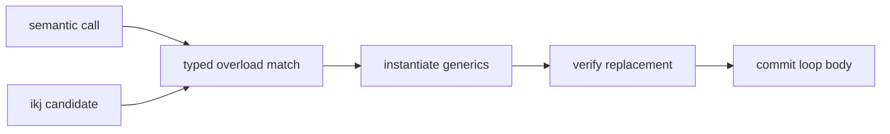

# `ikj`: replace meaning with a visible body

`ikj` is the smallest complete example of implementation selection. It adds one
matrix-multiplication body, discovers that body through metadata, and asks `opt`
to replace compatible semantic calls. There is no backend schedule registry and
no C++ plugin class.

> [!IMPORTANT]
> `tensor.matmul` owns the operation's meaning. `ikj.tensor.matmul` is only an
> alternative implementation. Keep that separation when adding a target- or
> project-specific implementation.

## What goes in and what comes out

The input keeps matrix multiplication semantic:

```jog
mod demo
use tensor

[entry]
fn main(
  a: tensor<f32, [2, 3]>, b: tensor<f32, [3, 2]>
) -> tensor<f32, [2, 2]> {
  return tensor.matmul(a, b)
}
```

After `ikj.apply`, the call has become an ordinary loop body:

```jog
fn main(a: tensor<f32, [2, 3]>, b: tensor<f32, [3, 2]>)
    -> tensor<f32, [2, 2]> {
  var out = tensor<f32, [2, 2]>(f32(0))
  for i in 0..2, k in 0..3, j in 0..2 {
    out[i, j] = out[i, j] + a[i, k] * b[k, j]
  }
  return out
}
```

The output is still Joggle source. Later passes can inspect, tile, reorder, or
emit it because the selected implementation is not hidden in a backend object.

## The implementation mod

The essential definition in `examples/mods/ikj/module.jog` is:

```jog
mod ikj
use ir
use opt
use tensor

[impl: "ikj"]
fn tensor.matmul<E: Ty, M: int, N: int, K: int>(
  a: tensor<E, [M, K]>, b: tensor<E, [K, N]>
) -> tensor<E, [M, N]> {
  var out = tensor<E, [M, N]>(E(0))
  for i in 0..M, k in 0..K, j in 0..N {
    out[i, j] = out[i, j] + a[i, k] * b[k, j]
  }
  return out
}
```

The name intentionally matches `tensor.matmul`. Generic parameters express the
shape contract, so the normal resolver—not handwritten string matching—checks
whether a call can use this body. `[impl: "ikj"]` is searchable metadata; it
does not change the function's type.

The public entry point is only a typed query plus a generic transform:

```jog
fn impls() -> list<Fn> {
  return ir.where(ir.fns("ikj"), "impl", "ikj")
}

fn apply(m: Mod) -> bool {
  return opt.apply(m, impls())
}
```

`ir.fns("ikj")` limits discovery to this mod. `ir.where` filters by metadata.
`opt.apply` performs overload matching, clones the selected body, substitutes
generic values, and commits the rewrite only when the resulting graph verifies.



## Run the complete path

```sh
mkdir -p build/examples/ikj
./build/joggle run ikj.apply c.prepare examples/mods/ikj/model.jog \
  -M examples/mods -M build/modules > build/examples/ikj/model.jog
```

Inspect `build/examples/ikj/model.jog` before emitting C. This intermediate file
is the audit point: it shows exactly which implementation was selected.

```sh
./build/joggle emit c.header build/examples/ikj/model.jog \
  -M examples/mods -M build/modules > build/examples/ikj/model.h
./build/joggle emit c.source build/examples/ikj/model.jog \
  -M examples/mods -M build/modules > build/examples/ikj/model.c
cc -std=c11 -Wall -Wextra -Werror \
  -include build/examples/ikj/model.h build/examples/ikj/model.c \
  examples/mods/ikj/main.c -o build/examples/ikj/model
build/examples/ikj/model
```

The sample caller compares the generated function with known matrix products
and exits nonzero on disagreement.

## Modify it safely

| Change | Put it in | Reason |
|---|---|---|
| New mathematical semantics | `tensor` | all implementations must share it |
| New loop body | an external mod such as `ikj` | selection stays replaceable |
| Profitability rule | an `opt.apply` predicate/policy | mechanism stays generic |
| Loop legality | `tile` | legality must not be duplicated by policies |
| C syntax or ABI | `c` | artifact ownership remains centralized |

To add `jki`, copy the body into another external mod, change the loop order,
give it distinct metadata, and let a policy choose between the two candidates.
Do not add a `MatMulSchedule` enum to the core: the function and metadata are
already the extension protocol.

## Failure modes

- A mismatched shape signature yields no compatible candidate; it is not forced.
- Multiple equally valid candidates require a policy instead of implicit order.
- A body that fails verification is rejected before the source mod is changed.
- Selecting a loop order is not evidence of speedup; benchmark the emitted code
  on the intended shape and target.
