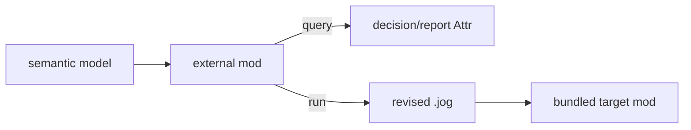

# External mod examples

These packages live in `examples/mods/`, not `modules/` or `test/`.

| Location | Why |
| --- | --- |
| `modules/` | installed product capability maintained as part of Joggle |
| `examples/mods/` | readable, runnable templates for external authors |
| `test/data/` | focused regression fixtures with no tutorial promise |

Tests execute the examples to keep them working, but users should be able to
understand and copy them without opening a test script.



| Example | Teaches |
| --- | --- |
| [`cost`](cost.md) | caller-defined measurement and profitability callbacks |
| [`ikj`](ikj.md) | alternative typed implementation selection |
| [`compact`](compact.md) | resource-aware fused implementation policy |
| [`locality`](locality.md) | legality/evidence separated from scheduling policy |
| [`edge`](edge.md) | explicit external C kernel ABI binding |

Add `examples/mods` as a root only when running an example:

```sh
joggle mod list -M build/modules -M examples/mods
```
