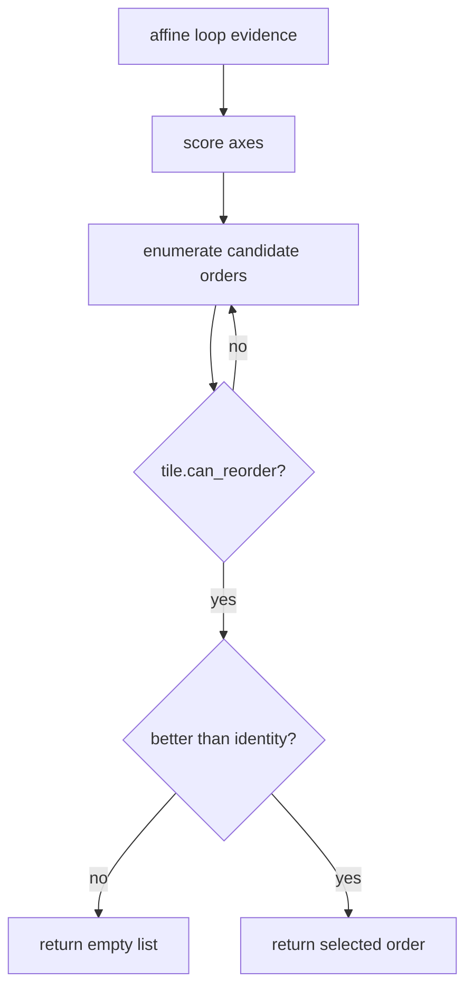

# `locality`: inspect, decide, then transform

`locality` is a scheduling policy written entirely in Joggle. It consumes affine
evidence exposed by `tile`, reports its decision as serializable data, and then
asks `tile` to perform legal graph edits.

## Why it is operator-independent

The policy never tests for `nn.conv2d` or `tensor.matmul`. It reads:

- state axes and reduction axes;
- static loop extents;
- affine read and write forms;
- a scalar-promotion cost proxy.

That evidence describes loop behavior after semantic bodies are exposed. The
same policy can therefore consider loops originating from different operators.

## Inspect before mutation

```sh
joggle query locality.plan canonical.jog \
  -M examples/mods -M build/modules > plan.attr
```

The query returns a dictionary with this shape:

```text
{
  revision: <integer>,
  candidates: <integer>,
  loops: [{
    fn: <string>, current: [<axis names>], selected: [<axis names>],
    extents: [<integers>], scores: [<integers>],
    reads: [<affine forms>], writes: [<affine forms>],
    scalar_cost: <integer>, changed: <boolean>
  }]
}
```

`locality.plan` records the revision before traversal and asserts that it is
unchanged afterward. A planning query is therefore usable in CI and tooling
without accidentally rewriting the model.

## The scoring mechanism

For every affine form, a unit-stride coefficient contributes more than a zero
coefficient. Candidate orders place higher-scoring axes farther inward:

```jog
local fn score(order: list<int>, scores: list<int>) -> int {
  var out = 0
  for position in 0..len(order) {
    out += (position + 1) * scores[order[position]]
  }
  return out
}
```

`choose` enumerates interleavings of state and reduction axes and calls
`tile.can_reorder` before returning a non-identity order. The score proposes;
the legality checker decides.



## Apply reordering

```jog
fn apply(m: Mod) -> bool {
  return tile.reorder(m, ir.find("locality.choose"))
}
```

```sh
joggle run locality.apply canonical.jog \
  -M examples/mods -M build/modules > scheduled.jog
```

Input is a canonical mod containing exposed loops. Output is another valid mod;
eligible loops may have reordered axes, while unsupported or unprofitable loops
are unchanged.

## Apply bounded blocking

```sh
joggle run locality.block canonical.jog \
  --arg '[4, 7]' --arg 4000 \
  -M examples/mods -M build/modules > blocked.jog
```

The first argument lists preferred factors. The second bounds a structural
source-duplication proxy. For each eligible loop, the policy may compose:

1. `tile.peel` when the chosen factor does not divide the extent;
2. `tile.split` to create outer and inner axes;
3. `tile.reorder` to move the new inner axis;
4. `tile.scalarize` to promote a bounded inner tile;
5. `opt.dce` after successful edits.

Every edit returns a live replacement handle. The next edit consumes that new
handle rather than retaining a stale `Op`.

> [!IMPORTANT]
> Affine legality, injective state access, capacity, and reduction-order safety
> belong to `tile`. A policy must not approximate and bypass those checks.

## Adapting the policy

Replace `locality_scores` when a target has a better cache or vector model. Keep
`plan` stable enough for tooling, make units explicit, and leave graph mutation
to `tile`. Add tests for identity, rejected, divisible, peeled, and budget-bound
cases; a single happy-path model is not sufficient.

## Interpreting a no-op

An empty choice or `false` changed flag can mean insufficient affine evidence,
no legal non-identity order, no profitable factor, or exhausted budget. Use the
plan output to distinguish those states before changing the transformation.
