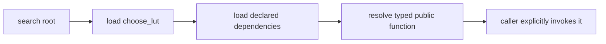

# Create an external mod

## Layout

```text
local-mods/
└── choose_lut/
    └── module.jog
```

## Source

```jog
mod choose_lut
use ir

fn apply(m: Mod) -> bool {
  var changed = false
  for op in ir.ops(m, ["call"]) {
    if ir.callee(op) == "nn.relu" {
      changed = ir.set(m, op, "implementation", "lut") || changed
    }
  }
  return changed
}
```

`ir.ops` traverses nested structure. The filter avoids testing non-call forms.
`ir.set` writes open metadata and returns whether it changed the operation.

The public surface contains only `choose_lut.apply`. Helper functions can remain
`local`; file names and directory layout do not create API by themselves.

## Input

```jog
mod demo
use nn

fn main(x: tensor<f32, [4]>) -> tensor<f32, [4]> {
  let y = nn.relu(x)
  return y
}
```

## Validate and run

```sh
./build/joggle mod check choose_lut \
  -M build/modules -M local-mods
./build/joggle mod info choose_lut \
  -M build/modules -M local-mods
./build/joggle run choose_lut.apply demo.jog \
  -M build/modules -M local-mods > selected.jog
```

Output:

```jog
mod demo
use nn

fn main(x: tensor<f32, [4]>) -> tensor<f32, [4]> {
  [implementation: "lut"]
  let y = nn.relu(x)
  return y
}
```

The call remains semantic `nn.relu`; the example records a decision. A real
implementation package may use `opt.apply`/`opt.instantiate` to select and
expose a compatible body.

## Add a read-only explanation

Users should be able to understand why a transform will act before mutating the
graph. Add a query that returns normal `Attr` data:

```jog
fn plan(m: Mod) -> list<dict> {
  var rows: list<dict> = []
  for op in ir.ops(m, ["call"]) {
    if ir.callee(op) == "nn.relu" {
      var row: dict = {}
      row["callee"] = ir.callee(op)
      row["selected"] = "lut"
      row["reason"] = "project policy"
      rows += [row]
    }
  }
  return rows
}
```

```sh
./build/joggle query choose_lut.plan demo.jog \
  -M build/modules -M local-mods
```

Output:

```text
[{callee: "nn.relu", reason: "project policy", selected: "lut"}]
```

The query must leave the mod revision unchanged. Keep device measurements or
large calibration tables in explicit input data rather than hidden globals.

## Grow without exposing helpers

```text
choose_lut/
├── module.jog
└── lib/
    ├── policy.jog
    └── rewrite.jog
```

Use `local fn` for helpers. `module.jog` is read first; fragments are sorted.

| File | Responsibility | Public? |
|---|---|---:|
| `module.jog` | imports and public entry points | yes |
| `lib/policy.jog` | evidence and selection callbacks | normally local |
| `lib/rewrite.jog` | composition of generic `ir`/`opt` edits | normally local |

Do not split one short function merely to create folders. Split when a file has
one stable responsibility that can be reviewed or tested independently.

## Package lifecycle

```sh
joggle mod install local-mods/choose_lut installed-mods -M local-mods
joggle mod upgrade local-mods/choose_lut installed-mods -M local-mods
joggle mod uninstall choose_lut installed-mods
```

Install/upgrade validate dependencies and public compatibility before making a
staged copy visible.

Installing a mod does not schedule `apply`, import it into every graph, or make
its metadata globally meaningful. A caller still reaches it through an explicit
`use`, qualified function name, or environment search root.



## Test the contract, not the folder

| Case | Expected result |
|---|---|
| one matching call | metadata added, changed is true |
| no matching call | graph identical, changed is false |
| repeated invocation | second invocation is a no-op |
| nested matching call | traversal still finds it |
| invalid argument | diagnostic and full rollback |
| missing dependency | load failure names the missing mod |

The documentation must still contain the complete normal example. Tests protect
the contract; they are not a substitute for explaining it.

## Promote annotation to implementation

To supply an actual body, define a compatible overload with identifying
metadata, discover it as a `Fn`, and delegate selection to `opt.apply` or
`opt.instantiate`. The [`ikj` example](../examples/ikj.md) shows the complete
input, candidate, selected body, and mechanism.

## Next examples

Use [External mod examples](../examples/index.md) for analysis callbacks,
implementation selection, structural scheduling, and external kernels.
