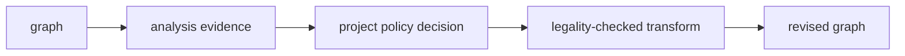

# Build a custom analysis and policy

A maintainable compiler extension separates three responsibilities:



This guide builds a simple call-weight report, then uses a separate policy to
annotate expensive calls. The example is intentionally structural; replace the
weights with calibrated data before treating it as a performance model.

## Package

```text
project-mods/
└── project.cost/
    ├── module.jog
    └── lib/
        ├── measure.jog
        └── annotate.jog
```

Entry:

```jog
mod project.cost
use ir
use stat
```

Measurement callback:

```jog
fn weight(op: Op, config: Attr) -> int {
  if ir.kind(op) != "call" { return 0 }
  let name = ir.callee(op)
  if name == "tensor.matmul" { return int(config["matmul"]) }
  if name == "nn.conv2d" { return int(config["conv2d"]) }
  return int(config["other"])
}

fn total(m: Mod, config: dict) -> int {
  return stat.sum(m, ir.find("project.cost.weight"), config)
}
```

## Query input and output

```console
$ joggle query project.cost.total model.jog \
    --arg '{matmul: 16, conv2d: 32, other: 1}' \
    -M build/modules -M project-mods
65
```

If the graph contains two Conv calls and one other call, the result is
`32 + 32 + 1 = 65`. Name the unit `weighted_calls`; it is not time or energy
until validated against measurements.

## Policy annotation

```jog
fn annotate(m: Mod, threshold: int, config: dict) -> bool {
  var changed = false
  let measure = ir.find("project.cost.weight")
  for op in ir.ops(m, ["call"]) {
    let score: int = ir.invoke(m, op, measure, config)
    if score >= threshold {
      changed = ir.set(m, op, "project.expensive", score) || changed
    }
  }
  return changed
}
```

```console
$ joggle run project.cost.annotate model.jog \
    --arg 16 \
    --arg '{matmul: 16, conv2d: 32, other: 1}' \
    -M build/modules -M project-mods \
    > annotated.jog
```

Representative output:

```jog
[project: {expensive: 32}]
let y = nn.conv2d(...)
```

The annotation records a decision. A later implementation-selection policy may
consume it; the analysis itself does not rewrite or target the graph.

## Improve the evidence

Move from a teaching proxy to a useful model incrementally:

1. derive element counts from tensor types;
2. distinguish reads, writes, weights, and workspace;
3. use `bounds` for dynamic capacities;
4. use `tile` affine forms for access/locality evidence;
5. keep device calibration in the configuration argument;
6. validate predictions against controlled measurements;
7. report model error and unsupported cases.

## Failure boundaries

| Failure | Owner |
| --- | --- |
| callback cannot resolve | callback signature/package visibility |
| callback mutates graph | analysis contract violation |
| missing config key | policy configuration validation |
| unsupported/open tensor type | analysis evidence limitation |
| selected transform is illegal | transform legality API |
| prediction is inaccurate | calibration/model design |

See [`stat`](../api/mods/analysis/stat.md), [`bounds`](../api/mods/analysis/bounds.md),
and [`tile`](../api/mods/transforms/tile.md) for the reusable evidence APIs.
