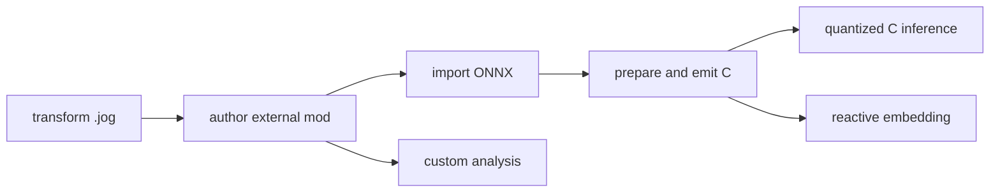

# Guides

Guides assume the [Language](../language/index.md) and show complete tasks.

| Guide | Input | Visible result |
| --- | --- | --- |
| [Transform a program](transform.md) | checked `.jog` | revised `.jog`, query, report |
| [Create an external mod](create-mod.md) | package + input graph | selected/annotated graph |
| [Import ONNX](import-onnx.md) | `.onnx` bytes | source then semantic `.jog` |
| [Emit C](emit-c.md) | semantic `.jog` | planned `.jog`, `.h`, `.c`, executable |
| [Quantized inference in C](quantized-c.md) | QLinear semantic/source calls | converted graph, ABI, strict C, exact output |
| [Custom analysis and policy](custom-analysis.md) | graph + calibration dictionary | query result and explicit policy metadata |
| [Reactive embedding](reactive-embedding.md) | persistent C++ `Env` and `Mod` | executed/reused stage report |

Every guide keeps stage boundaries named so a failure can be localized by
reading the last successful artifact.
