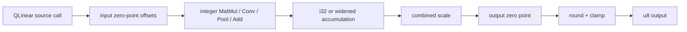

# Quantized neural-network inference in C

This guide uses the repository's QLinear fixture to show a realistic path from
source-format quantized operators to standalone C. It covers quantized MatMul,
Conv, broadcasting Add, and average pooling in one model.

> [!IMPORTANT]
> The fixture starts as readable ONNX-style `.jog`, not a binary `.onnx` file,
> so the example can focus on semantic conversion and C generation. For binary
> input, run `onnx.read` first; all later stages are identical.

## What the example proves

At the end, we will have evidence for four different properties:

| Evidence | Property |
| --- | --- |
| `opt.unresolved == []` and `opt.untyped == []` | converted graph resolves and has closed result types |
| `c.frontier == []` | the prepared/planned graph is representable by the C mod |
| strict C11 compilation succeeds | generated source/header satisfy compiler constraints |
| executable returns zero after exact comparisons | selected outputs match pinned integer oracles |

None of these alone proves all four.

## 1. Configure optional ONNX support

```console
$ cmake -S . -B build \
    -DCMAKE_BUILD_TYPE=Release \
    -DJOGGLE_BUILD_ONNX=ON
$ cmake --build build --parallel
$ mkdir -p build/quant-guide
```

The conversion bridge lives in `onnx.nn`; Protobuf is required by the optional
ONNX package even though this fixture is already source text.

## 2. Understand the source contract

The fixture exposes four public functions. The MatMul shape is small enough to
trace by hand:

```jog
mod qlinear_c
use onnx

fn matmul(
  a: tensor<u8, [2, 2]>, scale: tensor<f32, []>,
  zero: tensor<u8, []>, b: tensor<i8, [2, 2]>,
  b_zero: tensor<i8, []>
) -> tensor<u8, [2, 2]> {
  let result = onnx.QLinearMatMul(
    a, scale, zero, b, scale, b_zero, scale, zero
  )
  return result
}
```

The complete input is `test/data/qlinear_c.jog`. Its operator coverage is:

| Function | Source call | Quantization form | Result shape |
| --- | --- | --- | --- |
| `matmul` | `onnx.QLinearMatMul` | per-tensor | `[2, 2]` |
| `conv` | `onnx.QLinearConv` | per-tensor input/output, per-channel weights | `[1, 2, 2, 2]` |
| `add` | `com_microsoft.QLinearAdd` | broadcast second operand | `[2, 3]` |
| `avg_pool` | `com_microsoft.QLinearAveragePool` | quantized pooling | `[1, 1, 2, 2]` |

The model makes scale, zero point, bias, strides, and kernel shape explicit.

## 3. Infer and convert

Run both bridge stages in one transaction:

```console
$ ./build/joggle run \
    onnx.nn.infer onnx.nn.convert \
    test/data/qlinear_c.jog \
    -M build/modules \
    > build/quant-guide/semantic.jog
```

Then check the representation boundary:

```console
$ ./build/joggle query opt.unresolved \
    build/quant-guide/semantic.jog -M build/modules
[]
$ ./build/joggle query opt.untyped \
    build/quant-guide/semantic.jog -M build/modules
[]
```

The compact converted graph shows the important decomposition. A source
QLinear call becomes shared `quant` and `nn`/`tensor` semantics: offset integer
inputs, accumulate at a wider type, apply scale and output zero point, round,
and clamp.



This explicit graph is the point where a project may choose a fused kernel or
continue with portable expansion.

## 4. Prepare the C representation

```console
$ ./build/joggle run c.prepare \
    build/quant-guide/semantic.jog \
    -M build/modules \
    > build/quant-guide/prepared.jog
```

`c.prepare` exposes bodies the C target cannot represent directly and performs
target-owned preparation. It does not allocate buffers or emit source.

Useful inspection before the next stage:

```console
$ ./build/joggle query stat.summary \
    build/quant-guide/prepared.jog -M build/modules
```

Keep this structural report if you compare alternative fused and expanded
paths. A smaller operation count is not automatically faster, but it explains
what each path contains.

## 5. Plan storage

```console
$ ./build/joggle run mem.plan \
    build/quant-guide/prepared.jog \
    -M build/modules \
    > build/quant-guide/planned.jog
```

The planned fixture is still readable `.jog`. Values gain `mem.slot` where
workspace is needed, and functions gain slot type/count metadata. Parameters
and returned output buffers remain part of the external ABI.

## 6. Require an empty frontier

```console
$ ./build/joggle query c.frontier \
    build/quant-guide/planned.jog -M build/modules
[]
```

If the output contains a callee, do not emit and hope the C compiler resolves
it. Locate the missing conversion, semantic expansion, implementation, or C
representation first.

## 7. Inspect the generated ABI

The structured API is easier for tooling than scraping a header:

```console
$ ./build/joggle query c.api \
    build/quant-guide/planned.jog -M build/modules \
    > build/quant-guide/api.attr
```

For MatMul it includes this declaration:

```c
void qlinear_c_matmul(
    const uint8_t* a,
    const float* scale,
    const uint8_t* zero,
    const int8_t* b,
    const int8_t* b_zero,
    uint8_t* result_out);
```

The API report also records source tensor type, C scalar type, shape, capacity,
element count, byte count, pointer/scalar representation, and dynamic status for
each parameter/result.

For the convolution, note the distinction:

| Argument | Type/shape | Meaning |
| --- | --- | --- |
| input zero/scale | scalar tensors | per-tensor input quantization |
| weight zero/scale | `[2]` tensors | per-output-channel weight quantization |
| bias | `tensor<i32, [2]>` | wide accumulation-domain bias |
| result | `tensor<u8, [1,2,2,2]>` | requantized output |

## 8. Emit header and source

```console
$ ./build/joggle emit c.header \
    build/quant-guide/planned.jog -M build/modules \
    > build/quant-guide/model.h
$ ./build/joggle emit c.source \
    build/quant-guide/planned.jog -M build/modules \
    > build/quant-guide/model.c
```

The header contains `stdint.h`, C++ linkage guards, and four derived
declarations. The source contains portable expanded semantics for this path.

## 9. Compile strictly

```console
$ cc -std=c11 -O2 \
    -Wall -Wextra -Werror -pedantic-errors \
    -include build/quant-guide/model.h \
    build/quant-guide/model.c \
    test/data/qlinear_c_main.c \
    -lm -o build/quant-guide/model
```

Force-including the generated header makes the generated implementation and
the hand-written harness compile against the same derived declarations.

## 10. Execute exact integer oracles

```console
$ build/quant-guide/model
$ echo $?
0
```

The harness checks all elements, not just process completion:

| Path | Expected output |
| --- | --- |
| MatMul | `[1, 2, 3, 4]` |
| Conv | `[2, 3, 4, 5, 1, 3, 5, 7]` |
| broadcast Add | `[11, 22, 33, 14, 25, 36]` |
| average pool | `[1, 3, 5, 7]` |

Because these are quantized integer results, exact comparison is appropriate
for this controlled fixture. A float/dequantized oracle should define rounding
and tolerance explicitly.

## Where to optimize

The portable path is a correctness baseline, not the only representation.

| Opportunity | Extension point | Required proof/evidence |
| --- | --- | --- |
| fuse offset + MatMul + requantize | typed implementation mod + `opt.apply` | exact parameter/round/clamp semantics |
| use device int8 Conv | external/target implementation | layout, dilation, padding, per-axis policy |
| prepack constant weights | preparation/data artifact | stable constant ownership and ABI |
| narrow accumulator | `bounds`-driven policy | no overflow for every output |
| reuse workspace | `mem.plan` | non-overlapping live ranges |
| incremental regeneration | `ReactiveSchedule` | correctly observed dependencies |

> [!WARNING]
> Never fuse quantized operators by name alone. Zero-point types, scale shapes,
> axis, rounding mode, clamp bounds, bias domain, and layout all participate in
> equivalence.

## Diagnose by stage

| Failure | Inspect |
| --- | --- |
| source call remains after conversion | exact ONNX domain/opset and bridge rule |
| open type remains | inference rule and parameter/axis shape |
| nonempty C frontier | missing expansion or representation |
| unknown capacity | bounds and `mem.capacity` evidence |
| header/API mismatch | graph/config used for each artifact |
| compile failure | emitted signature/type/layout and strict diagnostic |
| numerical mismatch | converted semantic graph before C preparation |

This separation is intentional: it prevents a final wrong byte from becoming a
single opaque “compiler bug.”
