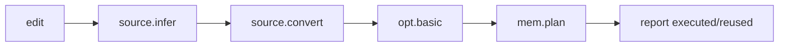

# Embed a reactive compiler pipeline

Use `ReactiveSchedule` when a long-lived tool edits one `Mod` and repeatedly
applies the same ordered compiler stages. A CLI invocation starts from a fresh
process and therefore cannot demonstrate cross-invocation stage reuse.

## Scenario

An editor or model-development service keeps a graph in memory. A user changes
one function. Type inference, conversion, cleanup, and memory planning should
rerun only when their observed inputs or upstream outputs make reuse unsafe.



## Complete C++ skeleton

```cpp
#include <joggle/joggle.h>

#include <cstdio>
#include <iostream>
#include <string>
#include <vector>

std::int64_t integer(const joggle::Attr& value, std::string_view key) {
  const auto* fields = value.dict();
  if (!fields) return 0;
  const auto found = fields->find(key);
  return found == fields->end()
             ? 0 : found->second.integer().value_or(0);
}

int main() {
  joggle::Env env;
  env.path("build/modules");

  const std::string source =
      "mod demo\n"
      "use opt\n"
      "fn main(x: i32) -> i32 { return x + 0 }\n";

  joggle::Mod mod;
  if (!joggle::parse(env, source, mod, "demo.jog")) {
    mod.print_diags(stderr);
    return 1;
  }

  joggle::ReactiveSchedule schedule({"opt.fold_add_zero", "opt.basic"});

  for (int iteration = 0; iteration != 2; ++iteration) {
    joggle::Attr report;
    if (!schedule.run(env, mod, {}, &report)) {
      env.print_diags(stderr);
      return 2;
    }
    std::cout << "run " << iteration
              << ": executed=" << integer(report, "executed_stages")
              << " reused=" << integer(report, "reused_stages") << '\n';
    for (const auto& stage : *report.dict()->at("stages").list()) {
      const auto& fields = *stage.dict();
      std::cout << "  " << *fields.at("function").string() << " "
                << (fields.at("executed").boolean() == true
                        ? "executed" : "reused") << '\n';
    }
  }
}
```

## Expected behavior

The first call is cold and executes both stages. If the second call has the same
environment, store, arguments, and valid recorded observations, it reuses both:

```text
run 0: executed=2 reused=0
  opt.fold_add_zero executed
  opt.basic executed
run 1: executed=0 reused=2
  opt.fold_add_zero reused
  opt.basic reused
```

Exact invalidation can vary with what a stage observes. The report, not an
assumption based on stage names, is authoritative.

## Edit and rerun

Perform edits only through `Mod`/`ir` APIs so revisions and observations remain
sound. On the next call, the schedule compares recorded dependencies and marks
the first invalid stage plus affected downstream stages.

Possible miss reasons include environment, arguments, package dependencies,
whole/structure revision, function/operation/value generation or revision, and
upstream dirtiness.

## Correctness contract

The selected subsequence runs in one transaction. A failure does not publish
partial graph edits or new dependency records. Reuse records are refreshed only
after successful evaluation and verification.

## Measure responsibly

Record at least:

- cold and warm wall time over repeated controlled runs;
- executed/reused stage counts;
- miss reasons;
- observed object counts;
- changed function counts;
- evaluator plan/memo/dispatch counters;
- structural/numerical output equivalence.

Do not describe evaluation-plan caching as native machine-code JIT. It is an
internal compiled execution plan for compiler functions.

## When not to use it

- one-shot CLI jobs with no persistent `Env`/`Mod`;
- pipelines whose external untracked state changes every run;
- impure stages that fail to express observations through supported APIs;
- workflows that replace the entire store each iteration.

See [Execution and updates](../compiler/execution.md) for the full invalidation
taxonomy and [C++ API](../api/cpp.md) for handle lifetime rules.
