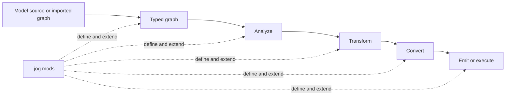

<section class="hero">
  <div class="eyebrow">Compiler infrastructure</div>
  <h1>Change the compiler without scattering the change.</h1>
  <p class="lead">Joggle gives operators, analyses, transformations, converters, and emitters one typed <code>.jog</code> language and one graph-scoped package model.</p>
  <div class="actions">
    <a class="button" href="start/">Run the first example</a>
    <a class="button secondary" href="compiler/">Understand the design</a>
    <a class="button secondary" href="api/mods/">Browse built-in mods</a>
  </div>
</section>

> [!NOTE]
> New to Joggle? Follow **Start here** once from top to bottom. It shows the source file, every command, the complete output, and what changed at each stage.

## One language, four kinds of work



Joggle does not hide this sequence behind a fixed pipeline. A command names the
function to run, its arguments, and the artifact to print or write. That makes a
compiler experiment inspectable: the same graph can be checked, queried,
transformed, emitted, and embedded without translating the extension logic into
several unrelated frameworks.

<div class="card-grid">
  <section class="card">
    <h3>Learn the language</h3>
    <p>Define packages, functions, types, values, control flow, and metadata through worked <code>.jog</code> programs.</p>
    <p><a href="language/">Open the language guide →</a></p>
  </section>
  <section class="card">
    <h3>Build with metaprogramming</h3>
    <p>Use one typed function model for reflection, graph generation, rewrites, policies, converters, and emitters.</p>
    <p><a href="metaprogramming/">Open metaprogramming →</a></p>
  </section>
  <section class="card">
    <h3>Understand the compiler</h3>
    <p>Trace source text into graph objects, resolution, reactive execution, transactions, and diagnostics.</p>
    <p><a href="compiler/">Open the compiler model →</a></p>
  </section>
  <section class="card">
    <h3>Use and extend mods</h3>
    <p>Each official mod has a dedicated API page with runnable calls, inputs, outputs, mechanisms, and limits.</p>
    <p><a href="api/mods/">Open the mod catalogue →</a></p>
  </section>
</div>

## Choose the shortest path

| Your goal | Start here | Continue with |
| --- | --- | --- |
| evaluate whether Joggle fits a project | [Start here](start/index.md) | [Compiler model](compiler/index.md) |
| write or read `.jog` | [Language map](language/index.md) | [Functions](language/functions.md), [types](language/types.md), and [values](language/values.md) |
| change an existing graph | [Transform a program](guides/transform.md) | [`ir`](api/mods/core/ir.md) and [`opt`](api/mods/transforms/opt.md) |
| build an out-of-tree package | [Create a mod](guides/create-mod.md) | [Mod organization](compiler/mods.md) and [external examples](examples/index.md) |
| import a model | [Import ONNX](guides/import-onnx.md) | [`onnx`](api/mods/frontends/onnx.md) and [`onnx.nn`](api/mods/frontends/onnx-nn.md) |
| generate deployable source | [Emit C](guides/emit-c.md) | [`c`](api/mods/targets/c.md) and [`mem`](api/mods/transforms/mem.md) |
| embed Joggle in a tool | [C++ API](api/cpp.md) | [Native mod ABI](api/native.md) |
| contribute to the implementation | [Subsystems](compiler/subsystems.md) | [Contributing](contributing/index.md) and [testing](contributing/testing.md) |

## A complete command is explicit

```console
$ joggle check model.jog -M modules
$ joggle run opt.fold model.jog -M modules > folded.jog
$ joggle emit c.source folded.jog -M modules > model.c
```

The three commands answer three different questions:

1. `check` asks whether source, names, types, calls, and graph structure are valid.
2. `run` invokes a compiler function and writes the resulting graph.
3. `emit` invokes an artifact-producing function and writes its return value.

The guides never require reading the test suite to discover missing steps. Tests
mirror the published paths for maintainers; the documentation itself contains
the inputs, expected outputs, and explanations a user needs.

## Documentation contract

Every reference page separates four concerns:

- **surface** — the names and signatures a caller uses;
- **worked use** — complete input, command, and output;
- **mechanism** — how the implementation reaches that result;
- **boundary** — rejected inputs, diagnostics, and where to extend the system.

That distinction matters. A user can stop after the worked example; a developer
can continue into ownership, invalidation, and implementation details without
having basic usage mixed into an internal design dump.
