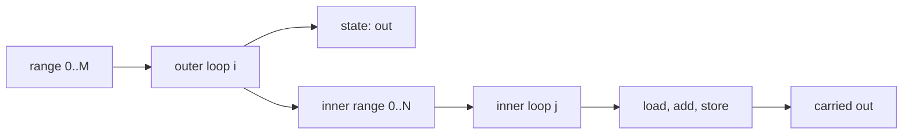

# Control flow

## Branches

```jog
fn absolute(x: i32) -> i32 {
  if x < 0 {
    return -x
  }
  return x
}
```

An `if` owns structured child blocks. Early returns remain explicit and every
path is verified against the function result types.

## Carried state

```jog
fn choose(x: i32, flag: bool) -> i32 {
  var result = x
  if flag {
    result += 1
  }
  return result
}
```

The readable source mutates `result`. Internally the branch receives and
returns carried values; graph transforms can inspect those edges directly.

## Loops

```jog
fn sum(values: list<int>) -> int {
  var total = 0
  for value in values {
    total += value
  }
  return total
}
```

Ranges and lists are iterable. Multiple variables form a nested Cartesian
product:

```jog
for i in 0..M, j in 0..N {
  out[i, j] = left[i, j] + right[i, j]
}
```

This syntax exposes loop order to structural transforms; it is not opaque
kernel text.

## Short circuit

```jog
fn valid(a: i64, b: i64) -> bool {
  return a > i64(0) && (b > i64(0) || a == b)
}
```

Most operators normalize to calls. `&&` and `||` normalize to branches so the
right operand is evaluated only when selected.

## Nested loop structure

Comma-separated loop variables are readable shorthand for nested loops. The
nest remains structured in the graph, which is why `tile` can inspect and
transform it later.

```jog
fn row_sums<M: int, N: int>(
  x: tensor<f32, [M, N]>
) -> tensor<f32, [M]> {
  var out = tensor<f32, [M]>(f32(0))
  for i in 0..M, j in 0..N {
    out[i] = out[i] + x[i, j]
  }
  return out
}
```

Conceptually:



The source is compact, while the graph retains the range, region arguments,
body operations, and carried result needed by analysis.

## Branch joins

Mutation makes branch joins explicit without requiring users to write phi
nodes:

```jog
fn clamp(x: i32, low: i32, high: i32) -> i32 {
  var result = x
  if result < low { result = low }
  if result > high { result = high }
  return result
}
```

Each branch returns the current `result`; the enclosing graph selects the
appropriate carried value. A transformation must preserve these dataflow
edges when moving or replacing operations.

## Early return and totality

Every reachable path of a value-returning function must return the declared
result list:

```jog
fn sign(x: i32) -> i32 {
  if x < 0 { return -1 }
  if x > 0 { return 1 }
  return 0
}
```

This is rejected because the false path is incomplete:

```jog
fn incomplete(x: i32) -> i32 {
  if x > 0 { return x }
}
```

## Loop transformation boundary

Source loops express meaning. Scheduling is a separate metaprogramming step:

| Layer | Owns |
| --- | --- |
| source function | ranges, carried state, loads, arithmetic, stores |
| `tile` mod | legality of reorder/split/peel/fuse/scalarize |
| project policy | whether a legal edit is profitable |
| target mod | final representability and artifact emission |

This separation prevents a target heuristic from silently redefining loop
semantics.

## Failure guide

| Symptom | Likely cause | Inspect |
| --- | --- | --- |
| missing return diagnostic | one branch falls through | every reachable path |
| carried type mismatch | assignments in branches/iterations disagree | initial `var` type and updates |
| loop cannot reorder | dependence or state mapping is unsafe | `tile.*_issue` and affine forms |
| condition unresolved | predicate overload/type is open | operand types and imported mods |
| transform loses a value | region result was not remapped | block arguments and loop outputs |

Continue with [Metadata](metadata.md).
